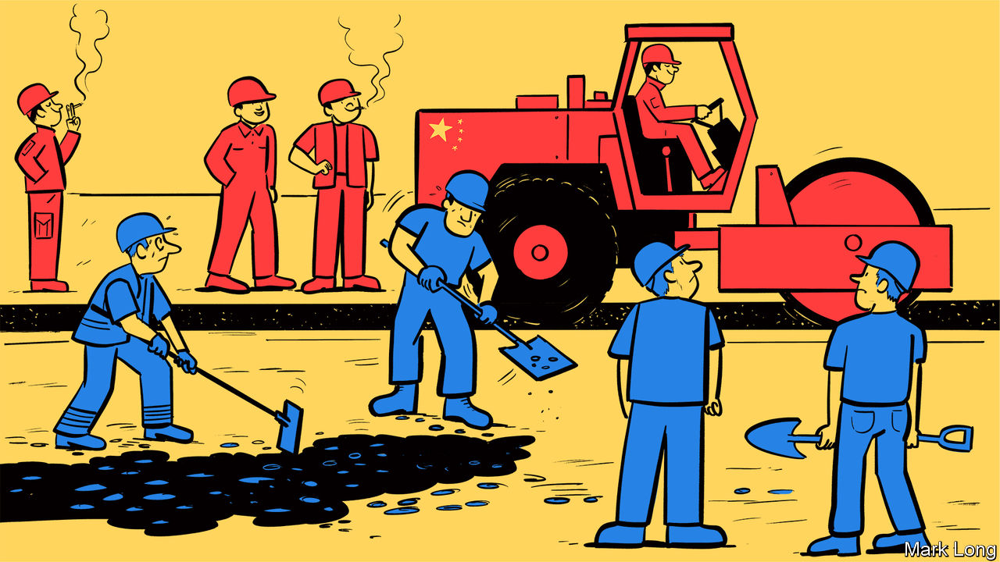

###### Building blocs

# The G7 at last presents an alternative to China’s Belt and Road Initiative 

##### Just as China starts to scale back its own scheme 

 

> Jul 7th 2022 

In the nine years since China launched its Belt and Road Initiative (bri), a multi-billion-dollar spree of global infrastructure-building, American efforts to counter the scheme have repeatedly faltered. Barack Obama’s administration failed to persuade allies to boycott the Chinese-led Asian Infrastructure Investment Bank. Mr Obama touted a free-trade deal, the Trans-Pacific Partnership, but Donald Trump sank it in his first week in the White House. 

As some countries struggled to repay Chinese loans, the Trump administration got some traction calling the bri “debt-trap diplomacy”. The scheme still accounted for about $890bn in investment and construction contracts (many financed by Chinese loans) between 2013 and 2021, says Christoph Nedopil Wang at Shanghai’s Fudan University. And every time America criticised China’s “new Silk Road”, the riposte came: “What are you offering instead?”

Now, just as China starts to scale back its programme, America and its allies appear to have come up with an answer. On June 26th the rich democracies of the g7 unveiled a plan to mobilise $600bn of private and public investment in infrastructure in low- and middle-income countries over the next five years. It is called the Partnership for Global Infrastructure and Investment (pgii). President Joe Biden said his country would stump up $200bn. 

Western officials say the scheme will not compete directly with the bri, which has focused on ports, railways and other “hard” infrastructure. Instead, it will try to play to the g7’s strengths by prioritising climate and energy security, digital connectivity, health and women’s equality. In contrast to China’s scheme, it promises to be transparent and sustainable—financially, environmentally and socially. Whereas China’s programme mainly involves loans from state-controlled banks, the pgii will aim to use limited government resources to catalyse larger private investments. “This isn’t aid or charity,” Mr Biden said on the plan’s launch. “It’s an investment that will deliver returns for everyone.” 

On the face of it, the plan is bad news for China. The bri was already facing headwinds, owing partly to excessive lending to commercially dubious projects and partly to the impact of covid-19. Pakistan, once hailed as the bri’s centrepiece, is on the brink of default. Sri Lanka, another big recipient of Chinese loans, defaulted in May. The bri had also grown too large to manage effectively. Those problems, combined with an economic slowdown at home, have prompted a scaling back, and the steering of funds towards smaller, higher-quality projects and into “soft” infrastructure such as health care. Although the bri will continue (it is written into the constitution), China’s president, Xi Jinping, is now promoting a new idea, the Global Development Initiative, which is expected to focus more on sustainable development. 

The upshot is that China’s efforts will increasingly come into direct competition with the g7’s. Some Chinese experts warn this will complicate Chinese strategic goals. Wang Yongzhong of the Chinese Academy of Social Sciences says that by focusing on “soft” infrastructure where they have comparative advantages, Western countries aim to boost exports of their own technology and services in areas such as 5g telecoms, blockchain and clean energy. That would allow them to “reap rich geopolitical and economic rewards”, he wrote in , an official magazine. 

A broader concern for China is that America and its allies are getting better at co-ordinating efforts to counterbalance Chinese economic and military heft. The g7’s plan was launched two days before the 30 members of nato agreed at a summit to include threats posed by China in a blueprint for its future strategy. The summit was also attended for the first time by the leaders of Japan, South Korea, Australia and New Zealand. A few days earlier, America and four of its closest allies launched yet another initiative, the Partners in the Blue Pacific pact, aimed at offsetting Chinese influence in the Pacific islands. 

In public, China has been dismissive of such efforts. “What the international community wants to see is real money and projects that actually benefit the people,” said Zhao Lijian, a spokesman, after the pgii was launched. Privately, though, some Chinese experts worry that such Western efforts are gaining pace just as China’s image has been tarnished by its zero-covid strategy and support for Russia in Ukraine. 

Yet there are reasons to be sceptical of the g7’s plan, too. It is a repackaging of an idea called Build Back Better World that was launched at the group’s summit last year. The rebranding was partly due to Mr Biden’s failure to win congressional support for his domestic Build Back Better initiative, Western officials say. But they also concede that there was little progress in implementing the international plan. 

The g7’s plan has roots, too, in an even earlier initiative, the Blue Dot Network, which was started by America, Japan and Australia in 2019 but has made little headway, in part because of differences over climate change. There are also overlaps with the eu’s Global Gateway scheme, launched in December to “mobilise” €300bn ($340bn) in infrastructure investment by 2027, and Britain’s Clean Green Initiative, unveiled a month earlier with a pledge of £3bn ($4.1bn) for sustainable infrastructure in developing countries.

Western officials say these efforts are complementary. But some observers see a lack of new money on offer. They worry that inflation and domestic politics will limit state funding, and the private sector will be wary of investing in unstable countries. “One has to wonder if this isn’t all just too little, too late,” said Matt Ferchen of the Leiden Asia Centre in the Netherlands. 

In one indication of how the g7 will try to meet its $600bn goal, the White House listed several ongoing projects that were retroactively included. China did the same when it launched the bri. But the g7 will need to show more substantial results fast if it is to convince developing countries that it offers a better alternative to China’s new Silk Road, rather than a dead end. ■

