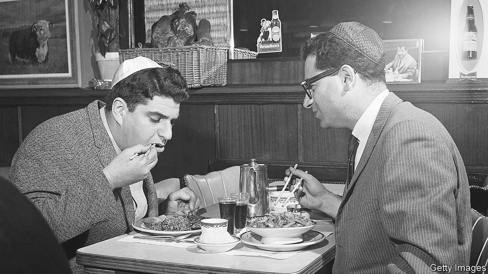

###### World in a dish

# A Chinese-flavoured challah tells a timeless human story 

##### People move, and food reflects the mixing that ensues 

 

> Jul 7th 2022 

On a friday afternoon, in the Platonic ideal of an Ashkenazi Jewish kitchen, a chicken roasts in the oven as a bakes beside it. Technically,  refers to any bread that has been ritually sanctified, but most people know it as a sweet, leavened, egg-enriched braided loaf. It is a cousin to brioche, but because it is often served with meat, it eschews the French version’s butter (Jewish dietary law forbids the consumption of milk and meat at the same meal). The result is better for the omission, lighter and cleaner-tasting.

 differs from baker to baker, but even so, Molly Yeh’s is unusual. Ms Yeh, a cookery writer and television presenter, is Jewish and Chinese. So is her . After the dough rises, it gets divided into three logs, which are flattened, brushed with sesame oil and sprinkled with spring onions, salt, chilli flakes and pepper, before being rolled up and braided. The flavours come from , an unleavened fried Chinese bread, known in the West as a scallion pancake.

Ms Yeh’s bread testifies to American Jews’ long-standing affection for Chinese cuisine. An old joke captures this affinity. If it is now the year 5782 in the Jewish calendar, and Chinese civilisation is reputedly 5,000 years old, what on Earth did Jews eat for nearly eight centuries?

In part, the link between the two American minorities is sociological. Neither group is Christian, and both have felt themselves to be outside the American mainstream. Jews were long comfortable in Chinese restaurants in ways that anti-Semitism prevented elsewhere. Partly the connection is spatial: the Lower East Side, once home to hundreds of thousands of Jewish immigrants, abuts Manhattan’s Chinatown. And part of it is just good sense: Chinese food is delicious.

Traditionally,  is eaten at the Shabbat table. Ms Yeh’s is best consumed straight from the oven—the better to jump up and down at how deliciously the classic Chinese pairing of sesame and spring onions cuts through the ’s sweetness. It makes a delightfully non-traditional accompaniment to Yemenite-Jewish chicken soup, itself spiced with turmeric and cardamom and served with , a dip typically made with chillies and herbs.

A Friday-night purist might proclaim Ms Yeh’sto be inauthentic and so unpalatable; ditto the idea of serving Chinese-seasoned eastern European bread with a dish from Yemen. This is a spiritually impoverished way to approach meals. No sensible diner, and no real food-lover, should fret over ossified customs and categories or reject innovation. Better to see, in the complementary bread and main course, the compression of a natural phenomenon that spans human history. 

Traders brought chillies from the New World to Yemen. Spring onions found their way into Ms Yeh’s bread because a mix of drive, luck, opportunity and tragedy brought European Jews and Chinese people into proximity in America. People move, and food reflects the mixing and adaptations that ensue. The world is richer for it, and so is the dinner table. ■

