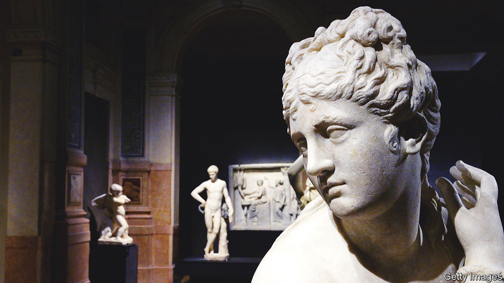

###### The Torlonia Marbles

# A legendary collection of classical statuary is at last on view 

##### Its story shows how politics and caprice can determine the art the public sees 

 

> Jul 7th 2022 

A boatman manoeuvres his tiny vessel alongside a towering cargo ship. In a butcher’s shop bedecked with disembowelled animals, an incongruously elegant lady sits at the counter, yanking a dead goose towards her by the neck. Elsewhere, two impish characters marvel at their discovery: that the sleeping figure beneath a sheet they have lifted is a hermaphrodite.

The people in these scenes lived—if they lived at all—around 2,000 years ago. But they have survived, trapped in marble, alongside Roman emperors and the heroes and deities of mythology in the world’s largest private collection of classical statuary. In the 18th and 19th centuries the princely Torlonia family acquired well over 1,000 works. Some are considered essential to an understanding of Roman art. 

Yet they have been almost entirely hidden from view since the second world war. Only now, with difficulty, are some being edged into the light: after decades of occasionally rancorous negotiation between the family and the Italian state, 96 marbles and a bronze are on display in Milan. The story of the Torlonia Marbles shows how the art the public sees can depend on politics and caprice (or, in some cases, crime). “Salvator Mundi”, ascribed to Leonardo da Vinci, vanished after being sold for a world-record $450m in 2017. Johannes Vermeer’s “The Concert”, valued at $250m, has not been seen since it was stolen from a museum in Boston in 1990. 

The Torlonia Marbles were never particularly accessible. In 1875 Prince Alessandro Torlonia created a museum that came to host 620 pieces (several hundred others have remained ever since at Villa Albani, the family’s residence in Rome, where they can be viewed by appointment). But even illustrious travellers struggled to get into the museum. The prince and, until very recently, his descendants seem to have regarded the collection as personal property—a stance that outraged critics and connoisseurs who saw it as part of Italy’s cultural heritage.

The museum closed during the second world war and became even more impenetrable. Even a senior government official had to disguise himself as a workman to get a peek at such celebrated works as the “Girl from Vulci”, whose smile, as enigmatic as the Mona Lisa’s, was known almost entirely from photographs. In 1976 the busts, statues and sarcophaguses were moved into storage so the building could be split into flats. The marbles continued to accumulate dust and grime for over 40 years, much to the frustration of art lovers. 

At different times, government representatives offered to buy—and threatened to confiscate—the contents of the former museum from the head of the family, a descendant and namesake of the original Prince Alessandro. Things may have been further complicated by an inheritance battle in the Torlonia clan. Before the modern-day Alessandro died in 2017, he was sued by his oldest son, Carlo, who has since brought a suit against his siblings. He has claimed, and they have denied, that they tried selling the former museum’s contents to the Getty Museum in America.

Still, in 2014 the marbles from the museum were entrusted to a foundation headed by one of the younger Torlonias. And the foundation concluded a deal with the culture and heritage ministry for the display of part of the collection.

It first went on show in Rome in 2020. Writing in the , Elizabeth Bartman, an art scholar, hailed the exhibition as “one of the most significant museological contributions to the study of ancient art in our time”. But the gallery was cramped, and a covid-19 lockdown meant few could admire the treasures. The new show runs until mid-September in the Palazzo Brentani, part of the Gallerie d’Italia in Milan.

“Here [the exhibits] get all the air and space they need to flourish,” says the director of the Torlonia Foundation, Carlotta Loverini Botta. She sweeps a hand around the central hall in which the busts, mostly of Roman emperors, stand on pedestals encircling the sole bronze: a life-size figure of the imperial general, Germanicus. 

Among the most historically valuable pieces is an imposing statue—a Roman copy of a Greek bronze—generally believed to portray Hestia, or Vesta, the goddess of the hearth. Another is a bust, known as the “Old Man from Otricoli”, which unblinkingly depicts the aged features of a patrician from the first century bc. Perhaps the most singular work is a sculpture of a resting goat. It was restored in the 17th century by the great Baroque sculptor Gian Lorenzo Bernini, who gave the animal a new head and a winningly human expression.

The boatman and the butcher feature in separate bas-reliefs, one of which offers a detailed view of Portus, the artificial harbour that served ancient Rome. As with most Roman sculptures, it was originally painted. Cleaning brought to light the colours used for two of the relief’s features: an intense scarlet for the flame that bursts from a lighthouse and a light blue for sea.

Another discovery came during preparatory research. Two outstanding pieces show a nymph gracefully removing a sandal and a satyr with a percussion instrument. Juxtaposed, they form a couple in which the satyr appears to be inviting the nymph to join him in a dance—a scene that was apparently a common motif since it also figures on two coins found in Asia Minor. Whether the two sculptures were a pair is uncertain. The research disclosed that they had been excavated in the same location, making it highly likely they were.

After Milan, an international tour is planned. But that too is the subject of painstaking and protracted discussion. And a new permanent home for the Torlonias’ extraordinary collection has yet to be chosen. Salvatore Settis, one of the show’s curators, says the Palazzo Silvestri-Rivaldi near the Forum, now being renovated at public expense, would be ideal. It even has a gallery adorned with 16th-century frescoes of the Roman emperors. “Nothing could be more appropriate,” he says. ■

