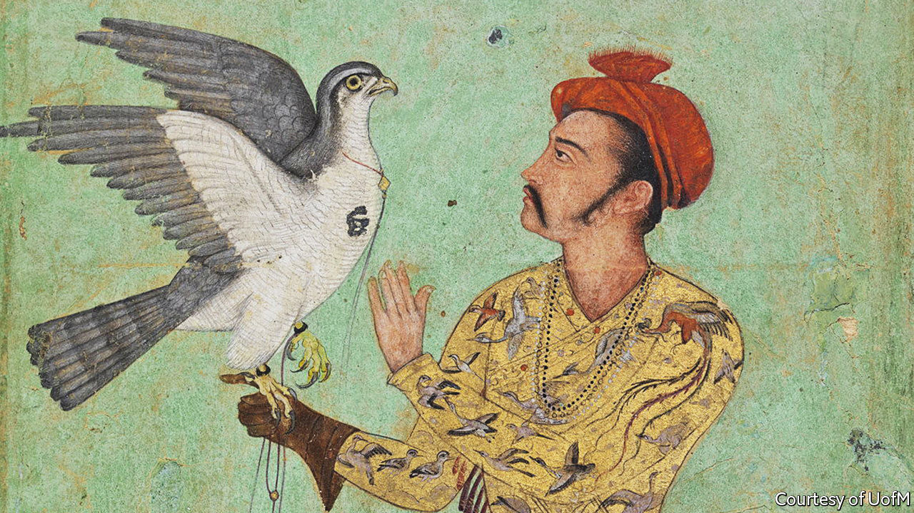

###### To be a pilgrim

# Gaming the haj, from the comfort of home 

##### A role-play game allows everyone to imagine one of the world’s great journeys 

 

> Jul 7th 2022 

For muslims making the pilgrimage, which this year runs from July 7th to July 12th, the first leg is easy enough: hop on a plane to the dedicated terminal in Jeddah. After that, they catch a bus or taxi for the last 85km to Mecca. But for generations of pilgrims the journey was difficult, expensive and fraught with dangers. The trek often took months. Not everyone made it.

Tyler Kynn, a teacher of Islamic history now at Central Connecticut State University, was looking for a way to bring the past to life when he remembered a computer game from his youth. “The Oregon Trail”, first released in 1971, introduced a generation of American schoolchildren to frontier life in the mid-19th century. Revolving around a band of settlers travelling in covered wagons from Missouri to Oregon, it forced players to think about finding supplies and water, conducting trade and simply staying alive. The masses of American millennials who played the game will remember the many, many ways to die on the trip. 

Working with a friend, and using travelogues by 17th-century Ottoman pilgrims, Mr Kynn developed “The Haj Trail”. It is a browser-based strategy game crammed with historical detail. Players can choose the role of one of five characters, from an Ottoman princess (the easiest) to an impoverished widow (the hardest). Travelling companions provide assistance, as do soldiers for hire and animals encountered along the way, such as the White Gyrfalcon (pictured). As in “The Oregon Trail”, the challenges are many. Bandits steal pilgrims’ food, money and goods; water purity is unreliable; bad trades can cause bankruptcy. 

Despite the sometimes frustrating difficulty of the game, Mr Kynn’s undergraduates were soon hooked. Gameplay made 17th-century travel more accessible than “giving them a book and saying: read these 100 pages of an account where the guy says ‘I get robbed here’.” Teachers from as far afield as Malaysia and Anatolia have stumbled on the game online and used it in their classes. Mr Kynn’s goal is to make the role-play widely available for educational use at no cost. 

The appeal arises not from fancy graphics but from the game’s multilayered texture. At each stop, players have the chance to explore local shrines. They can gossip in coffeehouses, picking up valuable tips on the route ahead, or go to the local market to barter goods. They frequently confront trade-offs in time, risks and supplies. 

This year Saudi Arabia has limited the number of people allowed to make the real pilgrimage to just 1m, far below the pre-pandemic peak of 2.5m. And for non-Muslims interested in the Islamic world, the will forever be forbidden. “The Haj Trail” offers a way to experience some of the magic, and dangers, of one of the world’s greatest journeys, albeit from the comfort of home. 

