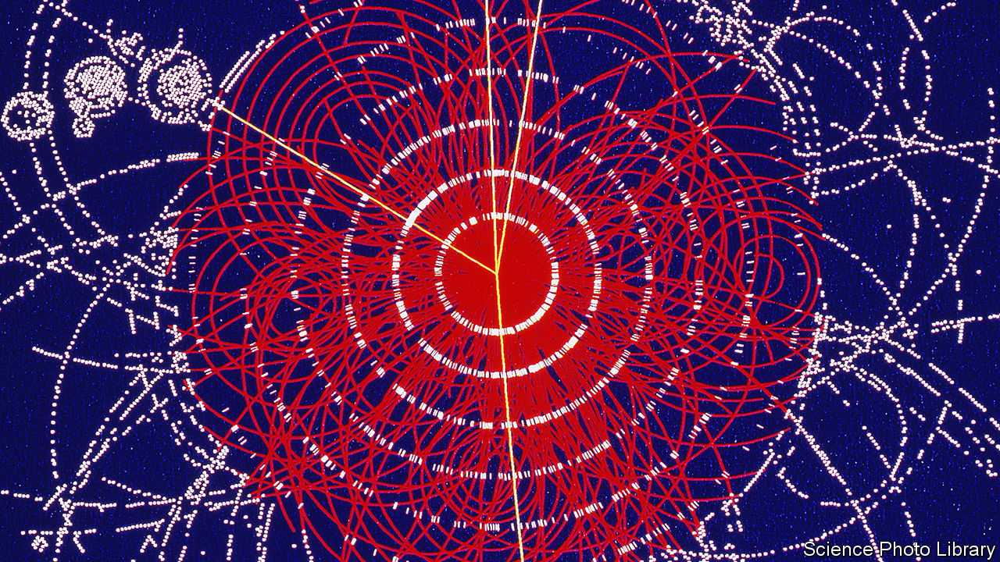

###### Hide and seek

# Peter Higgs and his boson have both been “Elusive” 

##### Frank Close tells their story in his aptly titled book 

 

> Jul 6th 2022 

By Frank Close. 

On the morning of October 8th 2013, no one could find Peter Higgs. The Royal Swedish Academy of Sciences had been trying to get hold of him on the phone for hours—its custom being to try to speak to the winners of a Nobel prize in the moments before making the decision known to the world. Despite delaying proceedings that day until past lunchtime, the Swedes could not locate Mr Higgs and had to press on with the announcement of that year’s physics prize without his knowledge. 

Frank Close’s new book tells Mr Higgs’s side of that story. He had spent a year preparing to disappear, it turns out. First, he threw journalists off the scent—they thought he had planned a jaunt to the Scottish Highlands that day. On the morning itself Mr Higgs discreetly left his flat in Edinburgh, took a five-kilometre bus ride to Leith and vanished for a few hours. 

It is an apt anecdote with which to open a book called “Elusive”. “There are some who revel in fame and public adulation,” writes Mr Close. “Higgs is not one of them.” That shyness is reflected in the particle named after him—the Higgs boson. Its existence was predicted in 1964, but it did not show its face to the world until 2012.

The Higgs boson is the cornerstone of the Standard Model of particle physics, the quantum mechanical description of all known elementary particles. In the theory’s earliest years in the 1950s and 1960s, one of its many open questions was: where did the mass of the various particles come from? If subatomic particles did not have any mass, they would zoom around the universe at the speed of light for eternity, never slowing down enough to coalesce into atoms, people, planets or stars. 

In 1964 Mr Higgs had worked it out. He proposed that the universe is permeated by an invisible force field. How strongly an elementary particle interacts with this Higgs field, as it came to be known, is what is commonly interpreted as its mass. 

Mr Close is among today’s best writers on the history of quantum mechanics and its associated field theories, and his book is more a biography of the boson than of the man. He rattles through Mr Higgs’s life story in the first few chapters. He was a sickly child and missed the first year of school. Thanks to a library at home, he went on to teach himself basic trigonometry, algebra and calculus. 

When Mr Higgs started at Cotham Secondary School in Bristol, he discovered that one of the alumni was Paul Dirac, a pioneer of quantum mechanics and the school’s first Nobel laureate. Mr Higgs’s physics teacher, Mr Willis, had also taught Dirac 30 years earlier. Nevertheless, Mr Higgs found the school physics syllabus “very boring” and admitted, “I never won a prize for physics at school.” 

Mr Higgs was not the only scientist to predict the mass-giving force field in 1964 but, crucially, he was the only one to add, at the last minute and as an afterthought, a short paragraph at the end of one of his papers on how evidence for the invisible force field might be found. If it existed, he wrote, there should be a particle associated with it, a massive boson. The “Higgs boson” was born, and the shy physicist it was named after became a permanent fixture in the world’s scientific headlines. 

The account of the decades-long search for the boson is one of the best parts of “Elusive”. A former particle physicist and then a member of staff at cern, the European particle physics laboratory, Mr Close offers a pacey insider’s story of the ups, downs and international politics of building cathedral-sized, cutting-edge scientific machines that cost billions of dollars in public money—and have no immediate benefit beyond curiosity. He also describes a transformational time in particle-physics research. Mr Higgs and his theorist colleagues had worked with paper and pencil to come up with the mathematics of the boson, but it took almost half a century of continual effort from thousands of scientists and engineers across the world to find the particle itself. Lone geniuses, if they ever existed, were no more.

The machine built to find the boson, the Large Hadron Collider, was first mooted at a meeting in 1976. It started collecting data in 2010 and, on July 4th 2012, confirmed the existence of the much-trailed boson. Mr Higgs was in the audience of the seminar at cern on the day and shed a tear. Fifteen months later came the morning that the Nobel committee decided to award him the most prestigious prize in physics, alongside François Englert, the only other surviving theorist of the six who had originally come up with the mass-giving mechanism back in 1964. Mr Higgs got up early to take a walk. ■

