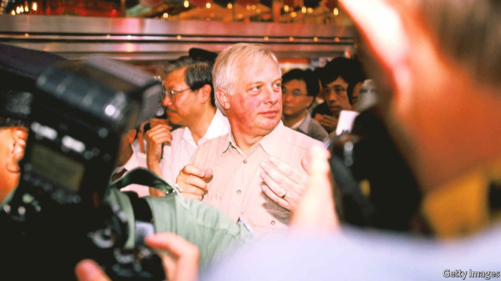

###### Perfidious Albion

# The diaries of the last British governor of Hong Kong 

##### Chris Patten is as scathing about some compatriots as about China’s Communist Party 

 

> Jul 7th 2022 

By Chris Patten.

It is april 1st 1997, just three months before Britain is due to hand Hong Kong back to China. As they prepare to leave, the territory’s colonial rulers go through their files to determine which documents to send back to London and which to destroy. Chris Patten, the governor, notes in his diary a “fascinating” find: decade-old telegrams that showed what he and many others had always suspected. A few years before he took over, a British-backed effort to consult people in Hong Kong about introducing more democracy had been manipulated to produce a result that China would like and to justify delaying reform. “I suppose that I’ve always hoped that it wasn’t true,” Lord Patten reflects. 

During his five years as Britain’s last chief in Hong Kong, there is little about the thuggery of China’s Communist rulers that appears to surprise Lord Patten, a former senior politician of the then-ruling Conservative Party who had got the job after losing his parliamentary seat in a general election. In his newly published book, “The Hong Kong Diaries”, his abhorrence of the Communists’ politics and of their disdain for Hong Kong’s freedoms is frequently and vividly expressed. Negotiating with Chinese officials, he says, is like “trying to shake hands with a bacon slicer”. 

In a postscript, Lord Patten describes China’s recent moves to “destroy the autonomy and way of life” of Hong Kong, including the imposition in 2020 of a draconian national-security law and sweeping arrests and jailings of pro-democracy activists who were involved in an explosion of unrest a year earlier. He calls this “the destruction of one of the freest societies in Asia by communist tyranny”. Lord Patten says he had “never believed that the Communist Party would hesitate for a second to throttle [Hong Kong] if they thought this was important to the party’s continued control of the country”. But in his diary the unwillingness of some British officials to stand up to China appears to prey on his mind as much as the party’s behaviour. 

Lord Patten notes Britain’s decision not to demand an “arbitration mechanism” to resolve any disputes with China over implementation of the Joint Declaration (the two countries’ treaty of 1984 concerning Hong Kong’s future). British officials argued this was unnecessary because the development of democracy would help protect Hong Kong. But the “phoney” effort to consult the public about this, which purported to show that Hong Kongers wanted to put off the introduction of direct elections to the legislature, resulted in a big delay. Lord Patten says Britain made a “strategic error” in the mid-1980s by seeming “to concede the point that everything we did before 1997 had to converge with whatever the Chinese wanted to do afterwards”. 

The postscript says the absence of an arbitration mechanism was among the factors that “sabotaged Hong Kong’s chances”. But Lord Patten does not make clear whether he thinks that an earlier, more assertive approach by Britain to the introduction of democracy in Hong Kong would have helped to avoid the tumult of 2019 and the subsequent clampdown. Under Chinese rule, the lack of democracy has been a catalyst of Hong Kong’s large-scale protest movements. But the party was never likely to conclude—as Lord Patten tried to persuade Chinese officials—that more democracy could help ensure stability. Especially since the Tiananmen Square upheaval of 1989, it has viewed political liberalisation as a threat to its survival. 

Lord Patten spent much of his time in Hong Kong struggling against British officials and members of the local elite who believed it was not worth trying to push China to accept more democracy in pre-handover Hong Kong—much less expanding it without China’s approval. Some of the most riveting detail in this rich volume relates to these tensions.

He names several of the senior bureaucrats and businessmen who were enemies of his political reforms and revels in pointing out their cravenness and hypocrisy (the party-praising, patriotic-sounding locals who criticise him often have foreign passports). But he reserves particular contempt for Sir Percy Cradock, a British diplomat who had retired by the time Lord Patten took up his post in 1992. He says Cradock’s “cloven hoof” was not difficult to spot on those “smoking gun” telegrams uncovered shortly before the handover. “But even at my age I’m capable of being shocked.”

The author’s entertaining language brings these diaries to life. They were clearly written (or dictated) for a wide audience as well as his close circle. The escapades of his Norfolk terriers, Whisky and Soda, are as keenly observed as the machinations of his critics. As he sails off on the Royal yacht,, after a handover ceremony attended by the “coelacanths of Leninism” (who had given up on the idea of outcompeting  by arriving in their own vast boat), his enemies are still on his tail: Chinese intelligence ships that “must have been mystified by the amount of ‘face’ being given to the departed colonial governor”. ■

