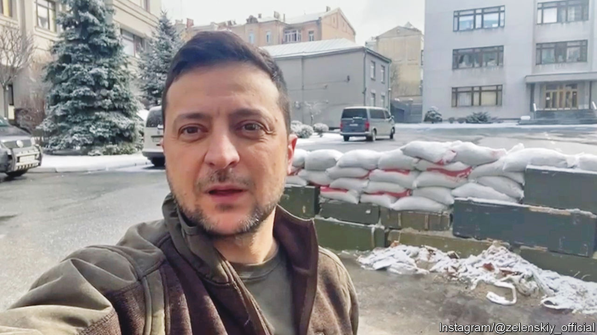

###### Back Story

# The many lives of Volodymyr Zelensky 

##### A book about Ukraine’s president measures the gulf between before and now 

 

> Jul 7th 2022 

Fate turned on a comedy show televised from Moscow in December 1997. In the grand final of kvn, an improv contest dating to Soviet times, a group of Armenian comics took on a team from Ukraine. The Ukrainian troupe brought together Volodymyr Zelensky, some of his future business partners and a writer of “Servant of the People”—the tv satire in which he would play a teacher who accidentally becomes president, a hit that was the launch-pad for his real-life election victory. If not for that night in Moscow, who knows?

So wonders Serhii Rudenko in “Zelensky”, the first book in English about Ukraine’s comedian-turned-president-turned-war leader. Along with such twists of fate, his account highlights the overlap between showbiz and politics, and, above all, the way the emergency of war can clarify people and priorities.

Ukraine was already a battlefield state when Mr Zelensky took office in 2019. Besides the Russian land-grabs in Donbas and Crimea, his country lay on the front lines of a series of 21st-century struggles: between democracy and authoritarianism, elections and oligarchy, the rule of law and corruption, facts and fakery. Dark money and propaganda coursed through the body politic; too many politicians saw the state as a cash trough, their aim being to gobble what they could before being shunted aside. As Mr Rudenko observes, Mr Zelensky and his novice crew faced these challenges with more memes in their armoury than policies. Then, this February, came a war of national survival.

Yet he also had assets, which dipped in value before rising sharply again. “An ordinary person can’t become president in this country,” says his character Holoborodko at the start of “Servant of the People”. He was right: in a cliquish system payrolled by billionaires, the barriers to entry were high. Perhaps only an a-list star could have levitated over them (if with a boost from the network behind the show, controlled by Ihor Kolomoisky, a controversial tycoon). Celebrity leaders carry risks, as America has learned, but on the upside, they can appeal across divides, regional or political. Mr Zelensky won 73% of the vote in a fractious electorate, even more than his tv alter ego.

“I am not your opponent,” he told Petro Poroshenko, the predecessor he would defeat. “I am your verdict.” In office, his talent for zingers and impish charm soon seemed meretricious. That is, until the war. Mr Zelensky, notes Mr Rudenko, may or may not have told Washington that he needed “ammo, not a ride”. Either way, it is an immortal line. Alluding to Churchill in his speech to Britain’s Parliament, or to Martin Luther King when he was beamed into Congress, he displayed the same actorly feel for audience and mood as in his stoical messages to his compatriots. 

These are a performer’s gifts. But in a deeper sense, the show is over. Before the invasion, says Mr Rudenko, the president’s “pauses, facial expressions, tone of voice and gestures” recalled his screen persona. These days he speaks to and for his nation in khaki, weary and unshaven, without makeup or lighting. Wartime leaders rely on rhetoric and bravado; yet with its life-and-death stakes, war is the coldest, hardest of realities, and calls for virtues that are the opposite of acting. As Mr Rudenko reflects, Mr Zelensky’s is “unembellished courage”.

Billed as a biography, this book is really a jumble of vignettes, often involving factions or grudges that readers may find baffling. Mostly written before the war, it has been hastily updated and translated from Ukrainian. That, though, is its main service: to measure the gulf between before and now.

The pre-war disparagements of Mr Zelensky as a creature of Mr Kolomoisky and even of the Kremlin; the splits in his entourage, gripes about his economic amateurishness and alleged cronyism—all these seem as relevant as treaties made by 17th-century tsars. Like Holoborodko, Mr Zelensky was in the past accused of vices he had pledged to abjure; but if you watch “Servant of the People” today, these life-imitates-art ironies seem petty, and you are struck instead by the lovely, heartbreaking opening sequence in which the hero bicycles through a sunny, peaceful Kyiv.

War is a rupture—in a country’s life and a leader’s. Amid the calamity, Ukrainians have proven lucky in theirs. As Mr Rudenko writes at the close, the man who was “visibly nervous” in his early bouts of diplomacy, the ingénue and clown, now has an experience of statecraft that no modern Western leader can match, nor would wish to.■


