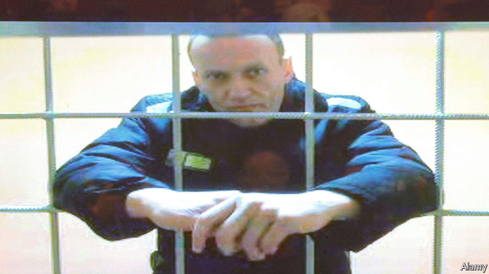

###### The defiant one

# Alexei Navalny’s jailers are tightening the screws 

##### Russia’s repression of independent voices grows harsher 

 

> Jul 4th 2022 

ALEXEI NAVALNY does not complain easily. The leading Russian opposition politician, who  in 2020 and has been imprisoned since January 2021, treats his jailers with defiance and irony. In June he was transferred from a penal colony to a maximum-security prison notorious for its brutality. He is now locked behind a six-metre-tall fence with murderers. Suffering from a bad back, he spends seven-hour shifts seated at a sewing machine on a stool below knee height. To see a lawyer, he must skip a meal.

The goal, according to Leonid Volkov, Mr Navalny’s chief of staff, is to isolate him and physically cripple him. “This is all very serious and very dangerous,” he wrote, even if Mr Navalny himself used his trade-mark light style to describe the darkness of his situation. “I live like Putin,” Mr Navalny wrote in his latest social-media message, posted via his lawyers. “I have a loudspeaker in my barracks that plays songs like ‘Glory to the FSB’, and I think Putin does too.”

The FSB, the successor to Stalin’s secret police, has grown even more repressive since Vladimir Putin invaded Ukraine. It controls the courts and prosecution service, and supports the war with purges of “extremists” and “traitors”. On June 30th the FSB arrested Dmitry Kolker, a terminally ill lecturer in physics at Novosibirsk university, on charges of passing secrets to China. (He had given lectures to Chinese students.) Agents grabbed him from his hospital bed in Siberia and flew him to a Moscow jail where he died a few days later. On July 2nd the FSB arrested his colleague, Anatoly Maslov of the Novosibirsk Institute of Theoretical and Applied Mathematics, on similar charges. 

The number of prosecutions for high treason and extremism has risen dramatically since Russia first invaded Ukraine in 2014, says Ivan Pavlov, a Russian human-rights lawyer who has fought several cases against the FSB. “The purpose is to demonstrate that Russia is surrounded by enemies,” he says. The definitions of treason and extremism keep broadening. A journalist gathering open-source information that might benefit a foreign power can be accused of treason.

With an acquittal rate he calculates at 0.17%, the best lawyers can do in Russia is provide a “palliative” service, says Mr Pavlov. “We can hold the defendant’s hand when a sentence is read out.” They can also talk to the media, but this is risky. Mr Pavlov and his team, who defended Mr Navalny, were chased out of the country by the FSB with threats and restriction orders; his attorney status is currently suspended.

“There was a clear policy of squeezing anyone who provided independent information out of the country,” says Mr Pavlov, sitting in the courtyard of his new office in Tbilisi, the capital of Georgia. On June 28th Dmitry Talantov, an attorney who had taken over Mr Pavlov’s cases, was arrested for speaking out against Russia’s war in Ukraine. On the same day Ilya Yashin, one of the few opposition politicians still in Russia, was thrown into a police cell in Moscow for 15 days. In court, Mr Yashin called his arrest “an insistent invitation to emigrate”.

Even those who do not explicitly oppose the Kremlin can be locked up. On June 30th Russia’s establishment was shaken by the arrest of Vladimir Mau, an economist who headed the Russian Presidential Academy of National Economy and Public Administration, which trains future civil servants. Mr Mau had advised the government on economics and demonstrated his political loyalty by signing a letter in support of Mr Putin’s “special military operation”. He has been charged with fraud, but few believe this was the real reason for his detention. His arrest seems to be part of a wider purge within universities and a signal to the technocratic elite that nobody is untouchable these days in Russia. 

For some reason people in the elite think they are untouchable, yet they never are, Mr Pavlov says. Until now few members of the Russian elite have linked Mr Navalny’s fate and their own. But they may now read his posts more closely. “You know me, I’m an optimist,” he wrote on July 1st. “While sewing, I’ve memorised Hamlet’s monologue in English. The inmates in my shift say that when I close my eyes and mutter something…like ‘in thy orisons be all my sins remembered’ it looks like I’m summoning a demon.” The demons, however, hardly need summoning. And Hamlet’s soliloquies do not augur a happy ending. ■


