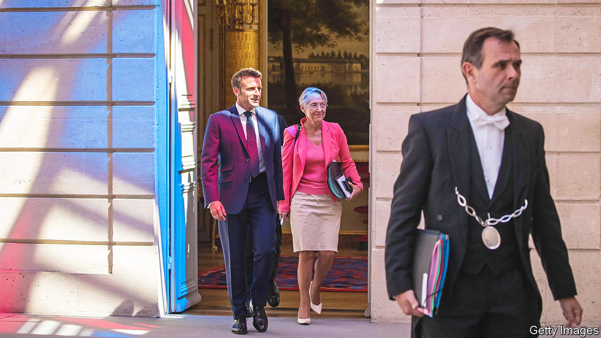

###### Minority report

# France’s President Emmanuel Macron decides to go it alone 

##### Spurned by other parties, he appoints a minority government 

 

> Jul 7th 2022 

Late last month, before heading off on a four-country marathon of summits, Emmanuel Macron vowed to put together a coalition government that would reach from the Communists on the left to the Republicans on the right. After losing his parliamentary majority at a general election in June, the centrist French president hoped this might secure broad-church support. But on July 4th, after mainstream opposition parties on the left and right rejected his advances, Mr Macron shelved the plan. Instead he unveiled a reshuffled government made up largely of fellow centrists, which will govern with only minority support in parliament.

Many of those in top jobs remain, including Elisabeth Borne, the prime minister, Bruno Le Maire at finance, and Catherine Colonna, the foreign minister. The few outside political recruits include a former Communist, Olivier Klein, mayor of the Paris  of Clichy-sous-Bois, who was named cities minister. Some loyal parliamentarians were rewarded, including Roland Lescure, who became industry minister. Given the prospect of greater parliamentarianism in France, however, this was not the heavyweight cross-party government that some had hoped to see.

As well as centrist friends, Mr Macron has turned to experts from outside politics. Laurence Boone, chief economist at the oecd, takes over as Europe minister from Clément Beaune, who becomes transport minister. The new health minister is François Braun, a doctor and head of samu, the ambulance and emergency services agency. Jean-Christophe Combe, head of the French Red Cross, was appointed “solidarity” minister. 

The big question now is whether Mr Macron’s second term can begin to match the ambition of the first. In 2017, backed by a solid parliamentary majority, the young president had clear plans: to shake up France, make it more competitive and job-creating, and open up opportunities for all to benefit. Since his re-election in April, however, there has been a sense of drift. Some close to Mr Macron say he is tired. Others think he has been waiting to test the political balance of power before deciding what is feasible. Either way, it is unclear whether the president can revive that reformist zeal, or whether his second term will be diminished to little more than in-tray management.

On July 6th Ms Borne sounded a confident note when she laid out her plans, promising to raise the pension age, bring about full employment and fully nationalise edf, an energy giant. After she decided not to follow tradition and put this to a vote of confidence, Jean-Luc Mélenchon’s radical-left alliance, nupes, offered a motion of censure instead. His attempt to topple the government is likely to fail. But it reflects the hostile mood. nupes, which holds 151 seats to Mr Macron’s 250, insists that the president “lost” the election and should implement its policies, not his. 

Even if Mr Macron tries to spend his way out of trouble, to help ease the soaring cost of living, it will never be enough for the left. And the president has promised not to raise taxes or debt. Already, Mr Le Maire has warned that debt-servicing charges are rising, as spreads on French borrowing widen. Moreover the country’s nuclear-energy plants are struggling with maintenance just as the energy prices leap. French public opinion, unlike that in Germany, has not been remotely prepared for the coming need to curb energy use. In short, France, like Mr Macron, is heading for a turbulent few months.■

