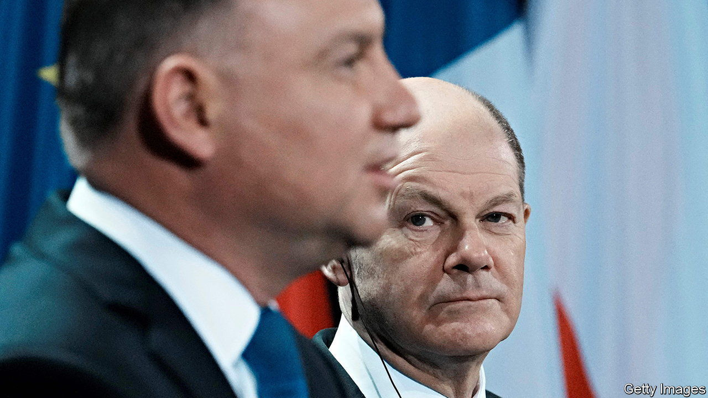

###### From bad to worse

# Polish-German relations have gone sour 

##### Trust is at its lowest ebb since the cold war 

 

> Jul 7th 2022 

Germany and Poland have never been great friends, but Vladimir Putin’s invasion of Ukraine could have been a turning-point. Relations had improved during the tenure of Civic Platform, a centrist party, only to sour again after the populist Law and Justice (pis) party won the elections in 2015. A major sticking point was Germany’s relationship with Russia, which Poles considered dangerously chummy.

Russia’s assault on its neighbour has outraged Germans and Poles alike. Yet there has been no rapprochement between biggest countries. Days after the invasion Olaf Scholz, Germany’s chancellor, heralded a  or seismic shift, in foreign and security policy. But Polish politicians were soon denouncing Germany for doing too little too late—with some reason, as German arms have been slow to arrive in Ukraine. They also pillory German officials for continuing to talk to Russian ones.

As Germany’s ambassador to Poland in recent years, Arndt Freytag von Loringhoven tried in vain to repair relations. “pis needs bogeymen,” says Mr Freytag von Loringhoven. Its villains are Russia, Germany and the European Union, usually in that order. “Trust between our countries is at an all-time low,” says the German envoy, who left Warsaw at the end of June. His successor will be Thomas Bagger, a top diplomat.

Mr Scholz got a taste of the acrimony after becoming chancellor in December. A foundation close to Poland’s ministry of culture sponsored a campaign demanding Germany pay reparations for the second world war. Placards in Warsaw showed Joseph Goebbels, Adolf Hitler’s chief propagandist, next to Angela Merkel, Mr Scholz’s predecessor; Frank-Walter Steinmeier, Germany’s president; and Mr Freytag von Loringhoven. Germany rules out reparations, saying Poland renounced them in 1953 and did not raise them in 1990 when German reunification was negotiated.

Poles tend to assume the worst of Germany. When Mr Scholz travelled to Kyiv in June along with Mario Draghi, the Italian premier, Emmanuel Macron, the French president, and Klaus Iohannis, the Romanian president, rumours circulated in Warsaw that Mr Scholz wanted to strike a deal to end the war and force Ukraine to give up territory. It did not go unnoticed that Messrs Scholz, Macron and Draghi invited Mr Iohannis along rather than Andrzej Duda, the Polish president. Mr Duda had alienated the German and French leaders by comparing their telephone diplomacy with Mr Putin to calling up Hitler. 

Mr Duda also accused Germany of breaking its promise to replace the 200-plus tanks which Poland has supplied to Ukraine. The German government says Poland refused its offer of Leopard tanks and Marder fighting vehicles because they were not the latest models and there were not enough of them. But “the mainstream of public opinion in Poland is convinced Germany has not yet delivered on the ,” says Sebastian Plociennik of Vistula University. Poland wants massive armed support for Ukraine, and finds Germany’s incremental approach foolish.

“It’s easy to push the anti-German button in Poland,” says Maria Skora, an expert on German-Polish relations. References to the defeat of the Teutonic Order at the battle of Grunwald in 1410 or Prussia’s role in partitioning the Polish-Lithuanian Commonwealth in the 18th century are still part of Polish political discourse. Fanning historical grudges may help pis to convince Poles their country needs patriotic leaders. But it does not help build the alliances Europe needs against Russia. ■

