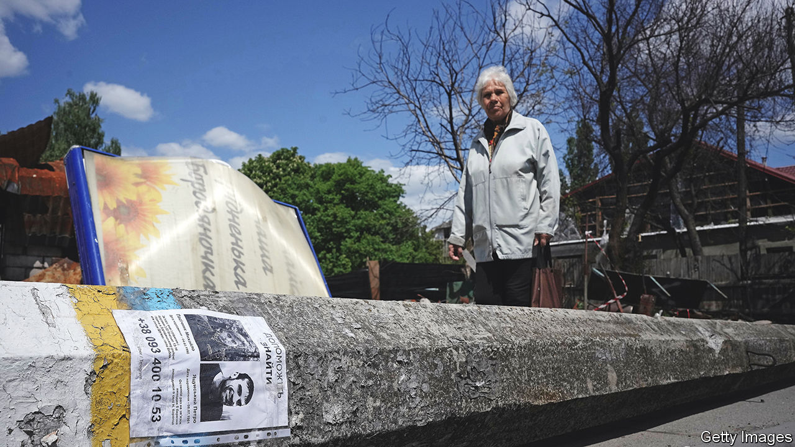

###### Fate unknown

# Russia is disappearing vast numbers of Ukrainians 

##### Thousands have vanished into exile, prison or death 

 

> Jul 7th 2022 

When russia occupied Bucha, a suburb of Kyiv, in February, most residents fled. But a baker named Matviy stayed to help his neighbours. (The names of the disappeared and their families have been changed for their protection.) On March 18th Russian soldiers burst into his home and took him away at gunpoint, says his sister Natalia: “We have not heard from him since.” Ukraine’s overwhelmed police, prosecutors and human-rights groups have been unable to help.

Bucha is the tip of the iceberg. Thousands of Ukrainians have been abducted from Russian-occupied areas, including activists, journalists and humanitarian workers. Journalists Serhey Tsyhipa and Oleh Baturin were seized on March 12th while reporting on atrocities committed by Russian forces. “They were taken to an unknown place with bags on their heads,” says Anastasia, Mr Tsyhipa’s step-daughter. Mr Tsyhipa eventually appeared on Russian state tv looking thin and spouting Kremlin propaganda.

“The Russians are abducting people to silence dissent,” says Nadia Dobriansk of Zmina, a Ukrainian human-rights group. Torture has been widely documented. Mykola Panchenko, an activist who had attended protests in occupied territory, was kidnapped while buying groceries. His wife Svitlana says masked men brought him to their house hours later and searched for weapons, then took him away again. The Russians released Mr Panchenko a month later with broken ribs. Other victims have turned up dead.

Disappearances in Ukraine are not new. Between 2014 and 2021 over 2,000 people vanished; both pro-Russian forces and Ukrainian security services were implicated. Russia has deployed such terror tactics for decades. After it annexed Crimea in 2014, Crimean Tatar activists and community leaders disappeared in droves. During Russia’s two wars in Chechnya in the 1990s, disappearances were so widespread that Human Rights Watch said they amounted to a crime against humanity.

“There are over ten thousand that we know are missing, but this is certainly an underestimate,” says Katya Osadcha, a Ukrainian tv presenter who set up a Telegram group called Search for the Missing. Police submitted over 9,000 missing-person reports from February 24th to May 24th, mostly from the Donetsk region in eastern Ukraine. The government claims hundreds of thousands of its citizens have been deported to Russia. Soldiers at filtration camps often confiscate people’s documents. “If we don’t have information, we can’t find people,” says Ms Osadcha.

Ukraine’s missing-persons systems are patchy. In 2018 the country passed a law setting up procedures to document and trace those who had disappeared since the conflict with Russia started, but it became mired in bureaucracy. The new war could provide fresh impetus. “We had to discover new procedures of registration and ways of searching for missing persons,” says Alyona Lunova of Zmina.

Families like Anastasia’s are trying everything to get loved ones back. “The state has not done anything,” she says. She has applied to a un working group on enforced disappearances and is submitting a case to the European Court of Human Rights. “We do not know when Matviy will come back, but we will wait and he will return. There is no other way.” ■


