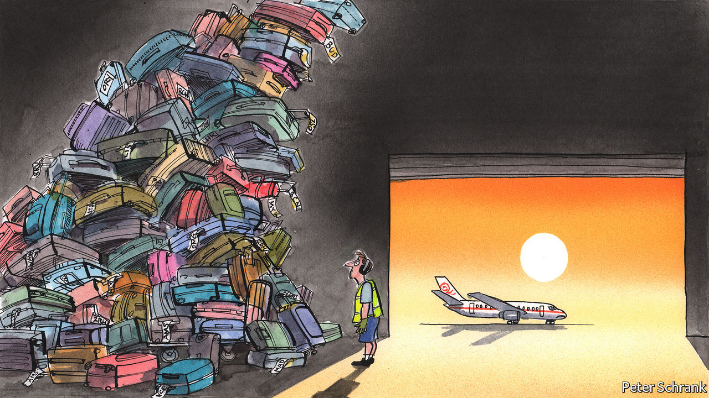

###### Charlemagne

# Travel chaos in Europe is a glimpse of a future with few spare workers 

##### Employers are wondering where the staff went 

 

> Jul 7th 2022 

Where did all the workers go? The question feels ubiquitous in Europe. From French cafés to Irish construction crews, Czech car factories and Italian farms, employers once assumed cheap staff could be summoned at will. Now the toilers seem to have simply vanished. Companies are grumbling, though rarely as loudly as Parisians waiting for an oblivious  to arrive with their drinks. In no sector is the lack of staff so glaring as in air travel. For weeks tourists at some of Europe’s biggest airports have faced serpentine queues to catch their flights, assuming those flights have not been cancelled due to the shortage of hands. Going on a relaxing holiday has never seemed so stressful. In this economy, everybody in Europe can find work; as a result, Europe isn’t working.

After two years of pandemic uncertainty, tourism is back (minus a few Asian visitors). For Europe, which attracts half the world’s international travellers, that ought to be a boon. And yet the headlines are grim. Staff shortages at airports and airlines have prompted a surge in flight cancellations. In June, just as resorts and city centres ought to have been filling up, carriers in Britain, France, Germany, Italy and Spain cancelled nearly 8,000 flights, roughly three times the figure in 2019, according to Cirium, a consultancy. Each scrapped journey gives rise to a planeload of sob stories: Alicante stag parties postponed, Tuscan family getaways forsaken. American air travel has problems too, but nothing like the bedlam that has engulfed parts of Europe. 

Those whose flights were not cancelled might wish they had been. Waiting times at Amsterdam’s Schiphol airport ran to six hours on some days in late May, prompting klm, the Dutch flag-carrier, to suspend bookings from its main hub for four days. Given the chaos behind the scenes, checking in luggage has become an act of faith. At Paris’s main airport, nearly half of all bags that were meant to follow their owners to their destinations on July 2nd went astray. Passengers have been warned by unions they may never be reunited with their swimming trunks. A member of the Cypriot parliament stuck at Frankfurt airport for two days decried the “third-world conditions” there in much the same tone some Germans use when they travel to the Mediterranean.

Some of the havoc is down to tourism rebounding unexpectedly fast. Deprived of holidays for years, vacationers are “revenge travelling”, depleting what remains of their pandemic-era stimulus cheques. War on the fringes of the continent might have been expected to crimp demand. Instead it sent the euro tanking (to near parity with the American dollar), making Greek tavernas and Baltic beaches irresistible.

Airports should have been prepared. Forecasting the number of travellers on a given day is not unreasonably complicated, given that they have bought tickets well beforehand. But aviation bosses have complained for months of the difficulty of hiring staff. Ramping up operations takes time: airport security must be vetted and cabin crew trained (though you wouldn’t know it at some airlines). Then came the strikes. Travel workers walking off the job in recent weeks included Scandinavian pilots, German security staff, French airport firemen, Dutch cleaners, Belgian cabin crew and Italian air-traffic controllers. 

In part the strikes reflect workers demanding that pay keep up with high tourist loads and soaring inflation. But airports’ difficulties are not merely the result of local labour troubles. Far beyond the tarmac, European workers currently have the upper hand. Unemployment in the euro area, at 6.6%, is at its lowest since the single currency was launched two decades ago. Some places have all but run out of workers: Germany’s jobless rate is just 2.8%. It would once have fixed a shortage of hands by importing willing throngs of Poles or Bulgarians. That no longer works: Poles and Bulgarians now find plenty of good jobs at home. Germany is issuing work permits to Turks to handle its luggage instead. Whatever reluctance it might have felt to let in more non-eu migrants has been set aside. Europe is now employing nearly everyone within its borders who is willing and able to work. 

Some might suspect that generous welfare states are letting a lot of Europeans shirk. The talk last year was of a “Great Resignation” of the previously employed. Yet this does not seem to be the case. A higher percentage of 15- to 64-year-olds in the euro area have jobs than before lockdowns. The eu’s labour force, unlike Britain’s or America’s, is now bigger than before the pandemic, notes Jessica Hinds of Capital Economics. Many have better options than the jobs once reserved for them. “Everyone’s asking, where have they all gone?” pondered Tim Clark, the boss of Emirates airline, according to Bloomberg. “And the answer is always: Amazon.” It turns out that handling e-commerce packages for decent pay while listening to podcasts beats arriving at 5am to ask passengers whether they have packed any liquids in their carry-on. Or serving impatient Parisians their cocktails, for that matter.

Europe is healing

Given its rigid labour rules and ho-hum growth in recent decades, Europe has not often had to face the problem of having too many jobs. It is a problem nonetheless. The dramas visible at airports are also unfolding in care homes, hotels and other places that need a lot of unskilled staff. They simply get less attention. Some workers may see salaries rise, though many firms that rely on cheap labour say they cannot afford to pay more. Meanwhile, the unions who typically bargain for permanent wage bumps may worry that doing so now might feed inflation.

Perhaps the labour market will regain some slack as Europe’s economy slows down. Soaring energy prices have soured the mood in recent weeks, as has a resurgence of covid. That would hardly be good news, except for hard-up employers—and those looking to catch a bit of downtime on a far-flung beach. ■


