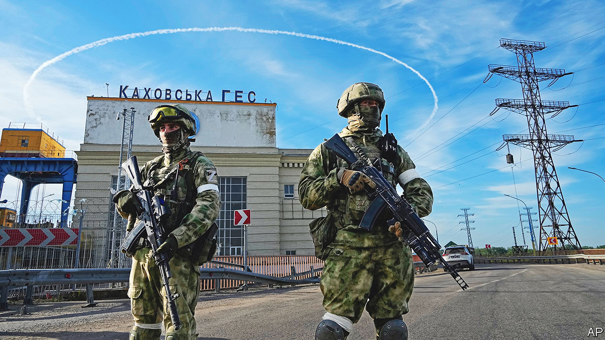
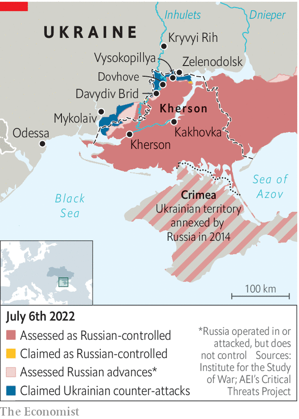

###### Heading south

# Ukraine prepares a counter-offensive to retake Kherson province 

##### Russia will provide fierce resistance 

 

> Jul 3rd 2022 

IN THE EARLY days of the war in , a rapid Russian advance plunged Kherson province into darkness. What little is known about life there comes from refugees who dare to escape, reaching relative safety in front-line towns like Zelenodolsk. They come any way they can: by foot, bike, boat, in wheelchairs. One woman was dragged by her son on a carpet. At one point, nearly 1,000 a day were arriving. Destroyed bridges and increased risks mean the daily count has dwindled to single digits. But a vast yard of abandoned bicycles, wheelchairs and baskets on the edge of Zelenodolsk stands as a memorial to the lives left behind—temporarily, so those who have fled hope. 

The most recent arrivals talk of intense fighting as Ukraine readies itself to counter-attack from the west, near Mykolaiv, and the north, from towns like Zelenodolsk. Vlad Milin, 31, and Olha Shelemba, 26, said that shelling had become so relentless in their village, Dovhove, they decided to risk everything and travel with their five young children in a boat, then navigate country fields and mined roads to safety. There was little point in watching the battle unfold further, they said. “Neither side is going to give up.” 

 


Kherson, a gateway to Crimea, is the  that Russia has managed to capture since the war began on February 24th. Just as important to Russia’s southern strategy is its occupation of neighbouring Kakhovka, on the left bank of the Dnieper, where a dam provides the annexed peninsula’s water. The whole region is an agricultural powerhouse, providing tomatoes, watermelons, sunflowers and soyabeans. For these reasons and more, Ukraine is prioritising efforts to retake it. The country’s forces can already boast tactical successes. A military-intelligence officer says that forward units are now within sniper range (a kilometre or so) of Chornobaivka, an outer suburb of Kherson. “The next week or two will be even more interesting,” he promises. 

Whatever is under way does not yet appear to be a full-fledged counter-offensive. Ukraine remains focussed on halting Russia’s —on July 2nd, its troops retreated from Lysychansk in Luhansk province—and its southern grouping does not enjoy the three-to-one advantage strategists recommend for a successful offensive. Soldiers complain of a critical shortage of ammunition and infantry. “There is a tendency by our bosses to overstate success on the battlefield,” says Banderas, the of a Ukrainian reconnaissance commander. That could change only if more Western rocket systems are used in the southern theatre, he added. Currently only a handful of M777 howitzers are deployed there. 

Where the Ukrainians are pushing, the Russians are fighting back hard. Serhiy, a Ukrainian territorial-defence soldier working behind Russian lines in Vysokopillya, just across from Zelenodolsk, says the enemy has built reinforced bunkers under the ground. When they try to push the Russians out, they return in greater numbers. “Their ten becomes a hundred,” he says. One village base has four air-defence units defending it. Ukraine’s task has been hindered, the soldier complains, by locals who did not flee the occupation and are being used by Russian troops as human shields: “We can’t shoot at our own people.” 

A handful of locals are collaborating with the enemy, he says. Girls as young as 15 have been recruited by the Russians. In early June, Serhiy’s company discovered a 40-year-old artillery spotter during a random search. The man’s near-clean mobile phone gave him away. The phone had just one computer-game app installed. Closer inspection revealed the game was, in fact, a tool to record co-ordinates and receive cryptocurrency payments. “The bastard had mapped out our hardware movements over the last month,” he says.

The exposed lowlands of Kherson mean that any Ukrainian advance there feels the full force of Russian artillery. There is already talk of serious losses in the areas immediately south of Zelenodolsk. An attempt to cross the Inhulets river at the village of Davydiv Brid in May—essential for a second-prong attack on Kakhovka—was particularly costly. “They were baited into the line of fire,” says Victoria, a farmer who lived in Davydiv Brid until it became impossible in mid-May. “A lot of our men lost their lives.” 

The 38-year-old fidgets as she recounts her own escape. The cue to leave came when Grad rockets landed in the farmyard. She jumped in a car and joined a convoy of a hundred vehicles that had been waiting to pass over the bridge, which has since been destroyed. Russian soldiers gave the go-ahead to cross, but as the convoy approached Ukrainian positions on the other side, it was shelled. To this day, it is unclear who fired. Ukrainian authorities say between 20 and 50 people died. Their bodies have not been recovered.

Lucky to be alive, Victoria has not moved far from danger. She is again living near the front line in Zelenodolsk, housed there by local volunteers. Like many of Kherson’s mostly poor refugees, she has no money for anything else. She left everything behind in the village: her house, her cows, her chickens. 

But she insists that not all the Russian soldiers were villains, and she even felt sorry for the youngest ones. Some were fellow Ukrainians, conscripted “after going out to buy bread” in occupied Luhansk, in the east. Those boys paid for everything they took from the village shop, she says—first in hryvnia, later in roubles—and even said “thank you” in Ukrainian. But when Russian positions came under serious attack, the Luhansk units were fortified with angrier colleagues from Russia itself. 

The shifting attitudes in Davydiv Brid offer a warning of what may happen in Kherson if Ukraine’s counter-offensive gathers pace. “Anton”, the pseudonym of a former official who fled to Krivyi Rih in late May after being asked to head a collaborationist authority, says Russia has generally tried not to upset locals too much. This was a conscious decision to co-opt the population, he said. But if that changes and the occupiers are forced out of Kherson, there is little to hold them back. Things will turn nasty, and quickly. “The Russians will be angry as hell, and lash out, but the partisan resistance will be just as fierce,” he said. “The locals will simply tear the Russians apart.” ■


