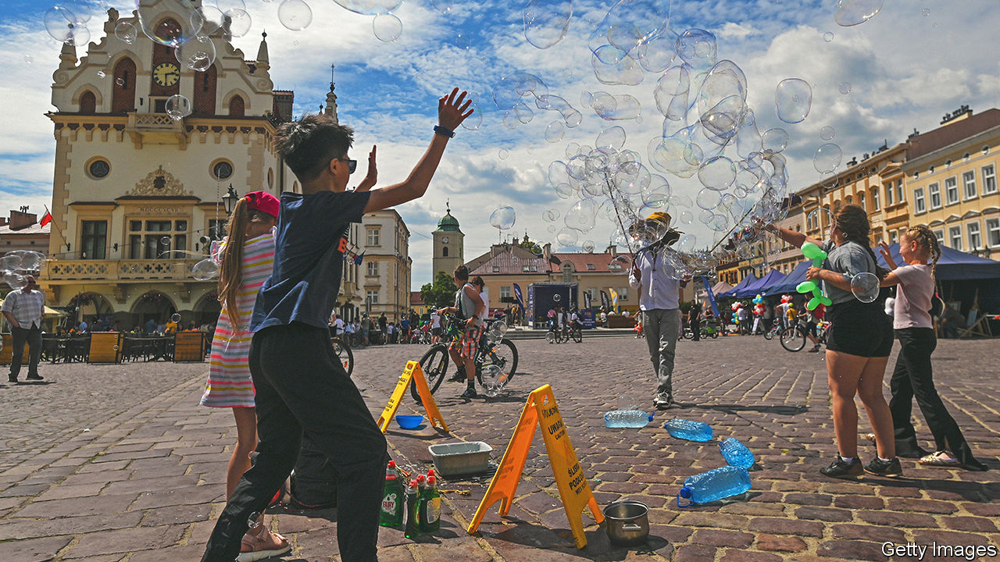

###### Explosive growth

# Weapons shipments turn a Polish city into a boom town 

##### Rzeszow is a key link in American aid to Ukraine 

 

> Jul 7th 2022 

Armoured vehicles pepper the tarmac. Patriot missile batteries, which America deployed here in March, scan the skies overhead. Military planes touch down, offload their cargo and take off, almost around the clock. Inside the arrivals hall a couple of foreign volunteers to fight in Ukraine, including a former American soldier, collect their luggage. The airport just north of Rzeszow, a city in south-eastern Poland, used to handle only a few flights a day. Vladimir Putin’s war has transformed it into the main entrepot for Western weapons destined for Ukraine. It has also transformed Rzeszow itself.

At the start of the year Rzeszow, an hour by train from the Ukrainian border, was the 15th-biggest city in Poland with a population just under 200,000. Since then about 100,000 refugees have arrived; depending on how many have stayed, it may now be the tenth-biggest. Ukrainians are not the only newcomers. Foreign diplomats, American troops and aid workers crowd the hotels and restaurants. A waitress is surprised when a customer speaks Polish.

“But where are the refugee camps?” the city’s mayor, Konrad Fijolek, recalls people asking at the start of the war. There aren’t any to speak of. Only a fraction of the displaced live in shelters. The rest were taken in by locals, or rented places of their own. As soon as the war started, emergency aid, packed onto buses, lorries and passenger cars, began making its way from Rzeszow to western Ukraine. On May 22nd Volodymyr Zelensky, Ukraine’s president, declared Rzeszow Ukraine’s “saviour city”. 

The warmth surprised even the locals. Relations in the border areas had been haunted by memories of atrocities during the second world war: massacres of Poles by Ukrainian nationalists; ethnic cleansing of Ukrainians by Polish partisans and later the communist regime. These fading grudges have been wiped away by Russia’s invasion, says Mr Fijolek. “The Ukrainians are fighting for us,” he says, “so that the Russians don’t get any stupid ideas about coming here.” 

The local economy is thriving. The maker of engines for America’s f-16 fighter jets, one of many aviation companies based in Rzeszow, is the region’s biggest employer. Rzeszow is also an it and pharmaceutical hub. But Ukrainians are struggling to find good jobs. Oksana Hluschko, who ran a pharmacy in Kyiv before the Russians invaded, now cleans rooms at a hotel on the outskirts of town. She has signed up for Polish classes, she says, and plans to become a licensed pharmacist. 

Many Ukrainians who passed through have moved on to bigger cities, or returned home. Ola Filaretova, a ballet dancer from Dnipro, and her two children returned to Rzeszow after a few weeks elsewhere in Poland. Her youngest daughter had missed the city, and the friends she had made here. Mrs Filaretova missed being closer to home. “It’s only 100km to the border,” she says, through tears. “That makes things more bearable.” ■

