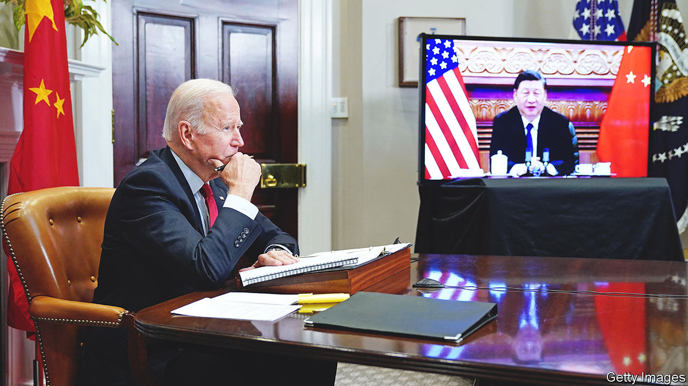
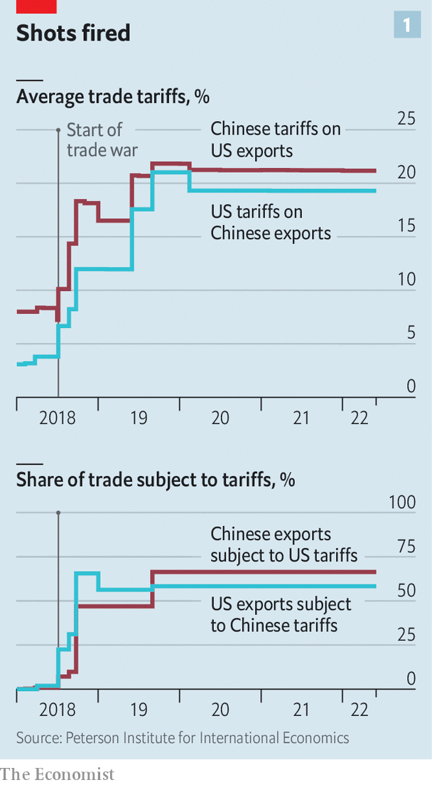

###### Tougher than tariffs

# America rethinks its strategy for taking on China’s economy 

##### The focus is on whether Joe Biden will cut tariffs, but the real action is elsewhere 

 

> Jul 6th 2022 

China is often said to be an area of rare consensus in American politics. Just about everyone agrees that something must be done to counter its rise. But this appearance of unity masks divisions and even confusion about what exactly needs to be done, most of all in the economic domain. Is the ultimate goal to open the Chinese market to American businesses, or to dissolve commercial bonds with China?

For Joe Biden’s administration, these cross-currents have led to prolonged deliberations—so much so that some critics accuse it of paralysis. A seemingly endless debate about whether to remove tariffs on China is the latest example of indecision. Slowly, though, the shape of Mr Biden’s approach to the Chinese economy is emerging. The coming weeks may determine whether it amounts to a resolute, coherent strategy or a mess of contradictions.

The narrative is clear enough. In a speech in May Antony Blinken, America’s secretary of state, boiled down Mr Biden’s China policy to three words: “invest, align, compete”. That is, America should invest in its own strength; align more closely with allies; and confront China where necessary. Putting the spin to one side, these are in fact good categories for understanding how the Biden administration is trying to deal with China’s economy.

 


Start with competition. This took centre-stage under Donald Trump, who dragged America away from a lingering desire to “engage” China towards a sharper rivalry with it. By the time he left office, America’s average tariff on Chinese products had risen from roughly 3% to nearly 20%, according to calculations by Chad Bown of the Peterson Institute for International Economics (see chart 1). The immediate question for Mr Biden is what to do about this inheritance.

With inflation running high, Mr Biden wants to lessen price pressures. Eliminating tariffs on China—which are, in effect, a tax on consumers—would in theory help. In practice it may make a very small contribution. One study from the Peterson Institute estimated that removing the tariffs would shave just 0.3 percentage points off the annual inflation rate, which is now running at more than 8%. On the one hand, every little counts. On the other, Mr Biden is loth do something that would be portrayed by Republicans, and perhaps China itself, as a capitulation.

 


Even within his own administration, many view the tariffs as precious leverage. The most likely outcome will be minor tweaks. Mr Trump’s earlier tariffs went after products such as semiconductors. But later levies hit items like shoes, hurting consumers more directly. Removing tariffs on some consumer products would therefore seem like an easy decision. Beyond that, opposition to cuts grows steelier. “For tariffs on high-tech products or industrial inputs, the Biden administration may want to increase these substantially at the same time that it eliminates others. It needs to determine which are working and which are not,” says Clete Willems, a veteran of Mr Trump’s trade team. Hawks welcome the fact that America imports less from China than it did at the start of the trade war (see chart 2). 

The Biden administration has also debated whether to begin a new probe into China’s economic behaviour. Mr Trump’s big investigation, conducted under section 301 of American trade law (used to tackle problems not solvable within the wto), was focused on China’s “forced technology transfers”. Many in the Biden administration see that as a misdiagnosis. The real issue is China’s broader state capitalism. 

A new 301 investigation could put China’s industrial plans and subsidies at the forefront of America’s economic grievances with it. Intellectually, that would be appealing. “The bigger challenge will be, is the administration ready to do what a 301 says? Is it ready to impose significant new penalties on China?” says Scott Kennedy of the Centre for Strategic and International Studies, a think-tank in Washington. The White House’s delay in announcing a new 301 case, despite talk swirling around it for months, reveals its hesitancy.

Another plank in America’s competition with China is the battery of economic sanctions rolled out against companies. Mr Trump’s administration blazed the trail, placing Chinese industrial champions from Huawei, a telecoms giant, to dji, a dronemaker, on the government’s “entity list”, thereby preventing American companies from selling them any items without permission. By the end of his term, though, his methods were increasingly chaotic, epitomised by his ill-fated demand that the Chinese owner of TikTok, a wildly popular app, spin off its American operations (see Briefing).

Mr Biden’s team has worked to place sanctions on a sounder legal footing, while also making them more targeted. Most of Mr Trump’s corporate blacklistings are still in place. Mr Biden has added to them, including barring American investments in a range of Chinese surveillance-tech companies. It is also considering new rules to block foreign rivals’ access to Americans’ personal data, which may yet ensnare TikTok. Taken together, the Biden approach looks less like a retreat from Mr Trump’s brawl with China and more like a professionalisation of it.

The second part of Mr Biden’s strategy—alignment with allies—sets him much further apart from his predecessor. Whereas Mr Trump revelled in scorning America’s staunchest friends, Mr Biden has steadfastly repaired relations. The cornerstone of his approach to Asia was unveiled in May with the launch of the Indo-Pacific Economic Framework (ipef), tying together countries that represent 40% of global gdp. India, Japan and Vietnam are part of it and, most crucially, China is not. Another fruit of Mr Biden’s efforts was a joint statement at the end of the g7 summit on June 28th pledging to “reduce strategic dependencies” on China (see China section).

There are doubts that these fine words will add up to much concrete action. The messages shared by several Asian diplomats about the ipef are remarkably similar: it is good to have America back at the table, but the only dish on offer is thin gruel. The ipef will include discussions about everything from decarbonisation to data sharing, but there will be nothing on tariffs, a mainstay of traditional trade talks. The Biden administration disputes this characterisation. One senior official points to the ipef’s focus on supply chains, arguing that it will be meaty. With talks starting later this month, the official believes that a deal to accelerate port-clearance times could be reached within as little as a year.

Even if that comes to fruition, there is frustration among many in America and abroad that Mr Biden will not do more on trade. A stubborn bipartisan group of politicians in Washington is still agitating for America to re-enter the Trans-Pacific Partnership, a regional trade deal from which Mr Trump withdrew. Allies such as Japan would love that. They believe forging new supply chains is essential to lessening reliance on China. For the Biden administration, though, the idea is a non-starter; it is fearful of alienating union supporters and angering a trade-wary public. The unsatisfactory conclusion is that Mr Biden’s desire to align with allies in its China strategy can only go so far. 

That speaks to the final element of Mr Biden’s approach: investing at home. This is the area where rhetoric and action are furthest apart. After all, Mr Biden’s signature spending plan, his “Build Back Better” social-and-climate package, has not yet made it through Congress. It is now crunch time for an initiative that was conceived as a response to China. The Senate and House have passed two alternative bills with the same centrepiece: a $52bn plan for bolstering America’s capacity to produce semiconductors. The Senate’s is more modest and has received bipartisan support. The House‘s, almost exclusively backed by Democrats, contains a hotch-potch of measures—including even funding to save coral reefs.

People familiar with talks to bridge the differences say there has been recent progress, bringing the unified bill closer to the Senate’s version. One aspect of the House’s may, in reduced form, survive: the creation of a mechanism that, for the first time, would require American companies to notify the government of overseas spending, raising the possibility that the White House could block some investments in China. For the bill to pass before mid-term elections in November, agreement will probably have to be hammered out before Congress breaks for recess for August. 

Even without that bill, the Biden administration has tried to set the tone for an investment push at home. Mr Trump cajoled and threatened companies to set up factories in America, making limited headway. Mr Biden’s big initiative, grabbing fewer headlines, has been a sprawling review of supply chains. In February the government published six separate reports, covering semiconductors, batteries and more. This hardly equates to industrial policy on a Chinese scale. But the aim is to channel financing and incentives to strengthen America’s manufacturing base.

The Biden plan may be pushing at an open door. Since the start of his administration companies have announced more than $75bn of investments in semiconductor production and research in America. That is in part a response to Mr Biden’s actions, but also a recognition of the fragility of global supply chains. Indeed, perhaps the most useful policy in weaning companies off the Chinese market is Xi Jinping’s foolhardy pursuit of “zero covid”, which has almost walled off the country. 

If Mr Biden does succeed in boosting domestic manufacturing, that victory could well come at the cost of higher prices for consumers, reduced efficiency and, ultimately, lower economic growth. True, he is rebuilding frayed relationships with allies. But in other respects, his economic strategy for dealing with China looks a lot like a refinement of the bare-knuckle competition started by Mr Trump. ■


