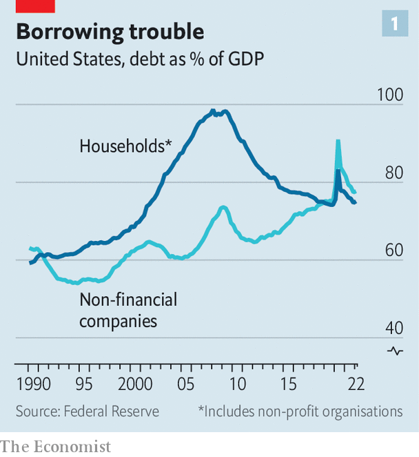
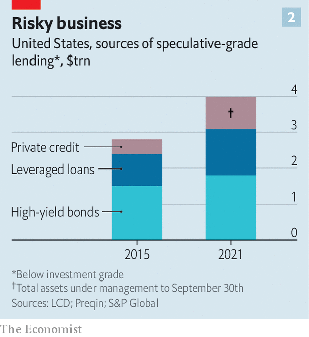

###### Bills, bills, bills

# As interest rates climb and the economy cools, can companies pay their debts? 

##### The risks might lie in shadowy private markets 

 

> Jul 3rd 2022 

Welcome to the American corporate-debt market of 2022. Often the only risky bonds that are being issued are the legacy debts of a now ancient-seeming time—when interest rates were low and . Elsewhere, the high-yield market has almost ground to a halt. A paltry $83bn of risky debt has been issued so far in 2022, 75% less than in the same period last year. 

A sharp rise in interest rates this year has cooled credit markets, wrong-footed investors and complicated bankers’ lives. In January Bank of America, Credit Suisse, Goldman Sachs and a handful of other lenders agreed to finance a $15bn deal for two private-equity firms to buy Citrix, a software firm. They promised to issue the riskiest $4bn of that debt at a maximum interest rate of 9%. At the time, the average yield on bonds with a credit rating of ccc, a speculative grade, was around 8%. 

The Citrix deal is expected to close this month. But the yield on ccc-rated bonds has soared above 14%. Should the bankers be unable to sell the debt below the interest-rate cap they will be on the hook for the difference. “If the market is anything like it is today, they are going to lose hundreds of millions—and potentially a billion—dollars on this deal alone,” says Roberta Goss of Pretium, a debt-investment manager. 

Such potential losses offer a glimpse of the impact that higher rates are having on company borrowing in America. Bankers stand to make losses on the $80bn of buy-out financing they have agreed to facilitate for deals that are yet to close. That will weigh both on their profits, and their willingness to lend. 

Companies are also going to suffer; the only question is how much. A steady fall in interest rates over the past 30 years encouraged firms to borrow record amounts. Now the cost of servicing and refinancing that debt is climbing, profits are being dented by rising costs and  at some firms as demand slows. Does a corporate-debt meltdown loom?

 


America’s last big debt crisis, in 2007-09, was in housing. The stock of household debt relative to gdp had jumped as lenders aggressively issued mortgages and property prices soared. When interest rates rose, borrowers began to default. Some 3m households were eventually foreclosed on in 2008. This time it seems  that households will be the borrowers struggling. Lending standards have been tightened and debt levels have fallen. Household debt to gdp peaked at 99% in 2008 but has since tumbled to 75%. By contrast, corporate debt as a share of gdp, at around 80%, has been at or near record highs over the past two years (see chart 1). 

To understand where problems might arise, it is important to look across the funding options available to firms and their owners. American companies owe around $12.2trn. Some $6.7trn of that is in bonds, mostly issued by large or mid-size public firms. Another $1.2trn is loans from banks, and $1.1trn is mortgage debt. The rest—over $3trn—is financing from non-banks, made up mostly of either private credit, typically loans made for private-equity buy-outs, or “syndicated” loans, which originate in banks but are split into pieces and sold to investors, or sometimes bundled into other debt securities. 

The bond market, as the biggest source of debt, might seem like the natural place to look for trouble. But firms that issued bonds are “relative winners” of the rise in interest rates, says Eric Beinstein of JPMorgan Chase, a bank, because most of them pay fixed coupons. Of the $5trn-worth of corporate bonds issued since the start of 2020 some 87% pay fixed coupons. And those rates are at all-time lows. The average coupon on an investment-grade bond is just 3.6%—half the rate in the early 2000s and still below the level in 2019. That will insulate borrowers as rates rise. 

These fixed-rate bonds are not due to mature soon, either. The high-yield end of the market—the roughly $1.8trn owed by sub-investment-grade issuers, which tend to be smaller or heavily indebted companies—saw a wave of refinancing in 2020 and 2021. The result is that only a tiny $73bn-worth of high-yield bonds are due to mature in 2022 and 2023. The peak of risky-bond maturation will not come until 2029.

 


The impact of rising rates is likely to be much greater in the syndicated-loan and private-debt markets, which typically issue floating-rate debt (though some of that rate risk may have been hedged). They have also seen explosive growth. Between 2015 and 2021 the value of outstanding high-yield bonds rose by 15%. By contrast, leveraged loans, a risky subset of syndicated loans, grew by around 50%. Private credit has more than doubled in size (see chart 2). 

John Kline of New Mountain, a private-credit firm, argues that the growing market share of private credit is a reflection of the fact that it offers issuers price certainty and is “much easier to deal with” than slicing up a bank loan through a syndication process, or issuing a bond. He points out that the barbarian days of private-equity shops leveraging firms at debt-to-total-value ratios of 85% are long gone. The average debt-to-value ratio for private-equity deals last year was closer to 50%.

Still, that ratio is less reassuring once you consider how far private-equity valuations might have fallen this year (the formal figures are revised infrequently, unlike public-market valuations). And with growth seems to have come fresh risk. Compared with the earnings of the firms they bought, debt levels look much higher: equal to an average of six times gross operating profit, a little higher than the record set in 2019 or in any of the past 20 years. “Whenever a market grows quickly, there can be a sort of reckoning if the environment changes,” says Mr Beinstein. The challenge, he adds, is getting hold of any details or data on private deals. In the bright lights of public markets it is easy enough to find evidence suggesting that companies do not face an imminent crisis. The problem is that a chunk of the debt lurks in the shadows. ■


