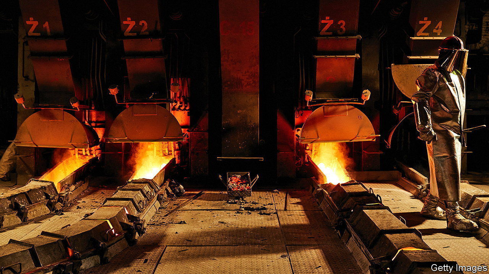
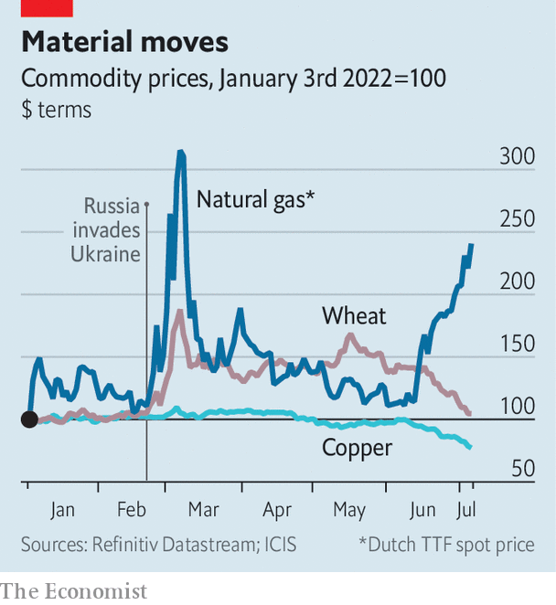

###### Helter skelter

# Do cheaper commodities herald a recession? 

##### Oil, metals and wheat prices are sinking 

 

> Jul 7th 2022 

The war in Ukraine throttled a flow of raw materials that was already being restricted by logistical logjams, bad weather and other disruptions. The result was soaring prices. In March a barrel of Brent crude oil hit $128, and European gas prices were three times higher than they had been just two months earlier. Copper, a trendsetter for all industrial metals, hit a record price of $10,845 per tonne. Wheat, corn and soyabean prices rose by double-digit percentages. The surge turbocharged consumer-price inflation, which, by challenging central banks’ credibility, has given them another reason to raise interest rates. 

Yet in recent weeks the wind has changed. Oil is trading at around $100 a barrel. Copper has dropped below $8,000 a tonne for the first time in 18 months; metals in general have fallen by 10-40% since May. Agricultural-commodity prices are back at pre-war levels. (Europe’s gas prices, which have continued to rise as Russia has cut supply, are bucking the trend.) The slide may fuel hopes that inflation will soon be defeated. But the victory might prove hollow—if there is one at all. 

One explanation for tanking commodity prices is that worries about a recession are taking hold. In this view, rising interest rates are cooling the market for new homes, dampening demand for building materials such as copper and wood, and lowering spending on things like clothing, appliances and cars, which in turn hurts everything from aluminium to zinc. Moreover, some of the supply constraints that contributed to price rises earlier in the year have eased—the weather in grain-growing regions has improved, for instance. Meanwhile, the un is trying to end a blockade on Ukraine’s shipments of wheat. 

 


For central banks, this is mixed news. It suggests that inflation may be beaten even though they have only just begun tightening monetary policy. True, this might be accompanied by a recession, but, because inflation would be tamed without interest rates having to rise too much, the downturn would, perhaps, at least be shallow. 

Worries about the economy are not the only force pushing down prices. Much of the money that has fled commodities, say industry experts, belongs not to physical traders but to financial punters. In the week to July 1st about $16bn flowed out of commodity-futures markets, bringing the total for the year so far to a record $145bn, according to JPMorgan Chase, a bank. In part that reflects rising interest rates. In May America’s long-dated real rates turned positive for the first time since 2020. That made commodities, which do not offer a yield, less attractive to speculators. 

This suggests that commodity-price inflation may not have been slayed. Movements driven by real-rate swings are usually short-lived, says Tom Price of Liberum, an investment bank. The last time one happened, in 2013, prices stabilised within weeks. Prices are also still sensitive to further supply disruptions. Commodity stocks remain 19% below historical average at a time of tight production, meaning there is less of a buffer against shocks. 

Even as some supply problems have eased, triggers for others abound. Energy prices are still vulnerable to Vladimir Putin’s whims. Pricey energy, in turn, would cause metals producers to trim output further, making production tighter still. And the return of La Niña, a harsh climate pattern, for the third consecutive year could disrupt grain harvests worldwide. Prices, in other words, might stay high even if recession hits. ■


