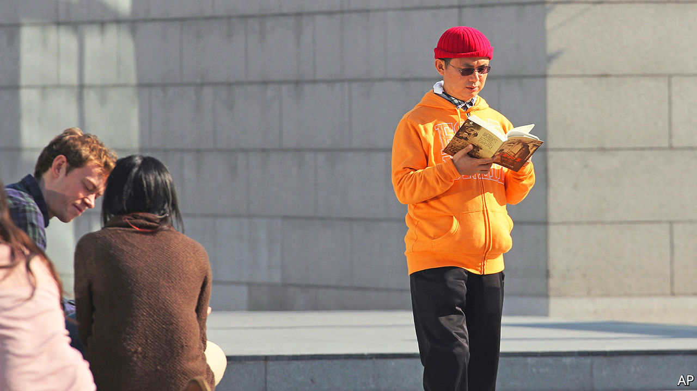

###### Case closed

# What a tycoon’s trial says about the rot in China’s financial system 

##### Even the charges against Xiao Jianhua have not been made public 

 

> Jul 7th 2022 

Insiders have been waiting for half a decade for official word on the whereabouts of Xiao Jianhua, an erstwhile billionaire financier. So far they have heard nothing, not even as his trial kicked off in a Shanghai courtroom on July 4th. All details of the charges he faces have been kept secret. The only official recognition of the trial itself has been from Canada’s foreign ministry (Mr Xiao is a Canadian citizen), which says its diplomats have been denied entry to the proceedings.

For leaders in Beijing, the secrecy is necessary because the case presents an uncomfortable picture of the Chinese political and financial system. Not long ago Mr Xiao counted some of China’s most powerful families as clients. His dealings have been linked to many elite families including, according to the , that of Xi Jinping, the president. This alone makes his trial extremely sensitive.

Mr Xiao was abducted by Chinese agents from his suite in the Four Seasons hotel in Hong Kong in early 2017, in violation of local law. He has been held for five years at an undisclosed location in Shanghai as he helps financial authorities untangle his business empire. Mere recognition that he is in China is a prickly fact officials would prefer to sidestep. 

Many of the details of Mr Xiao’s case may never be revealed to the public. But his tribulations have already laid bare some of the hidden risks lurking within China’s financial system. His conglomerate, Tomorrow Group, once controlled a vast array of assets from mining and property to banking and insurance. Over the years his network built up huge debts, which quickly turned into financial losses after he was abducted. The Chinese state was forced to take over his bank, Baoshang Bank, in 2019 in order to prevent spillovers to the wider system. Several other institutions were also eventually bailed out or seized in what posed one of the biggest threats to China’s financial system in years. 

Once-hidden risks such as these are now popping up in other corners. Poor oversight of smaller lenders has led to an accumulation of bad debt. In many cases tycoons such as Mr Xiao have been allowed to control banks and use them to lend to their own ventures, or to friends.

Central auditors recently discovered that a handful of small banks had understated their bad debts by a total of more than 170bn yuan ($25bn). The central bank has said there are more than 300 high-risk institutions in the country. All this is starting to test public trust in the thousands of small lenders. Bank runs are occurring more frequently. In May depositors at several rural banks in Henan province discovered they could no longer withdraw billions of dollars in funds, leading to protests in the provincial capital of Zhengzhou. The banks are linked to a property tycoon. 

Covid-19 is making the problems worse. Lockdowns are expected to create a new wave of troubled loans worth 1.1trn yuan this year alone. Adam Liu of the National University of Singapore recently noted that a “systematic central bail-out is increasingly foreseeable”. Political intrigue can be contained in a closed court. But the financial spillovers are harder to keep secret. ■


