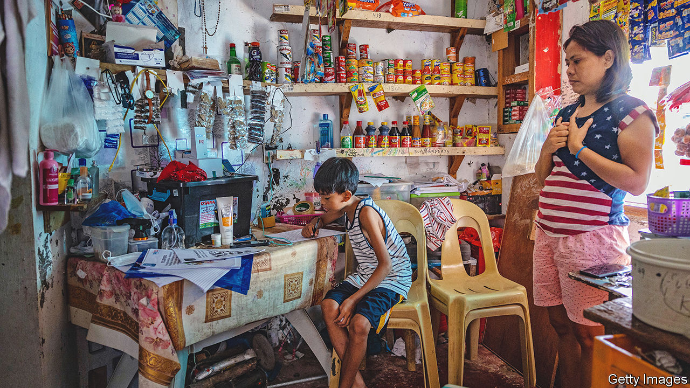
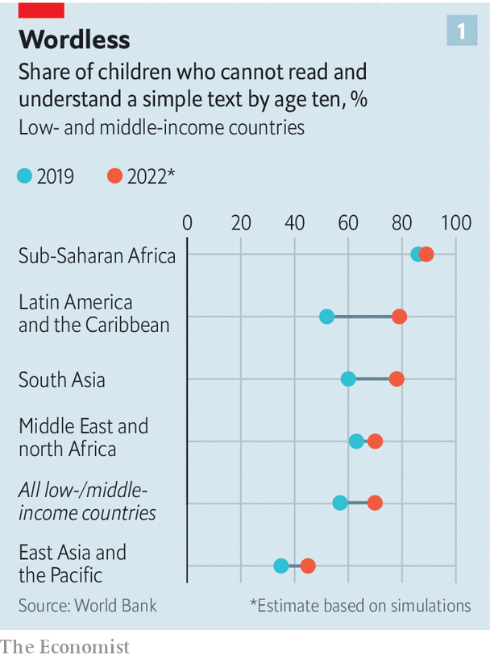
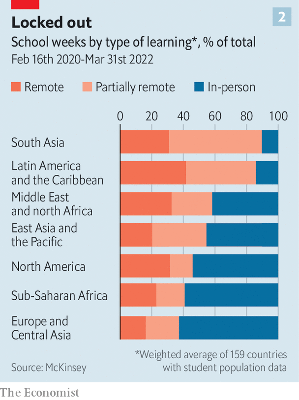
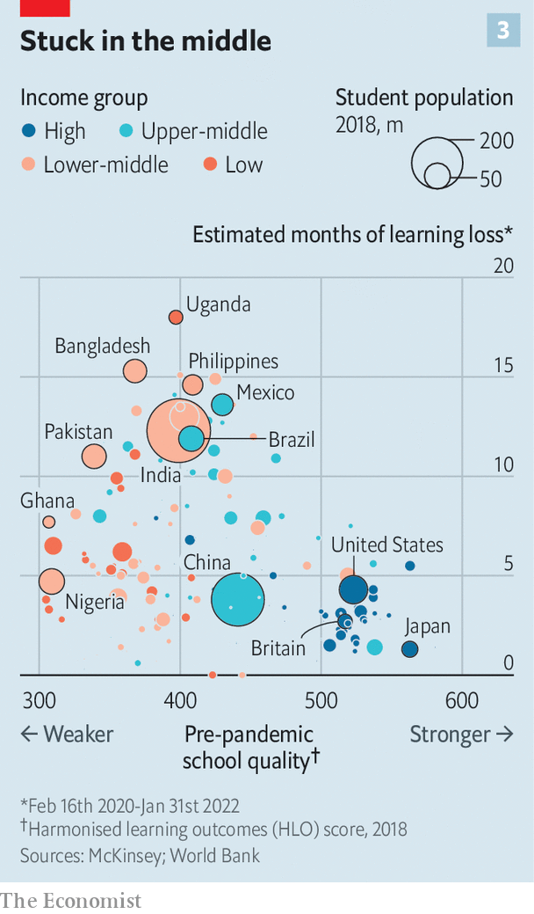

###### Wasted minds

# Covid learning loss has been a global disaster 

##### Millions of children are still out of school. The costs are stacking up 

 

> Jul 7th 2022 

King norvic tarroyo lives with his parents and five siblings in a slum near the sea wall in Manila, the capital of the Philippines. The eight-year-old has not set foot in a school since March 2020, when classrooms closed as a precaution against covid-19. Twenty-seven months later his school, like thousands of others across the country, remains shut. A year ago teachers gave him a tablet computer for remote learning. But his mother says he uses it for only a few hours each day. After that, he pretends to snooze or scampers into alleys near his home. His mum sometimes does his schoolwork for him.

The Philippines’ response to covid-19 has been terrible for its children. For the first seven months of the pandemic the country’s 27m pupils received no classes of any kind. For more than a year children in much of the Philippines were not even supposed to leave their homes. Since the start of 2022 about 80% of government schools have been granted permission to restart some limited face-to-face lessons. But not all of them have chosen to do so. Perhaps two-thirds of children have not yet been invited back to school at all. 

When covid-19 first began to spread around the world, pausing normal lessons was a forgivable precaution. No one knew how transmissible the virus was in classrooms; how sick youngsters would become; or how likely they would be to infect their grandparents. But disruptions to education lasted long after encouraging answers to these questions emerged. 

 


New data suggest that the damage has been worse than almost anyone expected. Locking kids out of school has prevented many of them from learning how to read properly. Before the pandemic 57% of ten-year-olds in low and middle-income countries could not read a simple story, says the World Bank. That figure may have risen to 70%, it now estimates. The share of ten-year-olds who cannot read in Latin America, probably the worst-affected region, could rocket from around 50% to 80% (see chart 1).

Children who never master the basics will grow up to be less productive and to earn less. McKinsey, a consultancy, estimates that by 2040 education lost to school closures could cause global gdp to be 0.9% lower than it would otherwise have been—an annual loss of $1.6trn. The World Bank thinks the disruption could cost children $21trn in earnings over their lifetimes—a sum equivalent to 17% of global gdp today. That is much more than the $10trn it had estimated in 2020, and also an increase on the $17trn it was predicting last year. 

 


In many parts of the world, schools were closed for far too long (see chart 2). During the first two years of the pandemic countries enforced national school closures lasting 20 weeks on average, according to unesco. Periods of “partial” closure—when schools were closed in some parts of a country, or to some year groups, or were running part-time schedules—wasted a further 21 weeks. Regional differences are huge. Full and partial shutdowns lasted 29 weeks in Europe and 32 weeks in sub-Saharan Africa. Countries in Latin America imposed restrictions lasting 63 weeks, on average. That figure was 73 weeks in South Asia.

Over two years nearly 153m children missed more than half of all in-person schooling, reckons unesco. More than 60m missed three-quarters. By the end of May pupils in 13 countries were still enduring some restrictions on face-to-face learning—among them China, Iraq and Russia. In the Philippines and North Korea, classrooms were still more or less shut.

Poorer countries stayed closed longer than their neighbours. Places with low-performing schools kept them shut for longer than others in their regions. Closures were often long in places where teachers’ unions were especially powerful, such as Mexico and parts of the United States. Unions have fought hard to keep schools closed long after it was clear that this would harm children. 

School closures were also long in places where women tend not to hold jobs, perhaps because there was less clamour for schools to go back to providing child care. Many children in the Philippines live with their grandparents, says Bernadette Madrid, an expert in child protection in Manila. That made people cautious about letting them mingle in the playground.

Places where schooling is controlled locally have found it harder to reopen. In highly centralised France, President Emmanuel Macron decreed that all but the eldest pupils would return to school nationwide before the end of the 2020 summer term. It was the first big European country to do this. This gave other countries more confidence to follow. By contrast, decisions about reopening in places such as Brazil dissolved into local squabbles. In America a full year separated the districts that were first and last to restart properly. 

India, which has one-fifth of the world’s schoolchildren, suffered unusually long closures. Rakshit Mamumkar was 13 when his school near Mumbai shut its doors two years ago. He found himself with nothing to do and nowhere to go. Some days he and his 10-year-old brother played cricket in the small brick house in which they live with their mother, a domestic helper. But mostly, he says, “I would just watch tv and sleep.”

Rakshit’s classrooms stayed closed from March 2020 until February this year, save for a few weeks in late 2021. For some of that time he took a job helping the neighbourhood ironing man, for whom he collected and delivered clothes. His mother needed the money: her earnings had fallen by half at the start of the pandemic, and her sons were no longer eating free at school. Eventually she scraped together enough cash to buy a second-hand smartphone so Rakshit could keep learning. She had to borrow some of it from an employer.

Mexico enforced one of the world’s longest nationwide school closures, lasting more than 50 weeks. In theory its schools are now open but many children are absent. In Colegio Laureles—a school in Chiapas, Mexico’s poorest state—staff are trying simultaneously to teach children in the classroom and remotely. Ten months after Mexico’s classrooms started to reopen, perhaps only half of that school’s pupils have returned. Some are still in places their families went to during the pandemic, such as Argentina and Brazil. Many parents remain too worried about infection to let their children attend in person, says David Gómez, one of the school’s bosses.

Youngsters who are back in their seats sound overjoyed to be there. “We used not to want to come to school,” says José Emilio Robles, 16. “Now we really do.” Most think they learned little when schooling was remote. They were supposed to send teachers photos of the work they had completed. Sometimes these were too fuzzy to be useful; sometimes they tried to cheat. Monserrath Gómez, 16, says that when asked to send evidence of having done her pe lesson she was tempted just to “pose for a photo” in her gym kit.

A paper published in May by analysts at the World Bank, Harvard and the Brookings Institution looks at 35 studies of learning loss from 20 mostly rich countries. It finds that the average loss across these studies was equivalent to what would usually be learned in one-third to one-half of a year of normal schooling. 

In England test scores at the start of the 2021-22 school year suggest that primary-school kids were almost two months behind where they should be in maths, and one month in reading. Similar research in America found that children were on average between 8-19 weeks behind.

In some countries the results were truly dire. In South Africa primary schoolchildren tested after a 22-week closure were found to have learned only about one-quarter of what they should have. Brazilian secondary-school pupils who had missed almost six months of face-to-face school did similarly dreadfully. A study of 3,000 children in Mexico who had missed 48 weeks of in-person schooling suggests they appeared to have learned little or nothing during that time. 

For the moment rigorous information on learning loss comes from only about one-sixth of countries, most of them rich ones. Back-of-the-envelope calculations published by McKinsey try to fill in the blanks. They combine several sets of data: how much schoolchildren usually learned in every country before schools closed; how long they shut classrooms for; and how effective their efforts at distance learning were likely to have been. (Estimates of this last measure were based on how rich each country is.)

A learning experience

Their results (see chart 3) suggest that globally schoolchildren may be eight months behind where they would normally be. The damage may be massive in many middle-income countries, which are together home to about 75% of all school-age children. The lag in lots of those places could be 9-15 months. These countries generally kept school buildings closed longer than rich ones, and probably did a worse job of teaching remotely. 

 


The estimated effect of the pandemic on education in poor countries was less awful. The most likely explanation, alas, is that schools in such places were so bad before the pandemic that children did not miss out as much when they closed. 

Around the world children have fallen further behind in maths than in reading. Pupils of primary-school age have drifted further back than older ones. Learners who were doing worse before the pandemic have generally dealt worse with the disruptions. And studies everywhere find that within each country, poorer children appear to have suffered more than richer ones. A paper from America examines the progress of children in schools that stayed remote for longer than half of the 2020-21 school year. It finds children enrolled at institutions which had lots of poor pupils lost nearly twice as much learning during that time as did those in schools where children were mostly better off.

To reduce the harm caused by school closures, countries will have to pull out all the stops to help children catch up. A good start would be to get them all back into classrooms. Even then, “business as usual” won’t do, says Jaime Saavedra of the World Bank. Children who have not received the right support when they have returned to school may still be falling behind.

Before the pandemic many teachers had to struggle through dense curriculums packed with inessential stuff. Their task is made harder by the way the pandemic has widened the gap between the best- and worst-performing students in each class. Pupils who found schooling tiresome before covid are even more disengaged now. Many have dropped out. Trying to race pupils through more material in less time may prompt even more to give up.

Three-quarters of countries have put some thought into catch-up, according to a survey by unicef. Nearly 70% of those have slimmed down curriculums. Efforts in Indonesia and South Africa to carve out more of the school day for reading and maths are especially notable, boffins say.

Rich countries have commonly put money into tutoring, which is the most reliable way of helping struggling students. That is expensive, but need not lie out of reach in poorer places. In Bangladesh an experiment that provided tutoring over the phone during school closures saw pupils’ literacy improve about 50% faster than for those who did not receive the calls. A similar scheme in Nepal boosted learning in maths by 30%. Results from that pilot suggested it could raise a child’s achievement by an amount normally bestowed by a full year of school, for a cost of around $100.

In Botswana, India and Zambia students are getting catch-up classes of a type pioneered by Pratham, an Indian ngo. Teaching at the Right Level encourages teachers to use brief oral tests to sort students according to how much they know, rather than by age. These groups meet daily for short lessons in maths and reading. Before the pandemic similar classes in Uttar Pradesh, India’s largest state, raised the share of students who could read a paragraph from 15% to 48% after just 50 days.

Ring the bells

Data from a few rich countries suggest that schoolchildren in those places are gradually catching up. Although primary-school pupils in England are about two months behind in maths, that is much better than in autumn 2020, when they lagged by three-and-a-half months. By last autumn third-graders in Ohio had made back two-thirds of the learning that was found to have been lost by the start of the 2020-21 school year (when they were about one-third of a year behind where they would normally have been).

Before covid-19 governments in many developing countries were overlooking egregious failures in their education systems. Optimists hope that the pandemic could spur them to start fixing the problems. Schemes to recover lost learning could lead to permanent reforms. Never before has there been so much good evidence about what works to improve schooling at scale, says Benjamin Piper of the Bill &amp; Melinda Gates Foundation.

Yet this is only one possible outcome. Schools in a quarter of countries still have no plans for catch-up, says unicef. Fewer than half of governments have scribbled strategies that are national in scale. Poor children are clawing back time more slowly than wealthier ones. “The costs are astounding if we don’t fix them,” says Noam Angrist, an education specialist at the University of Oxford. 

Half of countries cut funding for education in 2020, the year school buildings first closed. The share of foreign aid that goes to education declined. A quarter of poor countries are not keeping track of how many pupils have returned to school. Going after dropouts while there is still a chance to tempt them back is urgent. “It could be hopeless in six months,” says Abhijit Banerjee, an economist and Nobel prize winner. 

Mr Saavedra says school closures have caused perhaps “the worst educational crisis for a century, and certainly since the world wars”. He worries that too few countries have recognised the scale of the disaster, and that the true cost will not be visible for years. “My fear is that 15 years from now people will be writing papers documenting consistently lower earnings, productivity and well-being for people who are now between six and 20 years old,” he says. “I don’t see societies taking this seriously.”

Teachers in Chiapas, and across Mexico, agree that children are struggling. They are “two years” behind where they should be, says Vianney Narváez, a teacher in Mexico City. “The main focus has had to be on whether they are okay, not their education.” Teachers report that basic skills such as handwriting and spelling have gone backwards. School buildings have decayed. Some were looted or damaged during long closures. Parents have been asked to chip in for repairs.

Mexico has not done any national testing that could show how far children have fallen behind. Only three of its 32 states have run big assessments. The government has extended this school year into the summer. But there is no other national plan, nor new funding, to drag back drop-outs and drive catch-up. “It is a deep tragedy,” says Marco Fernández of the Monterrey Institute of Technology. 

No one in the Philippines can say when normal schooling will resume. Ruby Ana Bernardo, a teacher in Manila, says the number of children who show up for her online lessons is dwindling. The government wants all schools to offer face-to-face classes during the coming school year. But to begin with this will be only part-time.

Filipino parents are still afraid of the virus, and not kicking up a fuss. The crisis in schooling played remarkably little role in campaigning for the country’s presidential election, which was won in May by Ferdinand Marcos, the son of a crooked dictator. Ms Madrid in Manila says she thinks some wealthy pupils will be able to make up for time wasted during the pandemic. But for the average child, she fears, these years “will be lost”. ■


