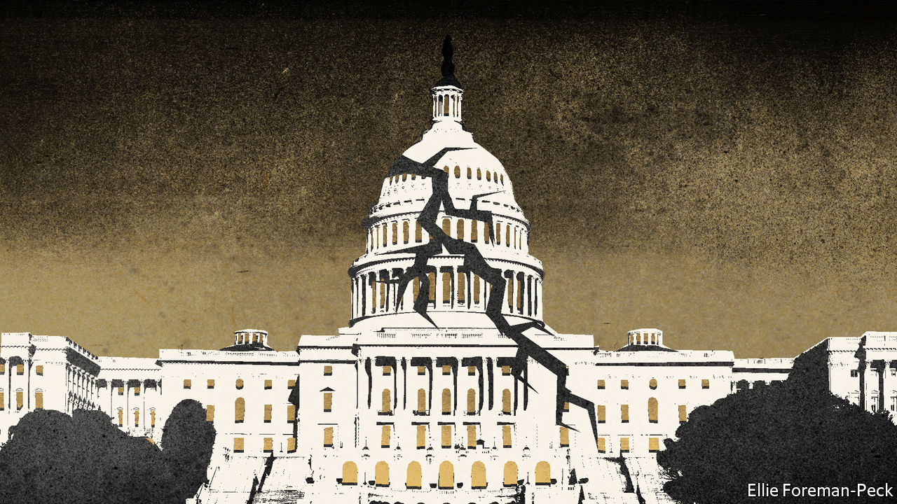

###### After Roe

# America’s new exceptionalism 

##### America has a set of laws on important subjects that do not reflect the views of Americans 

 

> Jul 7th 2022 

If a woman in Texas has an  she is breaking the law, even if her pregnancy is the result of a rape. The same woman may, however, buy an  capable of firing 45 rounds a minute, and she may carry a pistol on her hip when picking her toddler up from pre-school. In these, and in a few other ways, America is an outlier compared with other rich democracies. You might assume that this simply reflects the preferences of voters. You would be wrong: it is the result of a political failure.

American exceptionalism once seemed to be the cause of all sorts of transatlantic differences, for good and ill. America’s greater religiosity explained the intensity of the culture wars over gay marriage and abortion. Greater individualism explained the dynamism of America’s entrepreneurial economy, the willingness to move in search of something better and also, unfortunately, the passion for guns.

This diagnosis is no longer accurate. Before  hit, internal migration was at its lowest since records began. The share of Americans who belong to a church, synagogue or mosque has fallen from 70% in 2000 to below 50% now. The birth rate is the same as in France.

As America has become less exceptional in these ways, so has its public opinion. On abortion, Americans’ views are strikingly close to those in other rich countries. A  think it should be legal in the first trimester and restricted thereafter, with exemptions if the mother’s health is at risk, and for rape and incest—a qualifier that should be redundant, but is included because six Republican state legislatures  with no such exemptions. Support for gay marriage, at 40% in 2000, is at 70% now. Americans are about as accepting of homosexuality as Italians are, and more tolerant than the Japanese or Poles.

On climate change, American attitudes are remarkable in their ordinariness. Three-quarters of Americans are willing to make some changes to their lives to help reduce the effects of climate change. That is slightly higher than the share of Dutch who say the same, and about level with Belgium. On guns, America truly is an outlier: it is the only country with more civilian-owned firearms than people. But here too the overall picture is misleading: 60% of American homes have no guns in them, up from 50% in 1960. A clear majority favours banning guns that can fire lots of bullets quickly.

Yet despite this, America has not banned assault weapons, nor legalised abortion or gay marriage through the normal democratic process. Ireland, where anti-abortion sentiment has historically been stronger, has come to a democratic settlement on abortion—as has Japan, where a woman’s right to choose is less popular than in America. Switzerland, nobody’s idea of a forward-thinking place (it gave women the right to vote only in 1971), has legalised gay marriage through a referendum. America and Italy are the only members of the g7 that have not enshrined net-zero emissions targets in law.

America has been unable to settle any of these questions through elections and votes in legislatures. The federal right to abortion was created by the Supreme Court in 1973. The closest thing to a national climate law came in 2007 when the Court decided the president could regulate carbon emissions. Then in 2015 the Court decided gay marriage was a constitutional right. In all three cases the Court stepped in when Congress had failed to legislate. Now that the Court has reversed one of those decisions and some justices are talking about undoing the others, the costs of this political abdication are ever more apparent.

The solution sounds easy: Congress should pass laws that reflect public opinion. In practice, assembling a House majority, 60 votes in the Senate and a presidential signature for anything vaguely controversial is extraordinarily hard. The result is a set of federal laws that do not reflect what Americans actually want. That is what is exceptional now. ■


