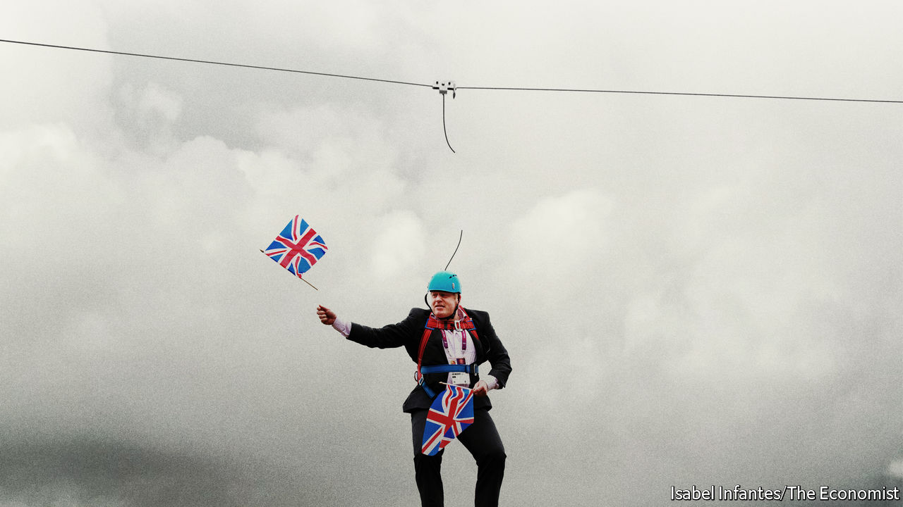

###### Britain after Boris Johnson

# Boris Johnson should go immediately 

##### Britain is in a dangerous state 

 

> Jul 7th 2022 

Boris johnson’s government has collapsed at last. For months Britain’s prime minister wriggled out of one scandal after another. Now, irretrievably rejected by his own mps, he has accepted that his premiership is over. He has asked to stay until the autumn, but he should go immediately.

Mr Johnson was brought down by his own dishonesty, so some may conclude that a simple change of leadership will be enough to get Britain back on course. If only. Although  are all over today’s mess, the problems run deeper than one man. Unless the ruling Conservative Party musters the fortitude to face that fact, Britain’s  will only worsen.

Right up until the end Mr Johnson clung desperately to power, arguing that he had a direct mandate from the people. That was always nonsense: his legitimacy derived from Parliament. Like America’s former president, Donald Trump, the more he hung on the more he disqualified himself from office. In his departure, as in government, Mr Johnson demonstrated a wanton disregard for the interests of his party and the nation. 

Although the denouement took almost two excruciating days, his fate was sealed on July 5th when two cabinet ministers resigned. The catalyst was the behaviour of his party’s deputy chief whip, accused by two men of a drunken . Downing Street lied about what the prime minister had known of the whip’s record of abuse, and sent out ministers to repeat its falsehoods—just as it had months earlier over illegal parties in the pandemic. Despairing of yet another scandal, over 50 ministers, aides and envoys joined an executive exodus so overwhelming that the bbc featured a ticker with a running total to keep up. In the end the government had so many vacancies that it could no longer function—one reason Mr Johnson should not stay on as caretaker.

The party will hope that its agony is now drawing to a close. But that depends on it taking the right lessons from Mr Johnson’s failure. One is about character in politics. Mr Johnson rejected the notion that to govern is to choose. He lacked the moral fibre to take hard decisions for the national good if that threatened his own popularity. He also lacked the constancy and the grasp of detail to see policies through. And he revelled in trampling rules and conventions. At the root of his style was an unshakable faith in his ability to get out of scrapes by spinning words. In a corner, Mr Johnson would charm, temporise, prevaricate and lie outright. Occasionally, he even apologised.

As a result, the bright spots in his record, such as the procurement of vaccines against covid-19 and support for Ukraine, were overwhelmed by scandal elsewhere. Behind the unfolding drama was a void where there should have been a vision. Crises were not a distraction from the business of government: they became the business of government. As the scandals mounted, so did the lies. Eventually, nothing much else was left.

Conservatives have been quick to blame everything on Mr Johnson’s character. But his going will be cathartic only if they also acknowledge a second, less comfortable truth. He was an answer to the contradictions in his party. Many of today’s Tory mps belong to the low-tax, more libertarian and free-market tradition, but others, many from northern constituencies, cleave to a new big-spending, interventionist and protectionist wing. They won Mr Johnson an 87-seat majority in the last election and are vital to Conservative fortunes in the next. 

The charismatic Mr Johnson was able to lash these factions together because he never felt the need to resolve their contradictions. Instead he was for both protectionism and free-trade agreements; he wanted a bonfire of red tape even as he punished energy firms for high prices; he planned huge government spending but promised sweeping tax cuts.

This is the politics of fantasy, and you can trace it back to Brexit. In the campaign to leave the European Union Mr Johnson promised voters that they could have everything they wanted—greater wealth, less Europe; more freedom, less regulation; more dynamism, less immigration—and that the eu would be knocking on Britain’s door desperate for a deal. It worked so well that fantasy became the Tories’ organising principle. 

Nowhere more than in the economy, the third lesson the next government must learn. Mr Johnson often boasted that Britain’s economic record was the envy of the world, but he was spinning words again. The truth is that the Britain he will leave behind faces grave social and economic problems. 

It has the highest inflation in the g7, which lavish government spending using borrowed money could well entrench. As we wrote recently, average annual gdp growth in the decade leading up to the global financial crisis of 2007-09 was 2.7%; today the average is closer to 1.7%. Britain is stuck in a 15-year low-productivity rut. The country is forecast to have the slowest growth in the g7 in 2023. 

What is more, this spluttering engine faces extraordinary demands. Industrial action is spreading from the rail unions to lawyers and doctors. As the cost of living rises, a coherent and determined government is needed to hold the line on spending. Britain is ageing. From 1987 to 2010, when the Tories took office, the share of the British population aged over 65 was steady, at 16%. It is now 19% and by 2035 will be close to 25%, adding to the benefits bill and the burden on the National Health Service, already buckling under the weight of untreated patients.

Britain also needs to speed its transition to a net-zero-emissions economy, requiring a vast programme of investment. It has ambitions to count in a world where Russia and China throw their weight around, but its armed forces are small and under-equipped. Scotland and Northern Ireland are restless in the Union and Westminster has no plan to make them content. 

Britain is in a dangerous state. The country is poorer than it imagines. Its current-account deficit has ballooned, sterling has tumbled and debt-interest costs are rising. If the next government insists on raising spending and cutting taxes at the same time, it could stumble into a crisis. The time when everything was possible is over. With Mr Johnson’s departure, politics must once more become anchored to reality. ■


