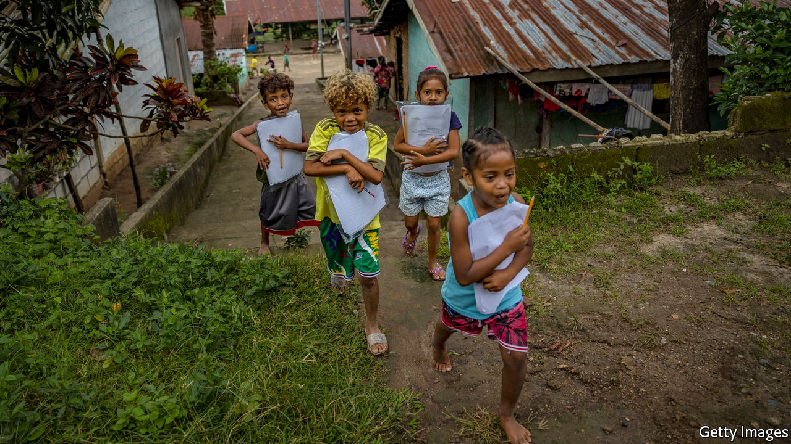

###### Crisis in the classroom

# Governments are ignoring the pandemic’s disastrous effect on education 

##### Neglected pupils will suffer for the rest of their lives 

 

> Jul 7th 2022 

If history is “a race between education and catastrophe”, as H.G. Wells once put it, education seemed until recently to be winning. In 1950 only about half of adults globally had any schooling; now at least 85% do. Between 2000 and 2018, the proportion of school-age children who were not enrolled in classes fell from 26% to 17%. But the rapid rise in attendance masked an ugly truth: many pupils were spending years behind desks but learning almost nothing. In 2019 the World Bank started keeping count of the number of children who still cannot read by the time they finish primary school. It found that less than half of ten-year-olds in developing countries (home to 90% of the world’s children) could read and understand a simple story. 

Then the pandemic struck and hundreds of millions of pupils were . At first, when it was not yet known whether children were vulnerable to  or were likely to spread the virus to older people, school closures were a prudent precaution. But in many places they continued long after it became clear that the risks of reopening classrooms were relatively small. During the first two years of the pandemic more than 80% of schooldays in Latin America and South Asia were disrupted by closures of some sort. Even today schools in some countries, such as the Philippines, remain shut to most pupils, leaving their minds to atrophy.

Globally, the harm that school closures have done to children has vastly outweighed any benefits they may have had for public health. The World Bank says the share of ten-year-olds in middle- and low-income countries who cannot read and understand a simple story has risen from 57% in 2019 to roughly 70%. If they lack such elementary skills, they will struggle to earn a good living. The bank estimates that $21trn will be wiped off their lifetime earnings—equivalent to about 20% of the world’s annual gdp today.

This should be seen for what it is: a global emergency. Nearly every problem that confronts humanity can be alleviated by good schooling. Better-educated people are more likely to devise a cleaner energy source, a cure for malaria or a smarter town plan. Workers who can read and manipulate numbers are more productive. Bookish populations will find it easier to adapt to climate change. They will also have fewer babies, and educate them better. If the damage the pandemic has done to education is not reversed, all these goals will be harder to reach. 

Politicians talk endlessly about the importance of schooling, but words are cheap and a fit-for-purpose education system is not. Spending has risen modestly in recent decades but fell in many countries during the pandemic. Scandalously, many governments spend more on rich pupils than they do on poor ones. Moreover, too little development aid goes to education, and some is self-interested. A chunk goes to donor countries’ own universities, to fund scholarships for the relatively well-to-do from poor places. Such exchanges are welcome, but funding primary schools in poor countries does more good.

Many of the most critical changes are not things that money will buy. Testing is a mess, leading governments to overestimate levels of literacy. New teachers have been hired but not trained properly. Lessons in reading and maths are too often cut short to make room for instruction in whatever other subjects happen to be faddish, from the moral certainties of left-leaning Westerners to the thoughts of Xi Jinping. Teachers, who have come through the same education systems they are supposed to be improving, often struggle to teach. They would benefit from clear lesson plans, as well as the freedom to pause and help children who have fallen behind. Politicians must stop pandering to teachers’ unions, many of which want schools to be run for the comfort of unsackable adults, rather than for the benefit of pupils.

At present a quarter of countries do not have any plans to help children claw back learning lost during the pandemic, according to a survey carried out earlier this year by unicef. Another quarter have inadequate catch-up strategies. The same energy that was once poured into building schools and filling up classrooms should now be used to improve the lessons that take place within them. At stake is the future not only of the generation scarred by the pandemic, but of all the pupils who will come after them. No more children should stumble through their school days without learning to read or add up. ■


