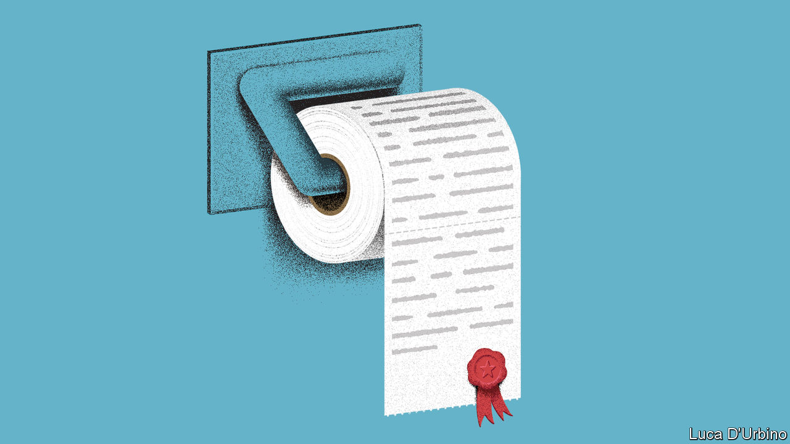

###### Magna mistake

# Voters should reject Chile’s new draft constitution 

##### It is a fiscally irresponsible left-wing wish list 

 

> Jul 6th 2022 

When angry and  took to the streets of Santiago, Chile’s capital, in 2019 and 2020, their grievances were manifold. Students marched against costly tuition; others demonstrated against the country’s  and threadbare health care. Many blamed Chile’s ills on one document: the constitution adopted in 1980 under Augusto Pinochet, the dictator who ruled from 1973 to 1990. 

To quell the protests, in which at least 30 people died, the centre-right government of the day agreed to have a . A constituent assembly of 155 people was elected, many of them from social movements rather than established parties. The  of their haggling was released on July 4th. It is absurdly long, with 388 articles. It is also fiscally irresponsible and sometimes dotty. 

To be fair, it omits some of the worst ideas aired in the assembly, which was dominated by leftists. These included nationalising all natural resources (mining generates 12% of gdp) and scrapping the upper house. The central bank retains its independence, though its remit has been expanded to include “employment protection, care for the environment and the natural heritage”. 

A few ideas are laudable. The document would require the devolution of some powers to regions, and would give indigenous people the right to be taught in their own languages in schools. It seems to require laws to be passed to legalise abortion and assisted suicide. 

But overall the draft is a confusing mess, full of woolly language that more or less guarantees decades of squabbling about what it actually means. “Nature” would be given rights. The draft mentions “gender” 39 times. Court rulings, the police and a national health system will have to operate with a “gender perspective”, which it does not define.

The document is far less business- or growth-friendly than the current constitution. It gives trade unions the sole right to represent workers, guarantees them a say in corporate decision-making and allows them to strike for any reason, not just those relating to work. It says that everyone has the “right to work” and that “all forms of job insecurity are prohibited”. That could make it rather hard to fire anyone. Landowners, such as farmers, could potentially lose the property rights to water on their land. Compensation for expropriated land would not be at a market price but at whatever Congress deems a “just” one. 

The draft creates a portfolio of socioeconomic rights that could blow up the budget. It requires the establishment of several new bodies, such as an integrated national health system, and cradle-to-grave care, without giving much thought to how they would be funded. The state would oversee the provision of housing, to which it says every person has a right. Property speculation would be banned. So would for-profit education. 

Legal checks and balances on the government would be watered down. A new council would have power over all judicial nominations; previously the Supreme Court, the president, the court of appeals and the Senate all had a role. The draft upends the budget process by giving Congress new powers to propose spending bills, although the president can veto them.

The document is ridiculously broad. It says the state should “promote the culinary and gastronomic heritage” of Chile and recognise “spirituality as an essential element of the human being”. Everyone has a “right to sports”. Non-humans get a look in, too: the state will promote “education based on empathy and respect for animals”.

Chile’s old constitution was hardly perfect. Indeed, it has been amended nearly 60 times. But compared with its proposed replacement, it is a paragon of clarity. More importantly, the old blueprint for governing works. Since democracy was restored, Chile has been a Latin American success. gdp per person has tripled since 1990 and poverty has fallen. 

Rather than scrapping the old constitution, Chileans should scrap the new one. When the draft is put to a referendum in September, they should reject it. Congress should then make a determined effort to reform the existing constitution to salve Chile’s discontent, for example by making it easier to build a strong welfare state. That may sound uninspiring to those who . But in the long run it is far more likely to make Chile prosperous—and governable. ■

