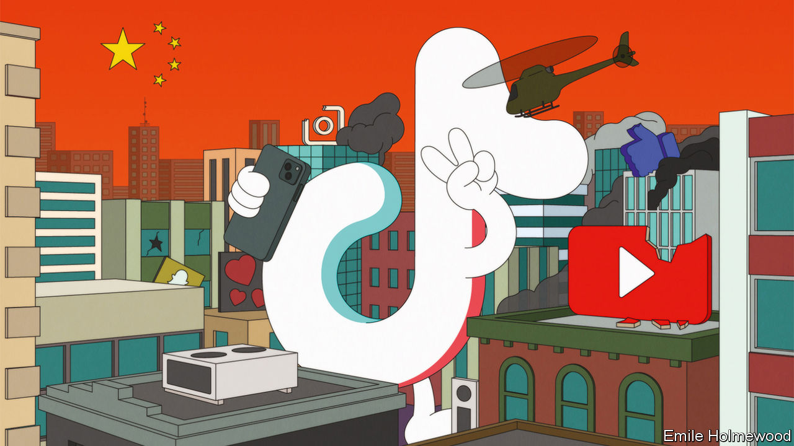

###### Social media and security

# Who’s afraid of TikTok? 

##### The world’s most exciting app is also its most mistrusted 

 

> Jul 7th 2022 

With its wholesome dancing and lip-syncing videos, TikTok once billed itself as “the last sunny corner on the internet”. Since launching just five years ago the app has brought a warm glow to its 1bn-plus users, as well as an icy dash of competition to the social-media incumbents of Silicon Valley. With its rise, a part of the tech industry that had seemed closed to competition has been .

Yet even as TikTok delights consumers and advertisers, others believe the sunny app has a dark side. ByteDance, its owner, has its headquarters in China, whose government is  and propaganda—making it a worrying place for a media app to be based. As  and as elections loom in America, there is a brewing bipartisan storm in Congress over its supposed role as a “Trojan horse”.

The hype about TikTok is justified—and so are the concerns. The app has transformed competition in social media. Yet unchecked, it presents a  to the Chinese Communist Party’s enemies. Finding a way for TikTok to operate safely in the West is a test of whether global business and the global internet can remain intact as us-China relations deteriorate.

Beneath TikTok’s simple interface lies fearsomely advanced  (ai). Its knack for learning what people like helped TikTok sign up its first 1bn users in half the time it took Facebook. In America the average user spends 50% longer on the app each day than the typical user spends on Instagram. TikTok’s revenues are expected to reach $12bn this year and $23bn in 2024, drawing level with YouTube’s. Young creators are flocking to the app—along with some older ones. This week   (no dancing, we promise).

The effect on competition has been dramatic. In 2020 American trustbusters sued Facebook, now known as Meta, for its alleged dominance of social media. Today such worries look eccentric; Meta has been particularly hard-hit as tech stocks have taken a beating, and the firm is re-engineering its products to mimic TikTok. America often accuses China of copycat capitalism. Now the boot is on the other foot.

Yet concerns about TikTok’s Chinese ownership have long simmered. Donald Trump tried and failed to force ByteDance to sell TikTok’s American business to a domestic owner towards the end of his presidency. Today, with TikTok approaching twice the size it was during the Trump era and with  at an even lower ebb, things are reaching a critical point.

The most frequently cited risk is privacy. China’s government gives itself the right to demand whatever data it likes from firms based in the country. Though most TikTokers are unbothered by the Communist Party analysing their dance moves, the app’s torrent of videos could be trawled for face and voice data to add to the digital panopticon that China is building at home. Yet this worry is probably exaggerated. Most such information could be scraped from TikTok’s front end or bought online—especially regarding Americans, who are poorly protected by data-privacy laws. The advantage of inside access would be marginal. 

The bigger, underappreciated problem with TikTok is the chance it offers China to manipulate what the app’s vast foreign audience sees. TikTok has gone beyond sunny entertainment to become a major news platform. Open the app and among the songs and skits you may see  or a . A quarter of American users say they consider TikTok to be a news source. In countries with weaker mainstream media the share is as high as 50%.

That makes TikTok’s Chinese ownership a serious worry. The Chinese government actively meddles in domestic media; four years ago it shut down another popular ByteDance app, unamused by the subversive jokes being shared on it. TikTok’s content moderators are outside China. But the app’s algorithm is nurtured in Beijing. A tweak here or there could give more traction to videos questioning covid-19’s Chinese origin, say, or blaming nato for the war in Ukraine. Because each user gets a personalised feed, tampering would be hard to spot.

TikTok insists no such meddling has taken place. But a company vulnerable to bullying by an authoritarian government obsessed with media manipulation is clearly a risk. Anyone who considers this paranoid should consider . Without new safety mechanisms, Western countries might one day have to shut TikTok down.

The first step to avoiding that involves technical fixes. TikTok is working with American regulators on a framework in which American users’ data are held by Oracle, an American firm, with limited access for TikTok’s China-based staff. To tackle the manipulation question, TikTok has offered to let third parties inspect its algorithm. It is hard to understand the black box of an ai program—does a glut of pro-Trump videos indicate that someone in Beijing is pulling a lever, or simply that audiences enjoy polarising content? But showing the source code and allowing ongoing inspection of how the algorithm is updated would provide some reassurance.

Clouding over

The harder step is to shore up TikTok’s independence. ByteDance’s efforts to separate TikTok’s management from the parent company must go further. TikTok should be ultimately responsible to an independent board of its own, with members from outside China (ideally including some who speak for wider interests than venture capital). Its ownership and voting rights should be more broadly distributed to give foreigners more say, for example by listing outside China. These would be ways of demonstrating that TikTok was genuinely autonomous.

China may bridle at all this. It recently classified content-recommendation algorithms as a key technology and may object to TikTok’s code being made available for dissection. It will be reluctant to cede any corporate control to foreigners. But it must recognise that if it wants its companies to operate globally in sensitive sectors, while the country remains an autocracy in which the state seeks to control business, adaptations will be necessary. If it refuses, the likely result is that TikTok—and more companies like it—will be locked out of the West altogether. ■


