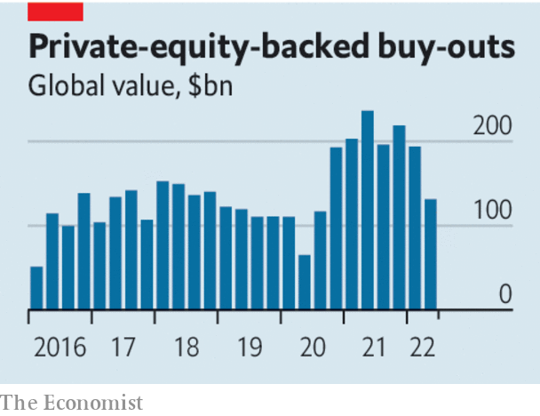

###### Private equity

# Why leveraged buy-outs are in trouble 

##### This downturn won’t be like the last one 

 

> Jul 7th 2022 

Held in february 2007, the 60th-birthday celebrations of Stephen Schwarzman, a private-equity magnate, captured the spirit of an age. Nothing distils the hubris of Manhattan on the eve of a financial crisis like Rod Stewart belting out “Maggie May” to a fizz-drinking crowd in Hermès ties. Within two years Mr Schwarzman’s firm, Blackstone, had lost more than 80% of its market value. Yet the striking thing is that the private-equity industry, including Blackstone, soon bounced back to enjoy a gargantuan boom. Today private equity is again . But shifting investment patterns and higher interest rates mean it is unlikely to enjoy such a miraculous recovery.

As central banks  and shrink their balance-sheets, . This year equities have suffered the worst sell-off in a generation. Things are also messy in , particularly the risky “high-yield” corners where private-equity funds gather ammunition for deals. Junk-bond yields have reached 9%.

All this raises questions about one of the biggest investing fashions of the past two decades. Private-equity assets have more than tripled over the past decade to reach $4.6trn. Desperate for higher returns as interest rates fell, almost all pension funds, endowments, sovereign-wealth investors and life insurers piled into private assets. It is commonplace for a pension fund to have 10% of its holdings in this asset class. 

 


Now a crunch is coming, in two ways. First, the deals done at sky-high valuations look a lot less clever. Higher costs and slowing economic growth will squeeze the profits of private-equity-owned firms. With share prices lower it becomes harder to sell or float firms at attractive valuations. In contrast with the last boom, buy-out funds have loaded up on tech firms that are facing a bigger valuation hit than the market overall. It will take months for funds to mark down their valuations and for investors to get a clear view of the damage, but it is possible that funds raised since 2018 will struggle to return any profits of note.

The second part of the crunch relates to future investments. The industry is sitting on $1.3trn of “dry powder” and investors are still increasing their allocations. Yet whether the business model works in the new macroeconomic environment is uncertain. Buy-outs, which involve buying firms using debt, can generate returns in three ways: through rising valuations, high leverage or improving operational performance. Today two of the three levers are impaired. As interest rates rise, reversing a long-term downward trend, it seems unlikely that asset prices will bounce back. Meanwhile, higher borrowing costs may be here to stay. Leverage is the lifeblood of buy-outs: the calculations have fundamentally shifted.

Private-equity managers will struggle to find a playbook from the industry’s 40-year history. The first cycle, in the 1980s, saw a band of pioneers capitalise on the inefficiencies of lumbering public corporations. The music stopped when credit markets, epitomised by the junk-bond king Michael Milken, crashed. Today there are few large, cheaply valued companies that are ripe for this kind of shock-therapy. Private equity recovered rapidly after the global financial crisis; by early 2011, business was back. But the most significant factor was central banks pushing interest rates to zero. Now some private-equity tycoons may hope to compensate by improving firms’ operating performance. Yet it is an open secret that many are speculators, not managers. 

Who will suffer most? The first losses will be incurred by investment bankers who underwrote buy-out debt at frothy prices. But that will be bonus-crushing, not system-shaking. Disclosure is patchy but, by our crude estimates, the five biggest American investment banks have up to $90bn of corporate loans held for short-term purposes. Even if they were worth nothing this would knock only about 12% off the banks’ total core capital. The ultimate investors face a bigger headache: they are betting on high returns from private equity to fulfil the promises they have made to retirees and other beneficiaries.

You stole my heart and that’s what really hurts

Best positioned of all are the private-equity firms themselves. Since the 1980s they have diversified. They often have property, credit and infrastructure businesses that are comparable in size to their buy-out activities. These areas may do well during inflationary periods. The industry’s pioneers have largely retired. One who has stayed the course, Mr Schwarzman, today manages a vastly different firm, with diversified assets under management of $915bn. For some people, the party never ends. ■

