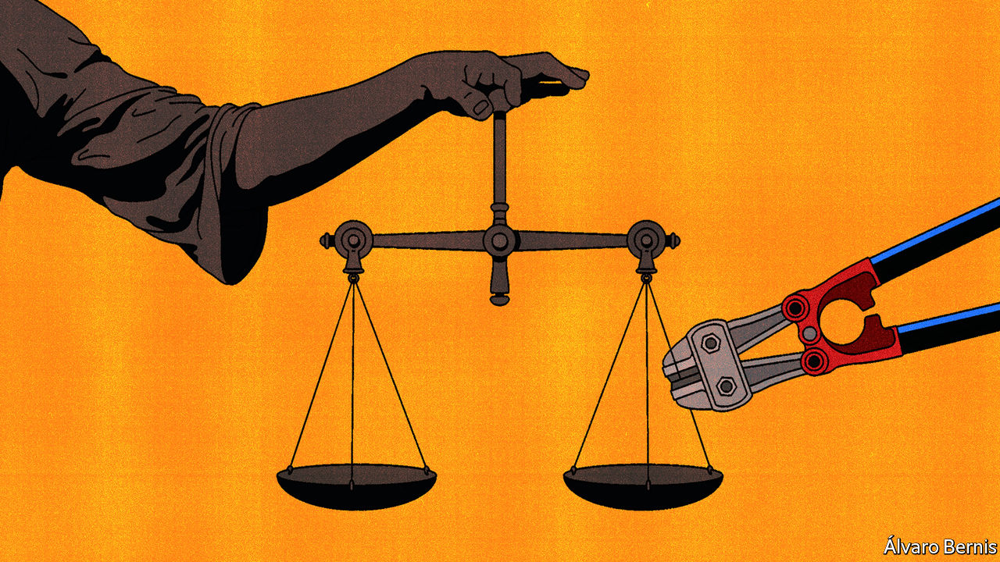
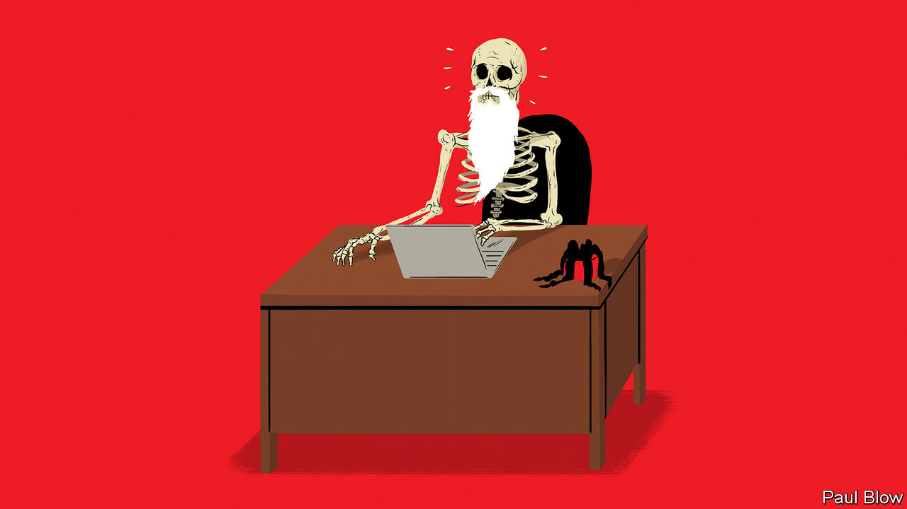

###### On justice services, abortion, Africa, car dealers, Turkey, BTS, technology at work

# Letters to the editor 

##### A selection of correspondence 

 

> Jul 7th 2022 


Frontline justice

As you suggest, brave grassroots activists who challenge and hold governments to account can lead to improvements in a country’s rule of law (“”, June 11th). But this is a long-term endeavour. In the meantime, improving frontline services to deal with people’s everyday justice problems is possible and affordable. In low-income countries it costs just $20 per person a year to provide basic community-level justice services. Sierra Leone’s government-funded Legal Aid Board, with its network of community-based paralegals, reaches ten times more people than the previous coalition of small-scale grassroots activists. It offers a powerful example of what can be done where there is political will and scaled-up targeted investment.

In rich countries, the failure to fund systems to deal with people’s routine legal problems is a political choice. But in poor countries affordability is an issue. These countries are unable to provide half the cost of a basic justice service, even if they maximise their tax take and allocate the same percentage to justice as oecd countries do. Targeting more of the aid budget that is spent on justice towards frontline services would be a good starting-point for opening up access.

clare manuel

marcus manuel

Senior research associates

odi


 


What did you expect?

Your leader on the Supreme Court’s overturning of admitted that the decision in 1973 to grant abortion rights “rested on shaky legal arguments” (“”, July 2nd). So why, in the face of this, wouldn’t conservatives have been expected to overturn  when they got the chance to do so? 

America’s culture wars have a strange character. They tend to be assumed to be fine until conservatives respond to the attacks made on their views. I personally favour a right to abortion, but it should be codified by Congress, which is accountable to the electorate. The same is true of some of the other dubious constitutional-law issues that have been introduced under substantive due process.

jeremy shearmur


Federal legislation is needed to fill the legal vacuum “that sucks in the justices”, you say. One pragmatic way of dealing with this would be for Congress to codify federal “guardrails” for abortion that all 50 states must abide by. Legislation that legalises abortion nationwide between eight and 18 weeks gestation, for example, would provide such guardrails. States would then enact their own abortion laws within these parameters, permitting places like Idaho to ban abortion eight weeks after conception and those like California to legalise it until 18 weeks. Sufficient numbers of pro-choice legislators might begrudgingly support such legislation, knowing that abortion would be legal nationwide until embryos become fetuses. Conversely, enough pro-life legislators may get on board if abortion after quickening was banned nationwide. 

This would require arduous compromise, but the 50 outcomes subsequently produced by the states would more closely align with the abortion values held by the overwhelming majority of Americans, rather than the chaos that now portends. 

t. michael spencer

 

 


Schools in Kenya

Your article “” (June 9th) refers to a study about schools in Kenya: all four of its authors are from American universities. What a shame that they did not see fit to involve any researchers based in Kenya, or elsewhere in Africa. Research co-led by one of us, Jimmy Volmink, found in medical research that in Africa 13% of studies involve no researchers from the country of focus (including two-thirds of papers about Somalia), and that studies “about Africa without Africa” are most commonly led by researchers in high income countries.


Africans are not lab rats to be studied by outsiders. They are perfectly able to—and often do—contribute useful insights and knowledge themselves.


JIMMY VOLMINK

Professor

Faculty of Medicine and Health Sciences

Stellenbosch University


CAROLINE FIENNES

Director

Giving Evidence


 


Dealers or no dealers?

I enjoyed your article on the upheaval in the automobile industry (“”, June 18th). The switch to electric vehicles (evs) will be daunting; the inputs and skills required to design and build them are fundamentally different from those required for vehicles powered by internal-combustion engines.

However, I challenge the notion that the “time-honoured dealership system” is still useful as we move to an ev world. The function of dealers as holders of new car inventory was on its way out because of Tesla’s online ordering system. This change has been hastened by the global chip shortage. You mentioned that dealers also serve an important service function. My new electric Volvo’s first recommended service is at 20,000 miles, about three times longer than for traditional cars. evs have fewer moving parts or fluids that need changing; they barely even use their traditional brakes because of regenerative braking.

If I don’t need a dealership to buy a car, and the car I buy needs little servicing, what time-honoured function are dealers serving?

jake dean

Director

Grainger Centre for Supply Chain Management

Wisconsin School of Business


You quote analysis from Barclays that carmakers need to “move at Silicon Valley speed”. If this is the same speed at which Barclays bank customer centres take my calls, the challenge is not so great.

paul samengo-turner


 


Your article  (Digital editions, June 28th) mentions that while Western countries classify the PKK as a terrorist organisation they do not see the group as a threat to their own security, despite being responsible for the killing of thousands of innocent people. This sincere confession is the very essence of the matter. When it comes to the PKK and its extensions under different names, Turkey has been experiencing such hypocrisy by the West. Well aware of Western complacency, the PKK and its offshoots have been operating in Europe with free hand. As long as the West insists on this flawed approach there can be no enduring defeat of the scourge of terrorism. Thank you for acknowledging what has been overlooked in the West for far too long.

ÜMIT YALÇIN

Ambassador of Kazakhstan


 


Life goes on

As a long-term subscriber to , history professor and bts army (Adorable Representative mc for Youth), I was disappointed by Banyan’s column on the legacy of the South Korean boyband (). In their break-up video, the members of bts discuss their ongoing commitment to create innovative and meaningful music, a process fuelled sometimes by public engagement and at other times by introspection. In the comments on that video, you will find armys who appreciate the group’s honest assessment of the challenges that they face and who look forward eagerly to their solo albums. In bts’s Korean-language songs, you will find commentary on Korean social issues and online bullies. Try “Silver Spoon”, “Spring Day”, or “Ugh!”.

hannah barker


 


The work-app balance

Sadly, I fear Bartleby’s belief that technology will lead to less wasted time at work is misguided (). We recently moved to jazzy new headquarters, fully digitally enabled. In practice, this means I now require four new apps on my phone. One has my access pass to get in. Another lets me reserve a desk, book a meeting room or open my locker. A third enables me to buy my lunch. The fourth provides a secure verification to access all the other apps.

As a result, every time I am at the office I add five minutes of swearing to my day as I open the incorrect app and another nine minutes staring at my screen so that I can use face recognition to avoid entering a password. I must also spend 12 minutes repeatedly giving my phone a mini-charge before each meeting. Fortunately, I’m in the office only two days a week due to our new flexible work policy.

sian davies


When Bartleby says “Whether the time thereby saved would be put to more productive use” he could stop wasting time by eliminating “thereby”.

keith sawyer


I am surprised that Bartleby left out the most pointless of pointless tasks: writing letters to the editor.

charles hagedorn


