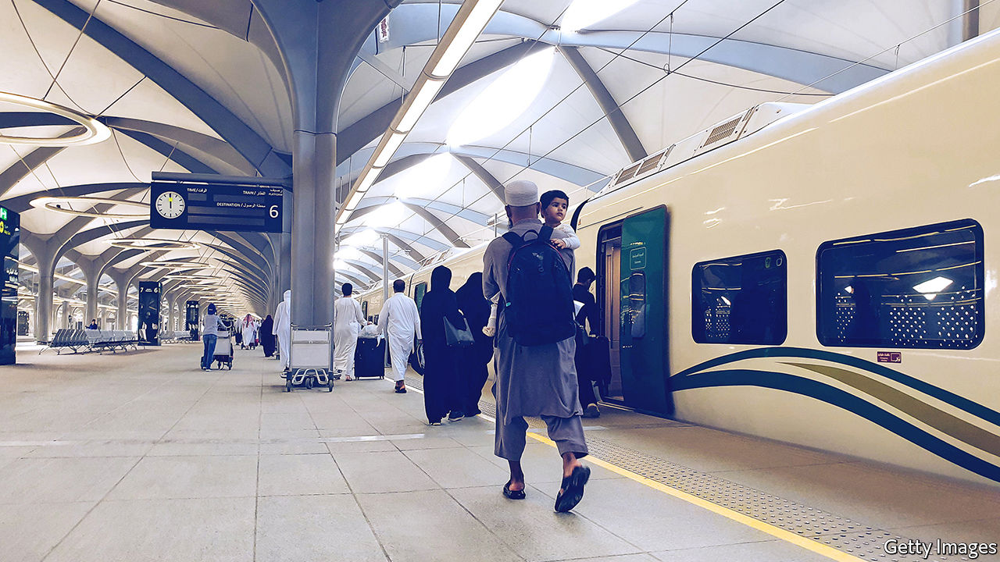
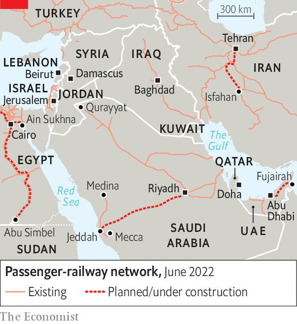

###### The latest railway bazaar

# A new web of Arab railways could transform the Middle East 

##### But old enmities block many of the links 

 

> Jul 7th 2022 

Not since the Hijaz railway between Damascus and the holy city of Medina was ruptured by the British buccaneer-cum-scholar T.E. Lawrence in the first world war has overland travel out of Saudi Arabia’s hinterland seemed so simple. On March 31st the first passenger train pulled out of Riyadh, the Saudi capital, and sped north past 1,215km (755 miles) of sand dunes to Qurayyat, a town near the Jordanian border. Within weeks the sleeper was proving so popular that your aggrieved correspondent’s couchette was double-booked. “You’ll get your bed in heaven, God willing,” promised the train’s conductor, ushering him into one of the few vacant overnight seats.

Colonial-era railway routes blocked or destroyed by conflict or disuse are being reconnected. From Marrakech in Morocco to Mashhad in Iran, governments are investing tens of billions of dollars expanding decayed networks. Some 25,000km of track today is expected to grow by tens of thousands of kilometres by 2040. Saudi Arabia is tripling its network. The region has two high-speed lines that whizz passengers at 300kph, with more being built. 

The revival has long been delayed, in part for lack of regional integration. After the collapse of the Ottoman, British and French empires, independence severed the lines colonial powers had built to help rule vast swathes of land. Newly minted countries closed borders and blew up bridges. Israel’s creation in 1948 drove a wedge between lines linking Asia to Africa.

What is more, most governments gave priority to private over public transport. “Everyone thought cars and trucks were enough,” says a spokesman for Israel Railways. Plans for an Arab Mashreq International Railway with a hub in Baghdad have come to nothing. The six countries of the Gulf Co-operation Council (gcc) paid only lip service to a railway project to link Kuwait along the Gulf to Oman.

 


But clogged roads, soaring populations and climate change are prompting a rethink. People need to move faster and more cleanly than along jammed, polluting roads, says the gcc’s Abdel Aziz Aluwaisheg. Travelling on the proposed new line across the United Arab Emirates (uae) from Abu Dhabi to Fujairah will take half the time of the car journey. Iran’s high-speed line from Tehran to Isfahan will cut the trip from five hours to 90 minutes.

Demand is booming. Israel’s passenger volume has soared from 12m two decades ago to 70m today and is projected to reach 400m by 2040. Egypt must upgrade its main lines, since passenger volume has risen 15-fold since the 1930s on track that is largely unchanged.

Metro systems are multiplying, too. Algiers, Dubai, Doha (Qatar’s capital), Cairo and Tehran have expanded their systems. Riyadh’s and Tel Aviv’s should open next year. Cairo’s new administrative capital will have north Africa’s first monorail.

Tourists and pilgrims should benefit. Saudi Arabia’s first high-speed train (pictured) runs between the holy cities of Mecca and Medina. Egypt has just signed a contract to build a fast track from Cairo along the Nile to the pharaonic statues at Abu Simbel, 1,100km away, near the border with Sudan. Morocco is planning a high-speed line to the tourist hub of Marrakech. 

Trade should improve, too. Egypt’s first high-speed train, set to open in 2027, will run from the Red Sea port of Ain Sukhna to Mersa Matruh on the Mediterranean, offering an alternative to the congested Suez canal. Saudi Arabia is planning a speedy railway running from the port of Jeddah via Riyadh to the Gulf. The new line to Fujairah, on the Indian Ocean, will provide a means for freight leaving or entering the uae to avoid the Strait of Hormuz, a strategic chokepoint at the entrance to the Gulf that Iran periodically threatens to close. Morocco hopes its high-speed train from Tangiers will one day zip along the coast through disputed Western Sahara to markets in west Africa. Even an undersea tunnel to Spain has been mooted.

China, a world leader in high-speed trains, wants to link Asia to Europe overland through the Middle East to foster its Belt and Road initiative. It has discussed such plans with Iran, Israel and the uae. But Siemens, a German company, has outbid Chinese rivals to build Egypt’s high-speed tracks. Morocco has signed up a French company, Saudi Arabia a Spanish one and Israel a German one for their high-speed projects. Most of the uae’s line has gone to a consortium of British and German companies.

Not all are aboard. Iraq, Palestine, Lebanon, Libya, Sudan, Syria and Yemen are too poor, war-torn or dysfunctional to restore their old tracks. State-owned airlines are lobbying to keep their lucrative short-haul routes. Old fears still make some governments twitchy. Oman, always wary of entanglements, has held back. Kuwait, wary of invasion, is nervous about linking up with Iraq. Qatar had once planned to build high-speed lines to Bahrain and Riyadh in time for this year’s football World Cup. But it put on the brakes after its neighbours blockaded it for political reasons. 

The fact that most of the new lines stop tantalisingly short of their frontiers illustrates this underlying queasiness. Israel’s “peace line” ends 8km short of the border with Jordan. The new Saudi line north from Riyadh peters out 28km from the crossing into Jordan, which is wary of being part of a direct link from Mecca to Israeli-occupied East Jerusalem. Though Morocco has built a gleaming new station at Oujda, the old border crossing with Algeria, the link between the two countries remains firmly shut. And China’s dream of reaching the Levant is blocked by a missing link, 22km long, between Iran and Iraq. For all the talk of regional integration and new silk routes, the Middle East’s railway map is still holed by the moths of history. ■


