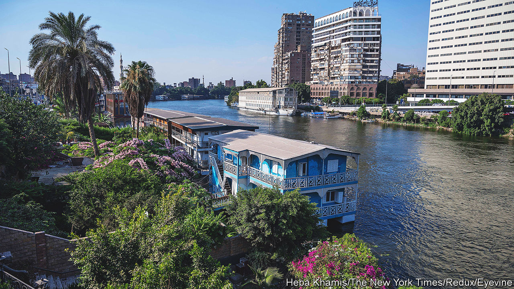

###### Paving paradise

# Historic houseboats fall victim to Egypt’s addiction to cement 

##### Centuries-old homes are being bulldozed 

 

> Jul 7th 2022 

The colourful houseboats anchored along the Nile have been fixtures of Cairo since the 1800s. Bigwigs once stashed mistresses on board. Diplomats and artists drank on their decks. They feature in film and the writings of Naguib Mahfouz, who won the Nobel prize for literature in 1988. 

No matter. Last month the government ordered their removal, saying the boats were unsafe and lacked permits—no surprise, since it stopped renewing the permits two years ago. It has recently begun towing them away. Officials are coy about their plans for the riverbank. If the past is any guide, the boats will be replaced by restaurants and cafés, their lush gardens buried under concrete.

Abdel-Fattah al-Sisi, Egypt’s authoritarian president, is addicted to the stuff. His ministers brag about 5,500km of new roads. Some of this frantic construction has won praise from citizens. Egypt’s crumbling infrastructure needs renewing. It also pleases allies. The army, where Mr Sisi spent most of his career, is often the lead contractor on big works and owns factories that make cement, steel and other materials.

But centuries-old neighbourhoods have been torn down and thousands of people evicted. Many receive little notice. Just a few days pass between red marks being daubed on their doors and bulldozers rolling down their streets. There is no space for sentimentality or historic preservation. A seventh-century cemetery in eastern Cairo may be razed. 

Officials rarely consult the public on projects. If they did, someone might have raised questions about the new motorway on the north coast. It should speed the journey to the growing expanse of villas that lines the Mediterranean, a popular escape for rich Egyptians. 

But many of those using it describe it as a death trap. Gated compounds spill directly onto the motorway, leading to dangerous tailbacks. Exits are oddly designed and lack signs. One widely mocked video on social media shows an elevated roundabout with unfinished lanes and confused drivers going against traffic. On June 28th seven people were killed in an accident.

Mr Sisi says the road is not finished and that the naysayers want to defame his government. But he also promised personally to review their complaints. It is probably no coincidence that his children have homes off the highway. Needless to say, the houseboat owners lacked such influential neighbours. 

