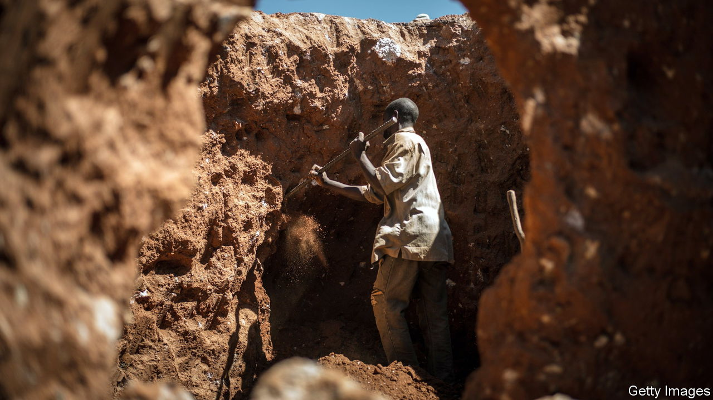
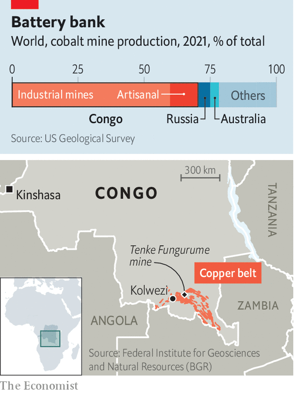

###### Either ore

# How the world depends on small cobalt miners 

##### The metal is key to the global energy transition. But its artisanal market is broken 

 

> Jul 5th 2022 

At first glance the dust-caked men carrying sacks of rocks into a trading depot outside Kolwezi, in the south-east of the Democratic Republic of Congo (drc), have little in common with the housewives in rich countries who hold parties to sell Avon creams. But in both cases, the more you flog, the better the bonuses. At the depot, under a ramshackle roof, handwritten posters state prices for the minerals in the ore. Industrious miners who hit production targets get bumper perks such as a bag of maize meal, a smartphone or television. 

The ultimate prize is the cobalt that will be extracted from the rock. For decades unloved, cobalt is now at the heart of the green economy. It is an essential component of batteries in phones, laptops and , which are now the biggest source of demand. The authors of an imf paper published last year predicted that consumption of cobalt could increase six-fold by 2050 as the world tries to curb global warming. However, they also note that cobalt supply could be .

 


To understand why, consider , from which 60-70% of the world’s cobalt is extracted (see map). Most of Congo’s cobalt is a by-product of large copper mines which cannot quickly increase their output and have little incentive to do so unless copper prices also rise. The other big source of supply in Congo is so-called “artisanal” mining. Small-scale informal miners dig up about 15% of Congo’s cobalt. That is more than the entire output of Russia, the world’s second-largest producer (see chart). 

Artisanal miners are critical to global supply chains. They hand-dig higher grade ores than those produced by large mechanised mines and can act as swing producers, opting to mine cobalt or copper depending on their relative prices. Yet Congo’s small miners face immense obstacles, which prevent them from producing as much as they could or reaping the rewards of the clean-energy revolution.

Chief among these problems is that small mines are dangerous and polluting. International ngos have reported on horrendous incidents of miners being killed when tunnels collapse or fires break out underground. Worse still, they found that children as young as seven were being sent out to dig for cobalt. After an influential report in 2016 by Amnesty International on the human cost of artisanal mines, a number of large mobile-phone and car companies pledged to eliminate artisanal cobalt from the batteries they used and to improve safety in small mines. Six years on too little has changed. 

Part of the reason why the lot of small-scale miners has not improved is because of the way they are pushed to the margins of the industry. In Congo artisanal mining is meant to be confined to dedicated sites. In practice, it is tacitly allowed on parts of the huge industrial mines in Kolwezi. Though some sites have been dug for decades, miners are vulnerable. In 2019 the army evicted 5,000-8,000 miners from the Tenke Fungurume Mine which is owned by China Molybdenum. Still, people returned to the mine, roughly 100km from Kolwezi, even in the face of violence. “Security is chasing us, beating us, breaking our basins,” says Generose Yandaya, who washes rocks to support her orphaned grandchildren. “I want them to go to school. The problem is there is no money and mining is the only job.” 

Roughly 140,000-200,000 people in the Copperbelt work as artisanal miners. Most earn less than the equivalent of $10 per day, according to the Federal Institute for Geosciences and Natural Resources (bgr), an arm of the German government. That is still a better wage than most get in a country where 73% earn less than $1.90 a day. Children work at an estimated 25-30% of mines, according to recent reports by bgr and the oecd, a club of mostly rich countries. Kitenge Mami, a teenager in Fungurume, says she goes to the quarry “because I don’t want to be a beggar”. Mining powers the wider economy: the motorcycle-taxi drivers transporting three sack-laden miners at a time; coiffed ladies in dirty markets selling “I heart drc” sacks for collecting rocks; merchants selling football boots in lieu of safety shoes. One study suggests 60% of households in the region rely on artisanal mining for their livelihoods. 

It is risky work. Pollution is rife; fathers with mining jobs are unusually likely to have children with birth defects. A law limiting pit depths to 30m is widely flouted. Deadly collapses are common. “There are no statistics but many, many are dying,” says Donat Kambola Lenge, a human-rights lawyer in Kolwezi. George Ngome, a pastor, says he presides over lots of funerals for miners without identity papers. “Those who come from other parts of the country, their families never know.” 

Some miners dig in ad hoc groups but by law they must belong to co-operatives. These can be genuinely collaborative ventures; often they are little more than labour gangs controlled by bigwigs. A government registry of the bosses of co-operatives includes politicians, their families and senior officials in regulatory agencies, notes the oecd report. Earlier this year the provincial government named as its new mining minister the head of one of the largest co-operatives.

By law the trading depots that buy ores must be owned by Congolese. But they are usually financed by foreigners, primarily Chinese. Every depot is colloquially known as . At one lackeys of a politician conflate your correspondent’s journalistic interest with the commercial sort and ask whether  wants in on the business. “You can also exploit our ores,” an aide says. 

It is mostly miners who seem to be getting exploited. Some of them say that traders’ scales and spectrometers (used to measure the concentration of cobalt) are rigged. They bemoan their lack of market power, since Chinese buyers have purchasing sewn up. They complain about a litany of unofficial “taxes” imposed by state agencies, chiefs, police and security guards, who can make $250 a night in bribes. In 90 of 116 depots studied by bgr, the intelligence services charge trucks to leave premises. “We have laws but there is no respect for the law,” says Mr Lenge. “Government is just corrupted.” 

Artisanal cobalt is trucked from trading depots to refineries where it may be blended with ore from big mines. “Despite the efforts of some companies to portray industrial (large-scale) mining and artisanal mining as completely distinct,” argues the Natural Resource Governance Institute, an ngo based in New York, “the boundaries between the two are permeable.”

The international firms that trade, refine and use cobalt have responded in three ways to the problems of artisanal mining. First, they have tried to understand what happens in their supply chains. Apple, for example, lists all of its cobalt refiners. Many downstream firms use rcs Global, a consultancy, which has staff permanently stationed at ten artisanal mines in the Copperbelt, so as to audit what happens. Tesla and Volvo are rolling out systems based on blockchain to trace the origins of the cobalt they use. 

The second has been to try to use less cobalt from Congo, especially the artisanal sort. bmw says it buys exclusively from Australia and Morocco. Elon Musk’s firm is also producing batteries that use much less cobalt (or none whatsoever). Huayou Cobalt, one of the largest refiners, said in 2020 that it would stop buying artisanal cobalt, though it is unclear whether that is still the case. (Huayou did not respond to requests for comment.) 

Third, firms are sponsoring initiatives to make life better for miners. The Fair Cobalt Alliance, which counts Glencore, Tesla and Google as members, is helping improve safety at an artisanal mine. It is renovating schools to give parents more reason to keep their kids away from pits. The Responsible Cobalt Initiative, an association of German car firms and industrial giants, wants to offer safety training. 

All of which is more than firms were doing a few years ago. But critics say it is not enough. “The current posture is the worst of all worlds,” argues Benjamin Katz of the oecd. “There is artisanal cobalt in supply chains, even if it is not acknowledged. And there is very little being done to improve conditions.” A consultant to large firms adds: “You have a group of downstream businesses that get their annual auditor report, pretend to be virtuous, and go back to selling phones and cars.” 

In 2019 the Congolese government proposed its own solution. Gécamines, the state miner, said its subsidiary, Entreprise Générale du Cobalt (egc), would have a monopoly over the buying of artisanal cobalt. “We are going to eliminate child labour,” said Albert Yuma, then the boss of Gécamines. “Perhaps not today, but tomorrow, the Congo will be the equivalent of opec [for cobalt].”

As part of the proposal the ores bought by egc would be exported on the global market by Trafigura, a commodities trader, which would pay to make mine sites safer and more productive. The scheme is loosely based on a pilot site that ran from 2018 to 2020 that Trafigura and pact, an American ngo, say improved both conditions and productivity. Critics question whether the model can be scaled up. 

There are plenty of moral incentives to reform artisanal mines but not enough market ones. “There is a double standard,” argues Mickael Daudin of pact. “The approach is: ‘We will help you but we don’t want to buy from you.’” Firms, for their part, argue that Congo ought to clarify the legal status of artisanal sites and that rich-country governments should be clear about what amounts to a responsible standard for cobalt, as is the case with diamonds and “conflict minerals” such as tungsten and gold. Without these things Congo may, yet again, squander the chance to use its natural resources to improve the lot of its people. 

Back in Kolwezi, Pastor Ngembe watches a Christian channel on satellite tv. He is seeking inspiration for his sermon later. The topic this evening is that age-old question: “drc is a rich country, so why are so many people poor?” ■


