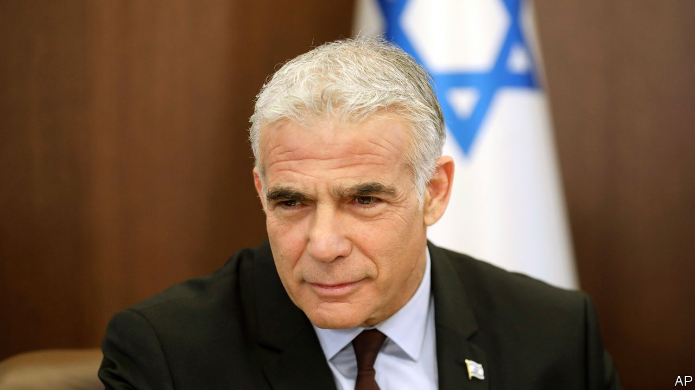

###### Lapid response

# Israel’s new leader, Yair Lapid, has four months to prove himself 

##### Or Binyamin Netanyahu could win back power 

 

> Jul 7th 2022 

With no ceremony or fanfare, not even a formal swearing in, Yair Lapid became Israel’s 14th prime minister at midnight on June 30th. His predecessor, Naftali Bennett, who took office a year ago, now holds the dubious title of having had the briefest ever stint as the country’s leader. But Mr Lapid will struggle to stay even for that long. He took office hours after Israel’s parliament, the Knesset, voted to dissolve itself, scheduling a general election for November 1st, its fifth in under four years. 

Mr Lapid, aged 58, was the architect of the coalition that imploded on June 20th after barely a year’s rule. He had cobbled together eight disparate parties, including for the first time an independent Arab party, ending Binyamin Netanyahu’s 12 years in power. Though he led the coalition’s largest party, Mr Lapid agreed to cede the first half of the term to Mr Bennett. Under the terms of their deal, he replaces him as prime minister until after the election—and perhaps longer if he wins it. 

Before entering politics and founding his centrist Yesh Atid party in 2012, Mr Lapid was a popular columnist and television chat-show host. He also dabbled in boxing, acting and writing thrillers, pop songs and tv dramas. As a journalist and politician, he appeals to Israel’s cosmopolitan, secular middle class. Often regarded as a lightweight, he proved his critics wrong by engineering Mr Netanyahu’s downfall. To prevent his return, Mr Lapid has just four months to broaden his personal appeal while once again building a coalition that is bound again to be creaky. So he must prove he can run Israel’s complex affairs, presiding over a cabinet in which three-quarters of the ministers belong to rival parties vying with him for votes. This may leave little time for electioneering. 

Looking abroad, Mr Lapid will have to chart a canny path, especially with regard to Iran and Lebanon. His predecessor ratcheted up tension with a series of clandestine attacks against Iran, including some assassinations. On Mr Lapid’s second day in office Hizbullah, Iran’s Shia Muslim ally in Lebanon, launched a flight of drones towards Israeli gas platforms in the Mediterranean. Israel shot them down.

President Joe Biden, who is due to visit the region starting in Israel on July 13th, will provide an early test of Mr Lapid’s international statesmanship, not least because the American president still wants to revive a nuclear deal with Iran which Israel’s previous two leaders have opposed. Mr Lapid has equivocated, saying he might back a deal if it were beefed up. 

After a burst of violence in Israel and the West Bank during the recent month of Ramadan, the Palestinian front seems fairly calm. Yet that conflict simmers as ever. Unlike Mr Bennett, Mr Lapid favours a two-state solution in principle, but as foreign minister he showed scant interest in making it happen. Millions of stateless Palestinians have their ways of reminding Israeli prime ministers of their existence, often at the least convenient moment. 

Mr Lapid faces a string of challenges at home, too. Israel’s economy is recovering fast from covid-19, but global factors are making the cost of living shoot up all the same. Mr Netanyahu, ever the populist, is already capitalising on this in campaign jaunts to shopping centres. Mr Lapid must urgently fend off the threat of chaos posed by teachers’ unions seeking higher salaries and aggrieved police who have been resigning in droves for similar reasons.

Above all, Mr Lapid needs to project the image of a steady, “normal” prime minister in contrast to the bombastic, sometimes mercurial Mr Netanyahu. But four months of normality in Israel would itself be considered quite abnormal. ■

