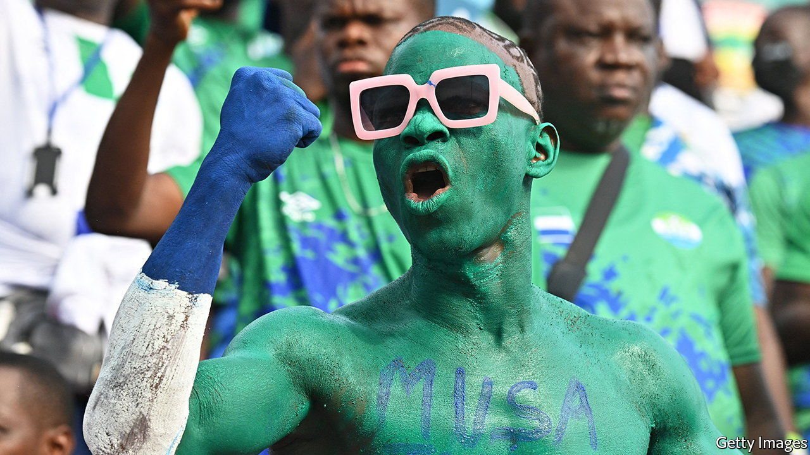

###### Where was the goalie?

# Two stupendous football scores raise questions in Sierra Leone 

##### It is not every week that teams win 91-1 and 95-0 

 

> Jul 7th 2022 

Unlike neighbouring Liberia (whose president, George Weah, was Africa’s first recipient of football’s most prestigious award), Sierra Leone is not known for its footballing talent. But it would take an extraordinarily inept goalkeeper to concede more than one goal every minute. Yet that is what allegedly happened on July 3rd, when Gulf fc and Kahunla Rangers reported respective victories by 91-1 and 95-0 in league games. The only larger margin recorded in world football was 149-0 in 2002, when players from a Madagascan team repeatedly kicked the ball in their own net in protest at poor refereeing. 

Football fans in Freetown, the capital, are outraged. “The over 180 goals are a national disgrace,” says Mohamed Kallokoh. “Our country is not serious about fair play.” The Sierra Leone Football Association (slfa) said the results were “impractical” and that it would investigate. 

News travelled quickly along the banter highway, but few bothered to verify it. Enquiries by  suggest that, unlike in Madagascar, the bumper scores did not actually occur. Eric Kaitell, the boss of Kahunla Rangers, says he watched the first half, which ended with his team up by 2-0, then went home for a nap. When he woke he learnt his team had supposedly scored another 93. Football is, as the cliché goes, a game of two halves. But that is a stretch. 

Mohamed Patel Jabbie, the chairman of Lumbenbu United, which allegedly lost 95-0, says: “My team only conceded five goals.” He adds that it would be impossible to score more than 90, partly because the pitch was waterlogged. He reckons the scores were changed after the final whistle. 

Why? The clubs and the slfa are, for want of a better phrase, shifting the goalposts. First there were suggestions of match-fixing for gambling syndicates, but that seems unlikely given that these were amateur games not covered by bookmakers. Mr Jabbie suggests that the two teams needed this many goals to get promoted. African players are prominent in the world’s best teams but domestic leagues are underfunded and their players underpaid. There might be a strong incentive to move up to the country’s premier league, where there is some prize money. 

Mr Kaitell apologises to fans and says he will get to the bottom of the matter. The only upside for Sierra Leone is that its goalkeepers are not as bad as they seemed. ■

