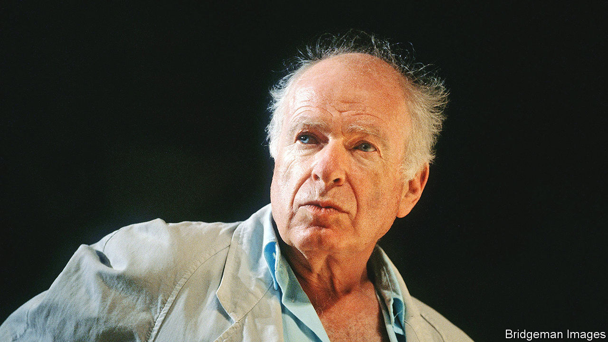

###### The mystic of the stage

# Peter Brook saw acting as an uncompromising search for truth 

##### The revolutionary theatre director died on July 2nd, aged 97 

 

> Jul 7th 2022 

Not long after the second world war, as he walked through the ruins of Hamburg, Peter Brook saw a crowd of children pushing through the door of a nightclub. He followed them. Inside was a dilapidated stage with a backdrop of blue sky, and in front of it two sad clowns sitting on a cloud. The clowns were on a visit to the Queen of Heaven, and were listing which foods, all scarce in the starving city, to ask her for. As they mentioned various delicious things, the children grew quiet. Then, as he remembered it, the silence became different. They were transfixed. That silence became what he most desired to generate in the theatre. 

That seemed a severe contradiction. For the best part of the next two decades he was known not for silence, but for noise. For his staging of Seneca’s “Oedipus”, the actors practised primal screams for hours and imitated beasts. In Shakespeare’s “Titus Andronicus”, murder-screams set off bursts of scarlet ribbons. In “US” in 1966, a happening to protest against the Vietnam war, the audience was asked to imagine being napalmed in their gardens. Most famously, in “Marat/Sade” two years earlier, the inmates of the Charenton asylum were shown staging the murder of Marat in 1793 and the king’s execution, rampaging round the guillotine with pots of thick red and blue blood. Explicitly, he had wanted the whole cast to break down as they rehearsed. 

There was method, though, in this madness. The British theatre world as he came into it, having decided not to be a film director, was one of stultifying conservatism, hidebound practices and polite plays for middle-class people. In a word, deadly. His father had been a revolutionary in Latvia; now he, too, felt that fire, and was ready to go through the West End breaking shop windows. 

Amid the deadliness, Shakespeare still stood out. Yet despite a glorious roster of English actors (Laurence Olivier, Edith Evans, Ralph Richardson, John Gielgud) the plays were produced as dully and dutifully as ever. He was having none of that. His version of “A Midsummer Night’s Dream” in 1970 was set in a white cube with swings, trapezes and jugglers, through which the mazed lovers raced like butterflies. His “Lear” was a brooding, ironclad reflection on the power and emptiness of nothing. “Hamlet” in his hands was stripped down to a third of its characters and half its length, and acted out on a cloth square with cushions. 

Stripping down became his hallmark, but it was a gradual change. His first big Shakespeare production, “Love’s Labour’s Lost”, was a froth of costumes and sets based on Watteau. Even much later, in his nine-hour version of the Hindu “Mahabharata” in 1985, he did not shy away from sumptuousness in lighting, costumes and props. Yet the theatre he most liked was rough and ready: done on carts, in barns, or simply in the empty space that one man crossed while another one watched. His base in France, after he had left England in 1970, was a battered old Parisian theatre with scorched walls, Les Bouffes du Nord; his base in Glasgow was a mothballed tram depot. On a tour of Africa his troupe went from village to village, often improvising plays that had no text, theme or name. He loved to perform for people who had no idea what to expect, and to register their reactions. 

Increasingly he was convinced that the richest tool he could use in theatre was the human being. In acting, an actor was his own field of work: his hands, his eyes, his heart. If a man or woman were simply to pour out all the emotion and imagination inside them, if they could make every moment count as theatre demanded, the audience would need nothing else. 

For that reason his rehearsals were long, exhausting and expensive: too expensive for him to stay in England without lavish subsidies, hence his move to France. In rehearsal each actor had to move from the first inner tremor of characterisation to full possession, but do it for themselves. He set tasks, and then sat in silence. When he told them to cross a carpet as if it were a tightrope, and to fall if their feet strayed, a mischievous smile still lingered in his sharp blue eyes. He was sympathising, but he would not intervene. He did not direct, but distilled. The moment he was waiting for came when the actor was suddenly free, feeling the flow, imagination fully expanded, opening to life beyond life. 

His ultimate aim was to get to the very nub of acting, the communication of thought. Words bothered him, because they had moved too far from the original impulse. In exercises he derived from Meyerhold and from Artaud’s Theatre of Cruelty, his actors practised sending complex ideas to each other with one finger or one cry. In 1971 he collaborated with the poet Ted Hughes to produce a play, “Orghast”, composed in invented language. Events like this baffled the critics but were, to him, essential. 

Immediacy also preoccupied him. He disliked tours, even long runs, because performance settled and soon began to die. Instead he fostered the invisible connection that could give the visible “a burning and fleeting taste of another world”. Though he liked to film his productions, and in 1963 directed William Golding’s “Lord of the Flies” with great success for cinema, he was concerned that film could present only images from the past. He was equally suspicious of “happenings” in the present, so often vacuous: a summons to wake up, but to what? To live, but how? 

For some time he had followed the writings and practised the sacred dances of Gurdjieff, who taught that humans were in a state of waking sleep. They could be roused to higher consciousness only by working on themselves from zero, as he asked his actors to. In turn, those actors could snap audiences out of their daydreams. He had felt the effect himself, leaving Samuel Beckett’s most “negative” plays in a state of irrational joy. He had experienced it as a child, when in a toy cardboard theatre he had found a world more convincing than the one outside. And he had known it in his own productions, as a silence more acute than silence descended on the audience. Theatre thus became, as it had for those children in Hamburg, transcendent and holy. That hush of revelation and self-revelation was better than any applause. ■

