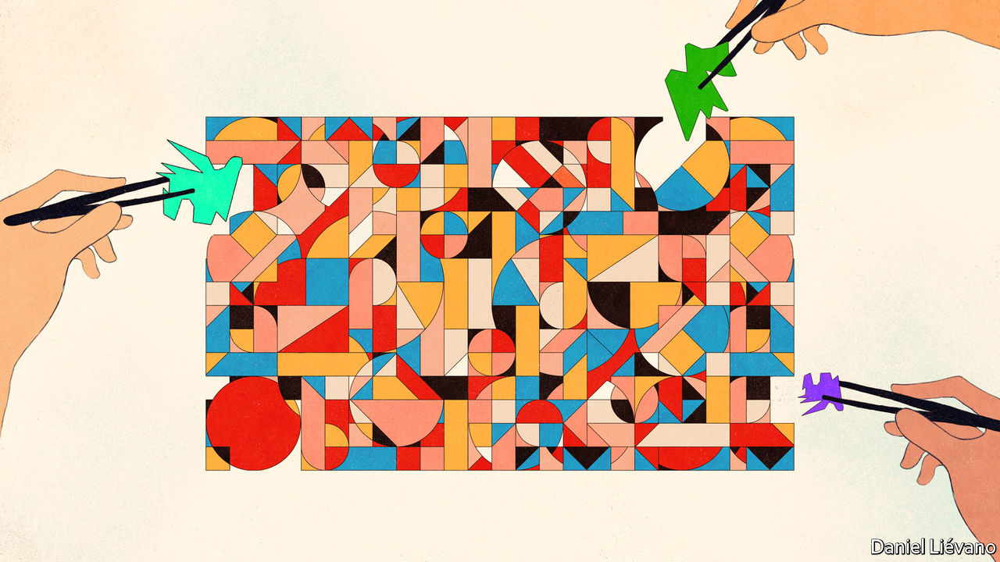
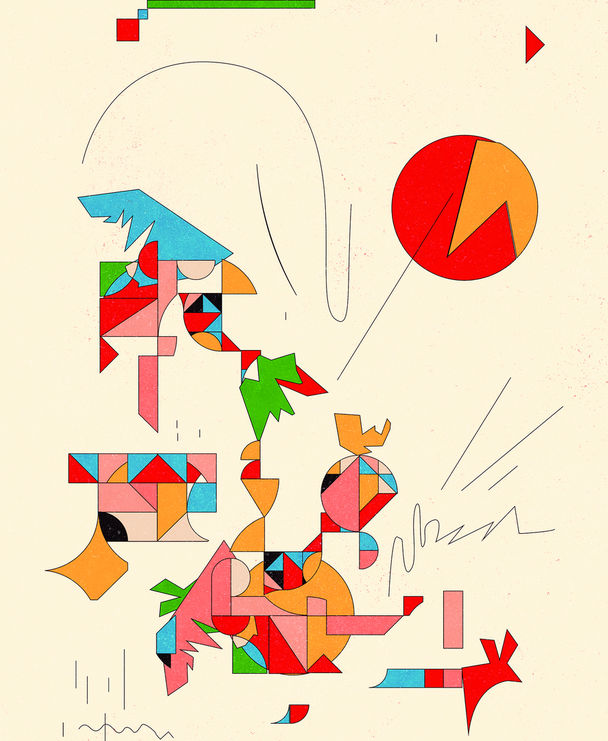

###### Beyond the Standard Model

# Ten years on from the Higgs boson, what is next for physics? 

##### New particles beckon as the Large Hadron Collider returns to life 

 

> Jul 4th 2022 

“I was actually shaking,” said Mitesh Patel, a particle physicist at Imperial College, London, as he describes the moment he saw the results. “I realised this was probably the most exciting thing I’ve done in my 20 years in particle physics.” 

Dr Patel is one of the leaders of lhcb, an experiment at cern, in Geneva. cern is the world’s largest particle-physics laboratory, and the “lhc” bit of the experiment’s name stands for “Large Hadron Collider”, which is likewise the world’s biggest particle accelerator. This machine, which collides packets of high-speed protons (examples of a type of subatomic particle called a hadron) was switched on again on July 5th, after a three-and-a-half-year upgrade, for what is known as “Run 3”. In the interim Dr Patel and his colleagues have been crunching data collected from previous runs. It is the results of these crunchings that are giving him palpitations. 

The lhcb team has spent the best part of a decade measuring how subatomic particles known as b mesons decay into lighter particles. b mesons come in many varieties, but all have a constituent called a bottom antiquark. One way in which these mesons decay is by the transformation of the bottom antiquark into a so-called “strange” antiquark and a pair of leptons, a different class of fundamental particle that includes electrons and their more massive cousins, muons. According to the accepted rules of particle physics, such decays should yield as many muons as they do electrons. For the forces that govern them, there is no difference between the two, an idea called “lepton universality”.

But that is not what the tallies counted by the lhcb showed. Instead, Dr Patel’s team found that only 85 muons were emitted for every 100 electrons. 

Physics wobbles

To the person in the street this may not sound a big deal. To a physicist it is practically an invitation to book a flight to Stockholm. A violation of lepton universality would be a crack in what is called the Standard Model, and therefore Nobel prizewinning stuff. This model has, with assistance from the general theory of relativity developed earlier by Albert Einstein, held physics together for around half a century. 

Nor is the b meson anomaly, as it is known, the only recent result that might attract the attention of the prize-awarders at Sweden’s Royal Academy of Science. Two other Standard Model-violating results, from cern’s American frenemy Fermilab, have also been published recently. After a long period in the doldrums, the sails of the ship of physics are rustling in the breeze. The lhc’s latest run may provide the wind needed to fill them properly.

Fermilab’s contributions to the anomaly list, announced respectively in the Aprils of 2021 and 2022, are that the magnetic properties of muons wobble around at frequencies which do not match predictions; and that the mass of another Standard Model particle, the w boson, which carries the weak nuclear force that is responsible for a form of radioactivity called beta decay, seems larger than predicted.

Once is happenstance. Twice is coincidence. The third time, as Ian Fleming opined through the mouth of Auric Goldfinger, does look like enemy action. None of these results, it must be said, yet quite reaches the gold standard of confirmation, known as 5-sigma (ie, five standard deviations from the mean) which particle physicists normally demand before they will call something a “discovery”. Five-sigma equates to a probability of around one in a million that something of interest in fact happened by chance. But all of them are close enough to this threshold to be eye-catching (Dr Patel’s, for example, is 3.1-sigma), and thus worthy of further work to attempt to reach the magic value of five.

If they do survive scrutiny, these three findings may go into future textbooks as the keys which unlocked the door marked “Physics beyond the Standard Model”. Practitioners have been battering on this portal since the Model was put together in the 1960s and 1970s, to no avail. Their ultimate goal is to unify the Standard Model and general relativity into an overarching “theory of everything”. That is some way off. But there was until recently a widespread belief that lurking behind this door would be a predicted step on the journey, called Supersymmetry. That is not what these results suggest.

Un peu d’histoire

The Standard Model describes two broad classes of particles—fermions and bosons. Fermions are the stuff of matter. Bosons carry the forces which hold that stuff together, or sometimes push it apart. 

Fermions divide into leptons, quarks and their antimatter equivalents, which are identical to normal matter but with opposite electrical charges. Bosons include photons, which carry the electromagnetic force (and are the particles of light), the aforementioned w boson, the gluons that hold atomic nuclei together via a second, strong nuclear force, and the Higgs. The discovery of this, in 2012, using the then recently opened lhc, was a triumph of scientific prediction, the particle having been described theoretically by the eponymous Peter Higgs in 1964. The field associated with it confers mass on the other particles, and ties the Standard Model together. 

But, though it is one of the most tested, most successful scientific ideas of all time, the Standard Model is not a complete description of the universe. Not only does it fail to account for gravity (this is the purview of general relativity), it cannot explain why matter is more abundant than antimatter. Neither does it say anything about two other important but obscure phenomena: dark matter and dark energy. 

 


Dark matter is stuff that interacts with gravity but not electromagnetism, so can be felt, but not seen. Its abundance can be calculated from its effects on visible matter—than which, the sums suggest, it is six times more plentiful. And, though it is invisible, its influence is profound. Galaxies, for example, are held together largely by the gravitational fields of their dark matter.

Dark energy is even weirder. Belief in it depends on calculations about the speed at which the universe is expanding, for dark energy is the stuff that propels this expansion. And, to show how little physicists really understand the cosmos, it is worth noting that, together, dark matter and dark energy make up more than 95% of it, and the familiar stuff of stars, planets and human beings themselves less than 5%.

Nor is the Model itself quite as elegant as it is sometimes made out to be. It is, rather, a thing of sealing-wax and string, held together by arbitrary mathematical assumptions. Until recently, this was not a cause of great worry. Supersymmetry, people thought, would ride to the rescue. Susy, as this theory is known for short, got rid of the arbitrary assumptions by predicting a set of heavier (and as-yet-unseen) particles, a “superpartner” for each known fermion and boson. These “sparticles” would be too massive for older, less powerful, machines to find (mass being, as per Einstein’s E=mc, an embodiment of energy) but not, it was hoped, for the lhc. It was Susy’s smiling face that people expected to greet them when the “physics beyond the Standard Model” door eventually opened.

Run 2 of the lhc, however, found no evidence of sparticles. If Run 3 also fails to reveal Susy, some of her supporters will no doubt tweak the numbers to try to explain why. But there is now a whiff of desperation in the air about the theory, and it would be sensible to assume that even if Susy is not dead, she is missing in action. And that will leave physicists scrabbling around for a replacement.

The kit they have to conduct their search with is a yet-more-powerful version of the collider that found the Higgs boson a decade ago. Since the machine paused operations in December 2018, dozens of its superconducting magnets have been replaced with stronger ones and the injection system, which packs 120bn protons into bunches the size of a human hair and then accelerates them before they enter the lhc itself, has been upgraded. The new version of the machine will thus collide more protons, more often and at higher energies than previous incarnations.

The four experiments that sit around its 27km ring and analyse the results of those collisions have also been given a once-over. The lhcb detector in particular has been almost entirely rebuilt. According to Chris Parkes, a physicist from the University of Manchester who acts as the detector’s spokesman, something like 90% of the sensitive elements which do the actual detecting have been changed. 

Collisions happen so fast and abundantly within the experiments that software known as a trigger system is normally used to decide, quickly, which data to keep and which to delete. A new trigger system at lhcb will permit retention of data from almost all the 40m collisions occurring per second in the upgraded detector, so that more intelligent decisions can be made later about which to retain and analyse.

Flavours of the month

The first job will be to gather more data on the b meson anomaly, in search of that precious 5-sigma status. Theoreticians, meanwhile, have been busy devising ways to extend the Standard Model to try to explain those mesons’ anomalous decays.

One approach starts with the idea of a fundamental particle’s “flavour”. This term was invented in 1971, by Murray Gell-Mann, an architect of the Standard Model, and his student Harald Fritzcsh as they sat eating ice cream at a Baskin-Robbins store in Pasadena, California. They wanted a way to label the different types of quarks that had so far been found inside atomic nuclei. Up and down quarks are the constituents of protons and neutrons, but there are two further pairs (or “generations”) of quarks of different flavours: charm and strange, and top and bottom (also known as truth and beauty). Each successive generation is heavier than the previous. 

Leptons are similar. The lightest generation contains the electron; a second, heavier, generation, the muon; the third and heaviest, the tau. Each generation also sports an associated neutrino. 

 


It is ingrained within the Standard Model that its fundamental forces—electromagnetic, weak nuclear and strong nuclear—do not distinguish between flavours. Photons, carriers of the electromagnetic force, interact with electrons, muons and taus in identical ways. Similarly, the gluons of the strong force bind with the same strength to all flavours of quark.

The b meson anomaly challenges this idea. “To me that looks like there’s a picture developing where a lot of things are pointing in the same direction. To a beyond-the-Standard Model theorist, that’s exciting,” says Ben Allanach, a professor of theoretical physics at Cambridge University. “What it means is there could be additional interactions within the b meson, that’s breaking it up with the wrong frequencies.”

By “frequencies”, Dr Allanach means the rates at which electrons and muons are emitted when b mesons decay. The hypothetical new interaction could be what he and his colleagues call the flavour force—a fifth fundamental force of nature besides gravity and the three of the Standard Model. This would act more strongly on muons than it does on electrons. Like Standard Model forces, this force would have a particle associated with it, which they call the z’ (pronounced “z prime”) boson. 

The idea of a force that discriminates between flavours is not in itself new—such theories have been invoked in the past to fill other gaps in the Standard Model. But in all previous versions the force-carrying particle was so heavy that no particle collider was or is powerful enough to create it. Theory suggests that Dr Allanach’s particle, if it exists, should have a mass less than 8,000 times that of a proton. This may sound quite big but it puts it squarely in the sights of Run 3.

Others, though, have a different explanation for the b meson decay anomaly—a proposed new particle called a leptoquark. This theory says that, at a deeper level of nature, quarks and leptons are actually the same thing. What are seen as electrons, muons, top quarks, bottom quarks and so on are actually different faces of the same underlying entity. The leptoquark force that this theory posits would be able to transform quarks into leptons, and vice versa. Crucially, it would also interact at different strengths with the different generations of fermions. In interacting with this force, b mesons would therefore emit electrons and muons at different rates. 

Unity is strength

Unifying quarks and leptons in this way could explain other things, too. One is why protons and electrons have exactly the same electric charges (though of opposite polarity), even though protons weigh more than 1,000 times as much as electrons do. It is this exact match which allows atoms to exist. The charges of the orbiting electrons are perfectly balanced by those of the protons in the nucleus, which get them from their constituent quarks. “But if these two objects are the same thing, you could understand it,” says Gino Isidori of the University of Zurich, who is a leading proponent of the leptoquark hypothesis. 

Looking for exchanges of leptoquarks between known particles could be possible during Run 3. The leptoquark itself would be too heavy for the collider to produce, says Dr Isidori. But “if we are lucky with the Run 3, we will start to see a more consistent series of deviations in the high-energy collisions”. That would be an unambiguous sign of the exchange of leptoquarks. Collisions of protons, for example, can (rarely but predictably) give rise to pairs of tau particles. If the number of taus appearing in Run 3 begins to grow, compared with the predictions of the Standard Model, as the energy is cranked up, Dr Isidori says “This would be a striking signal.”

Both the z’ particle and the leptoquark could also go some way towards explaining the discrepancy discovered by Fermilab between its measurement of the mass of the w boson and the mass that the Standard Model predicts. This result will need to be checked further by independent experiments but, assuming it stands, Dr Allanach says, “One of the things that can affect the prediction of [the w boson] is a z’ of exactly the kind that we’ve introduced.”

The Standard Model does not predict the w boson’s mass directly. Instead, it predicts the ratio of its mass to that of a z boson, the other weak-nuclear-force carrier. The z’ boson of the flavour force would interact with the z boson of the weak nuclear force and thus alter the predicted ratio. Put the z boson’s mass, which has been measured experimentally, into the altered ratio, says Dr Allanach, and out comes a w boson mass prediction that is much closer to the Fermilab measurement.

The third Model-breaking anomaly came from an experiment called Muon g-2. Like other leptons, muons contain a tiny internal magnet. When placed in a strong magnetic field, the direction in which this magnet points wobbles around like the axis of a spinning top. 

The strength of the magnet—a number known as the g-factor—determines the size of this wobble. The g-factor, and therefore the amount of wobble, is also influenced by a muon’s interactions with any particles that briefly pop into and out of existence around it from the vacuum of space. (This happens because of the uncertainties inherent in quantum mechanics.) The Standard Model can take all of these factors and all known particles and forces into account to make a precise prediction of how much a muon’s internal magnet should be wobbling. The measurements from Fermilab, which tallied the motions of 8bn muons, showed a deviation from the Standard Model’s prediction. The result had a statistical significance of 4.2-sigma, about a one in 40,000 chance that the result is a fluke. 

A tweaked version of the flavour force could ride to the rescue here, as well. This time the z’ boson would have to be lighter than the one used to explain the b meson anomaly—only a thousand times more massive than a proton—but it would also interact preferentially with muons. Muons might randomly emit and reabsorb these lighter z’ bosons, and that would change the frequency of their magnetic wobbles enough to match the data seen at Fermilab.

As well as investigating these anomalies, Run 3 will poke and prod all the known fundamental particles in ever more detail. “The Standard Model makes very clear predictions about how the Higgs boson should interact with different particles,” says Dr Parkes. “If you were to see some deviation of how the Higgs boson is interacting with particles in nature, and compare that with the Standard Model and see some differences, that will be another way of taking you on a journey beyond. But even at the moment, it’s telling you about the confidence you have in our current theory. It’s telling you about the level at which that theory is a reliable description of the fundamental particles and forces in nature.”

Tip top

Physicists have other things, too, in their sights for Run 3. One is the top quark, the heaviest of the lot, of which only a few hundred had been made before the lhc was built. Two of cern’s detectors—atlas and cms—have recently announced hints of excesses in the production of this and other heavy fermions, notably bottom quarks and tau leptons. These things will all need to be investigated. 

What physics no longer has, though, is an all-embracing model of the future to try to fit everything into. Perhaps, just perhaps, Susy will still show up at the party as the collisions get more energetic—possibly she will be wearing one of the disguises that those who have not yet abandoned her are trying to dress her up in. But don’t bet on it. For the moment, fundamental physics is back a pragmatic phase, gathering more pieces of the jigsaw in the hope of fitting them together later. Physicists have by no means abandoned the lofty goal of unifying forces and creating a grand theory that encompasses everything. But they need a new map to get them there. ■


