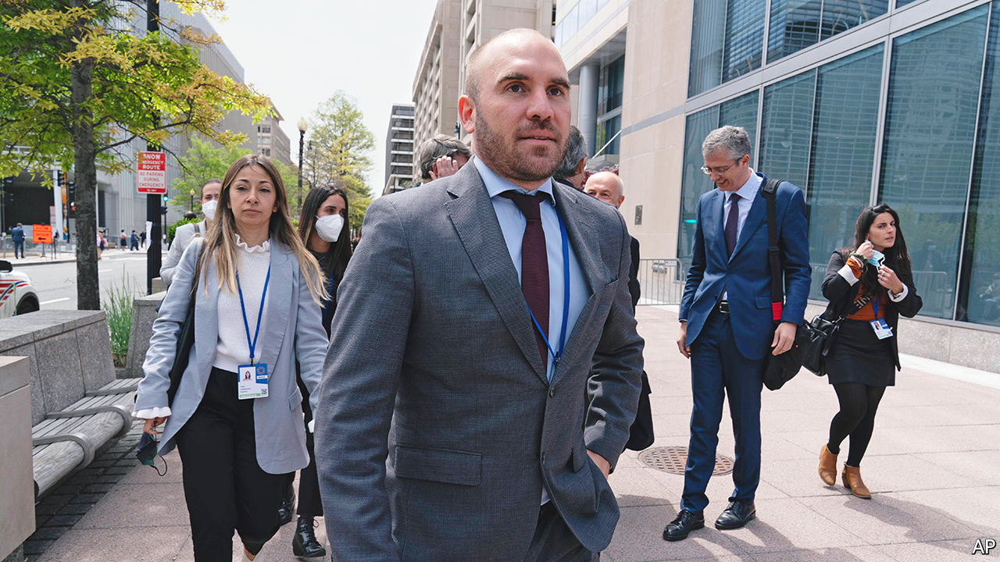
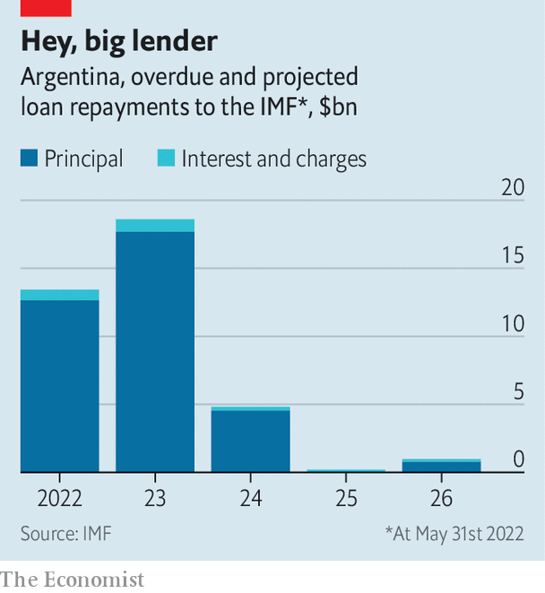

###### Find works; insert spanner; repeat

# Argentina’s economy minister resigns because of political infighting 

##### Martin Guzmán’s departure will exacerbate the country’s economic ills 

 

> Jul 7th 2022 

For several months Argentina’s president, Alberto Fernández, and his more left-wing vice-president, Cristina Fernández de Kirchner (no relation), have publicly aired their differences. Since September Ms Fernández has published blog posts that denounce the president’s supposed austerity. When he reached an agreement with the imf in January to restructure a gigantic debt, she flew to Honduras in a huff. To mark remembrance day in March, which commemorates the victims of Argentina’s military dictatorship, her son, a congressman, organised a separate parade to rival the president’s pow-wow. 

Now the saga has taken its most dramatic turn. On July 2nd Martin Guzmán, the economy minister, published a seven-page resignation letter in which he suggested that the spats between his superiors had prevented him from doing his job. The resignation is a victory for Ms Fernández, who had been pushing for Mr Guzmán, the president’s closest ally, to go. 

It comes less than a month after Matías Kulfas, the minister of industry and another ally of the president, was forced to resign after casting doubt on the role of Ms Fernández’s allies in the licensing of a gas pipeline (the case is being investigated; Ms Fernández described Mr Kulfas’ comments as “very unfair”). Both he and Mr Guzmán have been replaced by ministers closer to Ms Fernández.

Markets reacted badly to Mr Guzmán’s departure. The cost of a dollar on the black market, which more accurately reflects the value of the peso, shot up from 239 pesos to 260 (the official rate is artificially maintained at around 125). Some government bonds are trading as low as 20 cents on the dollar. The cost of insuring the country’s debt rose by 6%. Some businesses suspended sales, because the economic outlook seemed so uncertain. Meanwhile annual inflation is above 60%. The central bank has scant reserves of dollars.

 


Mr Guzmán was seen as one of the more sensible figures in the cabinet. He restructured $65bn of debt to international creditors in 2020 (equal to about a year’s government expenditure). He also cut the fiscal deficit after a spending boom during the pandemic and led talks to renegotiate the $44bn Argentina owes to the imf (see chart). None of this improved investors’ confidence in the country, which is a serial defaulter, though it did buy the government time. Yet it sparked the ire of Ms Fernández, who recently said that inflation is not caused by fiscal deficits but rather by debt. She also suggested the president should “use his pen” to halt imports. She believes that is the best way to remedy the dollar shortage. 

Silvina Batakis, the new economy minister, is a former civil servant. She was the economy minister of Argentina’s most populous province from 2011 to 2015, where she defended the use of price controls and higher wealth taxes. But more recently she said she believed in a balanced budget, agreed to stick with the deal with the imf (though she said “adjustments” were needed), conceded that price controls alone do not lower inflation and said that energy subsidies must “rapidly” be reduced—a particular affront to the more extreme elements in the government. Implementing these measures could stem another crisis. That is, if Ms Fernández allows it. ■

