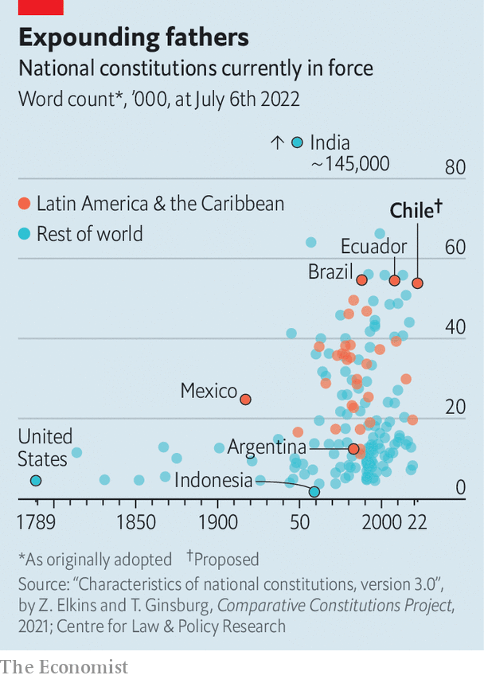

###### Hearts, not minds

# Chile’s new draft constitution would shift the country far to the left 

##### The process of drafting it has also polarised the country 

 

> Jul 7th 2022 

“In the middle of a political…crisis not seen in our country in decades, Chileans opted for more democracy, not less,” exclaimed Gabriel Boric, Chile’s 36-year-old president, on July 4th. His words marked the end of a year-long process to rewrite the country’s constitution. The final draft, which was presented to Mr Boric in a ceremony, will now be put to a referendum in September.

Chile’s current constitution was adopted in 1980, during the dictatorship of Augusto Pinochet. Even though it has been amended almost 60 times, some feel a completely new document is needed. In 2019 millions of people took to the streets in protests, some of which turned violent. Many of them argued that Chile’s problems stemmed from the old constitution. As a result, the centre-right government of the day put the idea of rewriting it to a referendum. Voters gave the go-ahead. 

A constituent assembly was formed of 155 people, many of them political novices. It was meant to rebuild trust in Chile’s institutions. Half of the delegates were women and seats were given to indigenous people to reflect their share of the population. But instead of uniting the country it has increased polarisation. Polls suggest that voters will reject the new constitution.

Part of the problem lies with the assembly itself. Although it was demographically representative, its ideological slant was not. Only 43% of voters bothered to choose the convention’s members in May 2021. Around 55 delegates were hard leftists, many of whom ran on single-issue tickets. Scandals did not help. A deputy resigned for lying about having cancer. They bickered among themselves. Indigenous constituents complained about racism. Right-wing representatives accused other assembly members of wanting to create an “indigenous monarchy”. Today only 40% of people trust the convention, down from a high of 63% in July 2021. Two-thirds find the draft worrying. A third find it hopeful.

Another problem is that the issues Chileans care about have changed. In May last year, most of those polled worried about health care and pensions. Today they care more about inflation and rising crime. Yet the convention carried on in a Utopian spirit. “The delegates saw themselves as the founders of a new republic, and it’s not clear that they should have interpreted their mandate in that way,” says Gabriel Negretto, a constitutional expert at Chile’s Catholic University. 

 


The resulting draft includes 388 articles, making it one of the world’s longest constitutions (see chart). It reflects the left-wing skew of the assembly. Although its language is opaque, it creates new socio-economic rights that, if enforced, would surely increase government spending a lot. One article says that “everybody has the right to care” from birth until death, and orders the creation of a state-run “care system”, whatever that might be. However much this costs, funding must be “sufficient and permanent”. Congress would be able to propose bills to increase spending, previously a power reserved for the president. (He retains a veto.)

Some articles unnerve investors. Trade unions would have a right to strike for any reason they see fit. Limits would only apply if a strike affects essential public services. When expropriating land, the state will pay a “just price” for compensation, a weaker protection than the formulation in the current constitution, which says that owners will receive compensation for “the pecuniary damage actually caused”. Water rights, previously treated as part of someone’s private property, become a public good. They would be regulated under a new state body that would issue permits. Farmers, who consume 72% of Chile’s water, say this creates uncertainty over the value of their land.

The final document shows flashes of restraint. It enshrines the independence of the central bank and maintains most checks and balances. It circumscribes regional governments’ power to borrow and repeatedly mentions fiscal responsibility. 

But constitutional scholars fret about the creation of a 17-member judicial council, which would have a broad mandate. It would nominate all judges; previously the Supreme Court, the Senate, the president and the court of appeals all had a role. Every five years the council would review the work of judges at public hearings (though it would not be able to review sentences). Rodrigo Correa of Adolfo Ibáñez University worries that this could put judges under pressure from public opinion.

The draft also tackles many subjects not normally considered constitutional. One article gives citizens the right to “adequate, healthy, sufficient, nutritionally complete and culturally relevant food”. The text mandates that the health-care system, courts and police all operate “with a gender perspective”, without elaborating. 

If voters reject the new constitution, the old one would remain in force. It could be improved. A super-majority in Congress could revise or scrap some of its 21 “organic laws’‘ which make tweaking legislation difficult. For example, changing education policy in Chile is almost impossible. The country’s Constitutional Tribunal also needs to be reformed. It often protects vested interests: in 2018 it prohibited a law that would have given the consumer-protection bureau the right to sanction companies that colluded to fix prices. 

Mr Boric will want the new constitution to be approved. His plans, such as creating a more elaborate national health service, would be easier to bring to fruition if it passes. But as the polls have turned against the charter in recent months, his people have stressed that they can implement their agenda even if it does not. Still, it would be a blow for Mr Boric, who championed the assembly, if its new constitution is stillborn. ■

