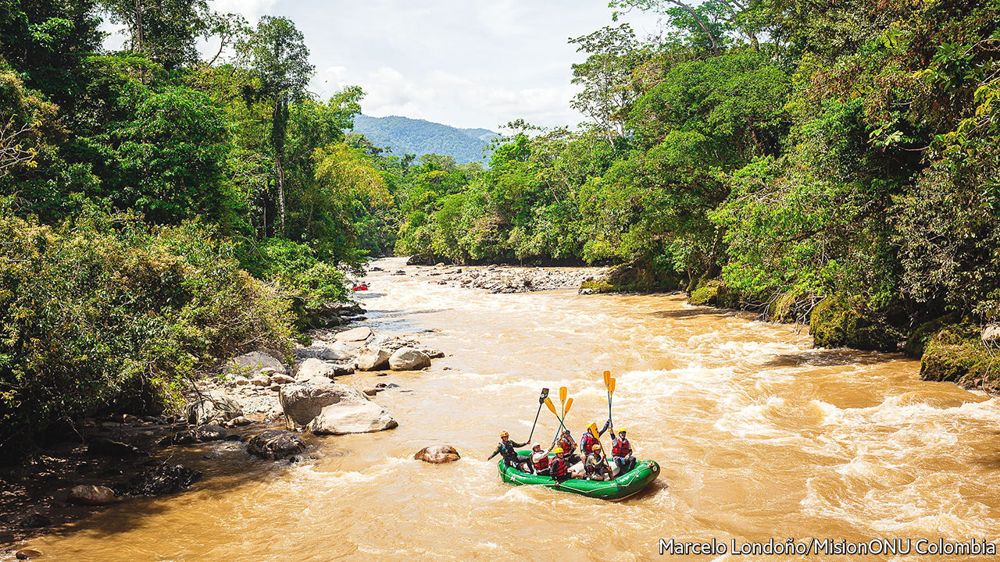
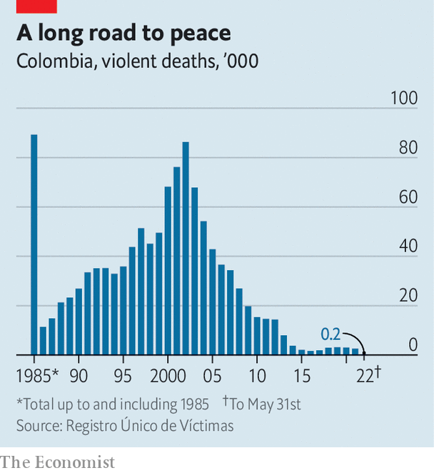

###### Rafting with rebels

# Some ex-FARC guerrillas have become tourist guides in Colombia 

##### But not everyone has swapped pistols for paddles 

 

> Jul 7th 2022 

It feels like floating down the nave of a flooded cathedral. Sheer walls of rock rise from placid, muddy waters, echoing with dripping vines and squawking parrots. Then the river widens and quickens, occasionally blocked by boulders that demand bicep-burning bursts of paddling to swerve. Waves of cold water smash over the raft as it bounces through foamy rapids. Eventually, it glides to a halt on a beach, where a local family waits with sugarcane and guava juice. “We’ve exchanged our rifles for oars,” grins a soggy Frellin Noreña, who was steering the raft and goes by the  of , or duck. “You’d have to be mad to prefer war over peace.”

Mr Noreña is a former fighter of the Revolutionary Armed Forces of Colombia (farc), a guerrilla group. Some 7,000 of his comrades gave up their weapons after a peace deal in 2016 that formally brought to an end the longest-running domestic conflict in the western hemisphere. He now works as a guide with Caguán Expeditions, which brings tourists to hurtle down rivers near Miravalle, in Caquetá, a remote corner of Colombia where outsiders have scarcely trod for decades. Backed by the un, the initiative aims to reintegrate former guerrillas by putting their knowledge of the Amazonian region to better use.

Several such projects exist. Ex-guerrillas offer birdwatching, hiking and hearty campfire cuisine as part of Tierra Grata Ecotours in La Paz, a town near the border with Venezuela. Over a two-day hike along boggy mountain paths, Jhonni Giraldo, a former farc footsoldier, leads hardy tourists to Marquetalia, a hamlet. In 1964 the military bombed an armed commune founded by refugees here into oblivion; the survivors headed to the hills and the farc insurgency was born. There is not much to see other than the rusted remains of a downed helicopter. Mr Giraldo is mulling over reconstructing the house of Manuel Marulanda, the founder of the farc. 

 


Lodging with local farmers provides tourists with a window into the stubborn poverty that the accord of 2016 was supposed to tackle. There are no roads and doctors visit rarely, says Fredy Conde, who laboriously transports his cheese on mules to sell at a local market. “In Colombia, the countryside is abandoned.” Staying in the farc resettlement camps, set up after the peace deal to rehabilitate ex-fighters, also offers a glimpse of the strains of demobilisation. Miravalle, daubed with murals of farc leaders and perched above a lush valley, boasts a fish farm, an organic greenhouse and a small museum as well as the rafting project. The rowing rebels have even competed in Australia.

But some river guides have decided to work instead as bodyguards for their former , says Mr Noreña (some 300 demobilised farc fighters have been killed since 2016). Many still revere their former commander, Hernán Darío Velásquez, better known as El Paisa, who abandoned Miravalle and returned to the jungle with a handful of men in 2018, leaving behind girlfriends and young children. El Paisa, reportedly killed in Venezuela in December last year, was a drug trafficker who murdered scores of civilians, counters Sebastián Velásquez of the Colombian Federation of farc Victims, an ngo.

Partly because such tensions remain, these ex-farc initiatives are unlikely to become a highlight on the international tourist trail. Just 10% of Caguán Expeditions’ clients so far have been foreigners, says Mr Noreña. The white-water rafting at San Gil, a seven-hour drive from the capital, is more exhilarating, he concedes. The Marquetalia Route will mostly interest history buffs and coffee fanatics (the region’s volcanic slopes pullulate with the stuff). 

Battle scars

But these initiatives are keeping a few families on the straight and narrow. And that is no small thing in a country where the scars from the armed conflict are still fresh. In its final report on June 28th, Colombia’s Truth Commission, set up in 2016 as part of the peace agreement, found that over 450,000 people were killed between 1985 and 2018—double previous estimates. Paramilitaries often linked to business elites and landowners were responsible for nearly half the killings; the farc and lesser rebel groups, a quarter. Some 7m people fled their homes.

The newly elected leftist president, Gustavo Petro—himself a former guerrilla, with the m-19 group—has promised to implement the commission’s recommendations, including reforming the armed forces and regulating the drug trade. Even a squaddie who briefly falls in with Mr Giraldo on the trail to Marquetalia argues that the state has so far failed to honour the promises of rural development. “Conflict isn’t good for anyone,” says the former rebel, trudging uphill to where it all began. The soldier concurs. “Not for civilians, nor the government.” ■

