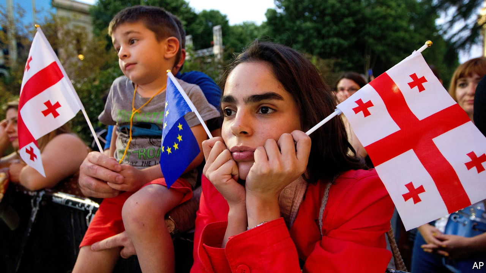

###### The Economist explains

# Why is Georgia struggling to join the EU? 

##### Its economy is improving but its politics remain a problem 

 

> Jul 6th 2022 

IT SEEMED TO be quite a snub. On June 23rd the European Union declined to grant Georgia candidate status, an important step towards full membership. Two other ex-Soviet countries,  and Moldova, did become candidates. The three had developed their relations with the bloc at a similar pace. In 2014 they all signed association agreements with the EU to encourage political collaboration and economic integration. More than 80% of Georgians want EU membership and last month’s setback sparked anti-government protests in Tbilisi, the capital. Why is Georgia falling behind on the path to accession?

When considering membership applications, the EU judges the stability of a country’s democratic institutions and the strength of its economy. First the European Commission gives a detailed opinion on a country’s application, either recommending that it be made an official candidate or outlining reforms needed to achieve that status. Its recommendation requires the approval of both the EU General Affairs Council, made up of member countries’ European-affairs ministers, and the European Council, made up of heads of state. Once candidate status is granted a country can negotiate a plan for accession. Official candidacy is no guarantee of membership, though. Turkey has been a candidate since 1999. 

The EU seems to have relatively few concerns about Georgia’s economy. In its opinion, released on June 16th, the commission praised reforms that have taken place since the early 2000s. The bigger problem is politics. Democratic backsliding in recent years has alarmed the bloc’s leaders. The commission made 12 recommendations for political reform, including improvements to the judicial system, media freedom and anti-corruption measures. The biggest challenge is what it called “de-oligarchisation”. That possibly refers to Bidzina Ivanishvili, a billionaire and former prime minister, who made his fortune in post-Soviet Russia. He claims to have retired from politics, having stepped down as chairman of the ruling party, Georgian Dream (GD), in 2021. But his associates are still in power: the internal-affairs minister, Vakhtang Gomelauri, was once his head bodyguard. 

Russia’s relationship with Georgia will also be on the minds of EU leaders. In 2008 Russia invaded Georgia and stationed forces in the breakaway statelets of South Ossetia and Abkhazia. Roughly 20% of the country’s territory remains under de facto Russian occupation. Having removed the pro-Western president Mikheil Saakashvili from power in 2013, Mr Ivanishvili and GD attempted to simultaneously affirm Georgia’s European ambitions and  with Russia. The government denies any undue Kremlin influence but its attitude to Russia is muddier than that of Ukraine or Moldova. Although most Georgians strongly oppose the invasion of Ukraine, the government has refused to  on Russia, Georgia’s second-biggest trading partner, claiming that would do too much damage to the economy.

The EU has not closed the door on Georgian membership. But pro-European activists fear that the government lacks the will to distance itself from Mr Ivanishvili, clarify its position on Russia and make the necessary reforms to achieve EU candidacy. Around 120,000 demonstrators marched on the Georgian parliament on June 20th, after the announcement of the commission’s recommendations for reform. More protests followed on June 24th, when the decision to deny candidacy was confirmed by EU leaders, and again on July 3rd. The bloc will review its decision on Georgia’s candidacy status by December. The chances of progress by then seem slim. 


