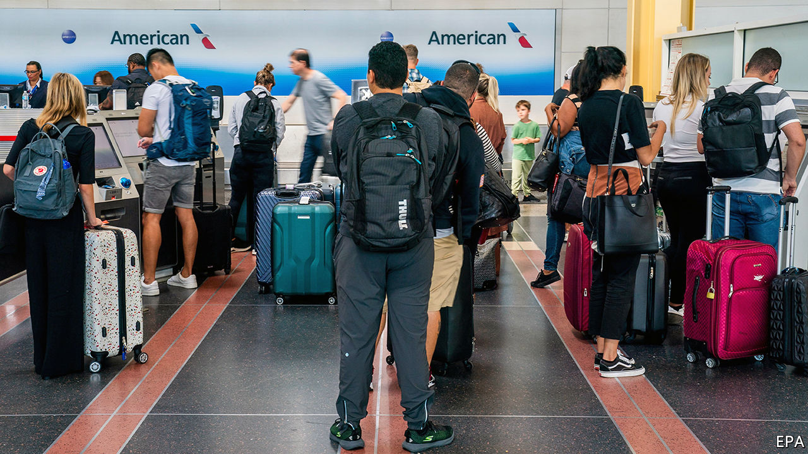
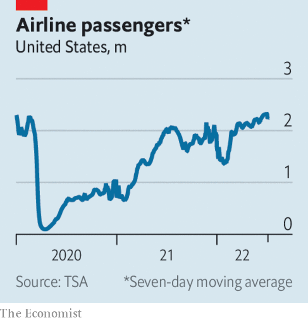

###### The world this week

# Business 

#####  

 

> Jul 7th 2022 

 


More Americans took flights over the July 4th weekend than at any time since the start of the pandemic. The Transportation Security Administration screened almost 2.5m passengers on July 1st alone, the most since February 11th 2020. But the  has left airlines and airports, which cut staff during the pandemic, struggling to cope. Hundreds of flights were cancelled over the weekend, and thousands more delayed. Estimates of the number of people travelling to America in the coming months have risen, now that it has lifted requirements on testing for covid-19. 

Flying into turbulence

Flight cancellations in Europe were more than double those in America between April and June.  has cancelled more flights over the busy summer, bringing its total to almost 30,000. The chief operating officer of  has resigned. The airline, one of Europe’s biggest low-cost carriers, has also had to cut its flight schedule. And  sought bankruptcy protection following a strike by its pilots. sas has long been in trouble. The Swedish government recently refused to bail it out. 

 delivery of vehicles to customers fell by more than a fifth in the second quarter compared with the first three months of the year. It was the first quarter-on-quarter decline in sales for the carmaker since early 2020. The company blamed “ongoing supply chain challenges” and factory shutdowns, but said that it had produced more cars in June than in any previous month. 

The Bank of England warned that the  for Britain and the global economy has “deteriorated materially”. It noted, however, that liquidity and capital positions at British banks remain strong, and that they still have “considerable capacity” to support lending to households and businesses. Curtailing lending “would harm the broader economy”, it said. 

 raised its main interest rate by half a percentage point, to 1.35%, the third consecutive increase. Annual inflation of 5.1% is at a 20-year high, and expected to rise again when official figures are published later this month.

 annual inflation rate hit 6% in June, the highest level since the Asian financial crisis of 1998. The  average inflation rate leapt to a new high, of 8.6%; the Baltic countries of Estonia, Latvia and Lithuania are contending with inflation rates of around 20%. Most countries battling surging prices might take comfort that things aren’t as bad as in , where inflation has reached 78.6%. The government there has almost doubled the minimum wage over the past six months to help low-income workers cope with the soaring cost of living, though that has only added to inflationary pressures. 

 reported its first monthly trade deficit since 1991, the year after the country’s reunification. Exports fell in May, in part because of a big drop in goods sold to Russia, while the cost of energy imported from Russia and other countries increased. 

The French government said it would fully renationalise , France’s biggest electricity provider (the state already held an 84% stake). edf has been beset by financial woes because of the government’s cap on electricity bills. It has also had to lower power production from its ageing nuclear plants. 

Once a darling of the Democrats,  criticised Joe Biden over the president’s handling of inflation, after Mr Biden made a plea for companies that run petrol stations to reduce prices at the pump. The former boss of Amazon described that as “either straight ahead misdirection or a deep misunderstanding of basic market dynamics”. Progressives reacted to his comment by renewing calls for a windfall tax on oil firms. 

Underlining those market dynamics, petrol prices in America fell this week, as  continued to retreat amid speculation of a recession. West Texas Intermediate, the American benchmark, fell below $100 a barrel. Brent crude hovered above $100.

 took a small stake in , a food-delivery service in America that is owned by Just Eat Takeaway. Based in Europe, jet has been pressed by investors to sell Grubhub little more than a year after taking it over. Amazon will offer Grubhub’s services at a discount to its Prime members in America. 

Justice desserts

 sued Unilever, its parent company, to block the sale of its business in Israel to a local licensee. The ice-cream maker has refused to trade its tubs of Chunky Monkey and Caramel Chew Chew in East Jerusalem and the West Bank (in effect a boycott of Israel) in support of the Palestinians. In its suit, Ben &amp; Jerry’s said allowing the sale affected its autonomy and its values of “advancing human rights” and economic and social justice. Many Israelis contend that its boycott is Half Baked. 

