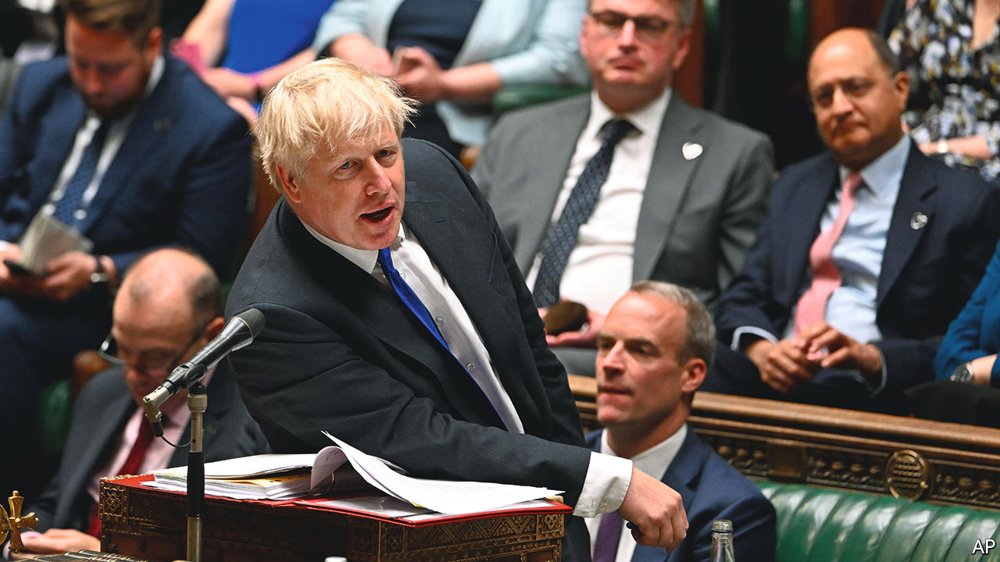
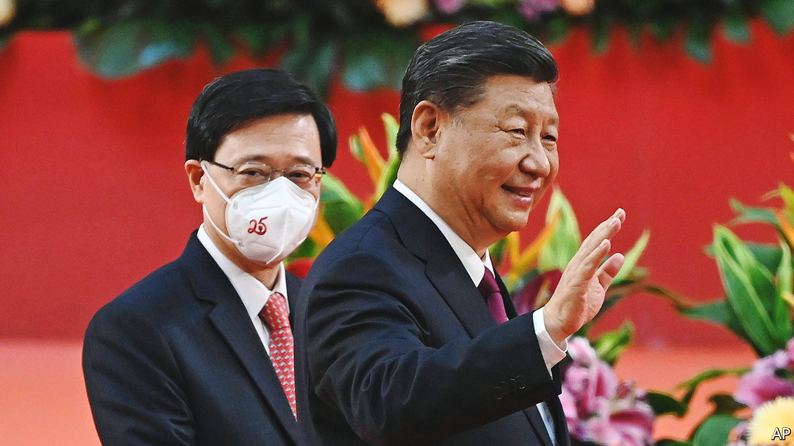

###### The world this week

# Politics 

#####  

 

> Jul 7th 2022 

, Britain’s prime minister, , but hopes to stay in office until the autumn, when a new leader can be installed. It was unclear as  went to press whether he would, in fact, be allowed to hang on. A rebellion within the Conservative government made his position untenable: dozens of ministers resigned, starting with the health secretary and the chancellor of the exchequer (finance minister). Various scandals were unfolding: the deputy chief whip had stood down amid accusations that he had drunkenly groped two men, and Mr Johnson was shown to have known about prior allegations of misbehaviour when he originally appointed him. Mr Johnson’s chaotic management style and repeated failure to tell the truth prompted many who had served under him to say they could no longer do so. 

Russia grabs more land

Russian troops captured the industrial town of Lysychansk, completing their takeover of Luhansk oblast in  east. The Ukrainian army is repositioning itself to defend more strategic sites in Donetsk, the other half of the badly bloodied Donbas region.

A conference on  was held in Lugano, Switzerland. Officials from America, Britain, the European Union and international organisations attended. The Ukrainian prime minister said a “full-fledged” recovery plan would cost $750bn. 

Ursula von der Leyen, the president of the European Commission, urged the eu to be prepared for a cut-off of . As electricity prices in Europe hit a new high, the European Parliament tweaked laws that would relabel gas and nuclear infrastructure as “green”.

The collapse of a glacier in the Italian Alps that killed at least nine people was blamed on climate change.  declared a state of emergency in five northern regions; a long bout of hot weather has caused the worst drought in 70 years. 

A gunman opened fire on a July 4th parade in Highland Park, a wealthy suburb north of Chicago, killing seven people. It was the deadliest such incident over the Independence Day holiday, which normally sees a spike in . Eight other people were gunned down in Chicago over the three-day weekend. Across the country more than 200 were killed in gun violence. 

In an emergency session,  state legislature passed a bill that would ban people from carrying guns near “sensitive” places, such as schools. The bill was crafted to comply with the Supreme Court’s recent curbs on gun controls.

The Supreme Court limited the power of the  to reduce greenhouse-gas emissions. Joe Biden’s plans to tackle climate change will now have to be rethought, and approved by Congress rather than implemented by executive fiat. 

Violent protests broke out in Karakalpakstan, an autonomous republic within , over planned constitutional changes to strip it of its right to secede. At least 18 people were killed. A state of emergency has been imposed for a month. The proposed changes have been dropped. 

Ranil Wickremesinghe,  prime minister, said his country was “bankrupt”. Sri Lanka has all but run out of fuel. With inflation at 55% the central bank raised its main interest rate by one percentage point to a 21-year high. Negotiations are continuing with the imf over a bail-out. 

A trove of Chinese police files has been offered for sale by a hacker in what appears to be one of the largest ever, containing information on 1bn Chinese citizens. China is notorious for its lax data security. The government likes to keep data unencrypted so it can spy on people. 

 


 president, Xi Jinping, attended a ceremony in  to mark the 25th anniversary of the return of the city from British to Chinese rule. Mr Xi said the “one country, two systems” model for ruling Hong Kong had worked. Critics say it has been subverted by a new national-security law that takes away many of the freedoms the Chinese government had promised to preserve. 

 said it shot down three drones heading for its gasfield in the Mediterranean that had been launched by Hizbullah, a Shia Muslim Lebanese party-cum-militia backed by Iran.

Mahmoud Abbas, the  president, and his long-standing rival, Ismail Haniyeh, who heads Hamas, the Islamist group that runs the Gaza Strip, met in Algiers. They have been at loggerheads for many years. Arab intermediaries periodically try in vain to make them reconcile with each other.

Gabriel Boric,  president, was presented with the  The document, which has been hashed out by an assembly including many political novices, is left-wing, Utopian and very, very long. With 388 articles it would, if adopted, be one of the wordiest constitutions in the world. Polls currently suggest that Chileans will reject it in a referendum in September.

 economy minister, Martín Guzmán, , citing squabbling between the president and vice-president. Mr Guzmán was seen as a stabilising figure in a country that is both politically and economically turbulent. 

 military government said it would withdraw from talks aimed at restoring civilian rule and instead allow civilians to form a transitional government. Activists who have protested for months against military rule say they will stay on their barricades to ensure the army, which has staged two coups since 2019, does not cling to power.

Jihadists attacked a prison in Abuja, the capital of, freeing 600 people including members of Boko Haram, a terrorist group that straps bombs to children. Separately, gunmen attacked a presidential convoy in Katsina, a state in Nigeria’s north. Muhammadu Buhari, the president, was not there.

Police in  broke up large protests against rising living costs. The government has started talks with the imf about a bail-out amid a deepening economic crisis. 

Africa’s big scorers

 football association is to  two matches that reported the astounding scores of 91-1 and 95-0. Allegations of match-fixing have surfaced before in west Africa, notably in 2013 when two games in Nigeria ended with scores of 67-0 and 79-0. The highest-ever scoring match was 149-0 in Madagascar in 2002, when one team’s players repeatedly kicked the ball in their own net to protest against refereeing decisions.

