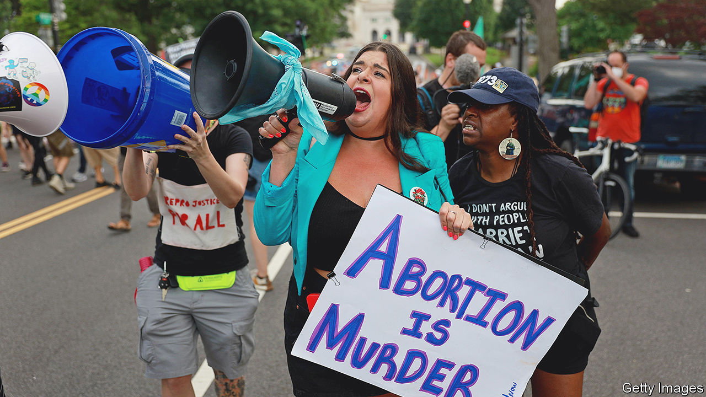

###### Zygote rights

# A push to recognise the rights of the unborn is growing in America 

##### The movement risks inflicting grievous harm on pregnant women 

 

> Jul 7th 2022 

What happens when America’s extreme anti-abortion activism meets its litigiousness? Fetuses get their own lawyers. In recent years some judges in conservative states have appointed legal representation for fetuses in abortion disputes (generally, when a minor wants to terminate a pregnancy). The arrangement has some glaring holes. Lawyers cannot meet or talk to their client or, supposing a fetus had wishes, guess at them. Yet with the recent overturning of the ruling that had enshrined access to abortion as a constitutional right—the push for legal recognition of the “personhood” of fetuses is set to grow.

Many anti-abortionists believe that life begins at conception. Proponents of “fetal personhood” go a step further, arguing that the 14th Amendment of America’s constitution gives “equal protection of the laws” to all, including a fertilised egg (despite the fact that as many as half of all zygotes do not implant and become pregnancies). Increasingly, anti-abortion legislation is adopting the language of fetal personhood.

, the case that ended , did not do so. But the Supreme Court’s momentous ruling, on June 24th, criticised the view that “the Constitution requires the states to regard a fetus as lacking even the most basic human right—to live—at least until an arbitrary point in a pregnancy has passed”. Laura Portuondo, a fellow in reproductive rights and justice at Yale Law School, says this is likely to encourage the emergence of state laws banning abortion explicitly in the name of fetal personhood.

Efforts to ban abortions on personhood grounds are “ethically clearer”, argues John Seago, the president of Texas Right to Life, an anti-abortion organisation. Mr Seago was influential in the push to pass a stringent abortion ban in Texas last year. “They are more honest about the ethical principle that underlines the belief that abortions are wrong,” he adds. Emphasising fetal personhood is a natural next step, he says, in working towards a national ban. Like many others in this camp, Mr Seago is “not content” for abortion to be decided on a state-by-state basis.

Before  was overturned dozens of states introduced bills that banned abortion by establishing fetal personhood, according to the Guttmacher Institute, a pro-choice think-tank. Because  rejected the idea and protected abortion until a fetus was viable, such laws were blocked. Since its overruling, at least two states have sought to reinvigorate them.

It is unclear if such laws will be allowed to stand. In Arizona the American Civil Liberties Union and the Centre for Reproductive Rights, two advocacy groups, are suing state officials over an abortion ban that would give “an unborn child at every stage of development all rights, privileges and immunities…” on the basis that the law’s “vagueness” violates the right to due process and puts providers and women at risk of prosecution.

Congress is not likely to pass an abortion ban based on fetal personhood any time soon. Elizabeth Sepper, a professor at the University of Texas School of Law, says it would lead to impossible questions over matters from the census (should it count fetuses?) to imprisoning pregnant women (can the state not imprison pregnant women since it would mean locking up the fetus as well?). Most Americans would not, she says, “struggle between saving a one-month-old infant and a container with dozens of embryos”.

Yet such beliefs need not be explicitly written into law to have an impact. Abortion-rights activists note that emphasising the legal rights of a fetus means compromising those of the woman who is carrying it. Believing that fetuses have rights has already led to cruel extremes, such as abortion bans with no exceptions for pregnancies that arise from rape.

The idea also affects how women are treated in pregnancy. Dana Sussman, deputy executive director of the National Advocates for Pregnant Women, which provides legal assistance for those who have had abortions, says her organisation has recorded lots of examples of forced interventions that prioritise the fetus over the well-being and autonomy of the mother, from bed rest to caesarean sections. Hospitals have reported pregnant women to the police for testing positive for drugs while pregnant. Some doctors are unsure about whether they may insert iuds as emergency contraception (in some cases the devices prevent the implantation of a fertilised egg). Without  such distressing scenarios will become more common. ■


