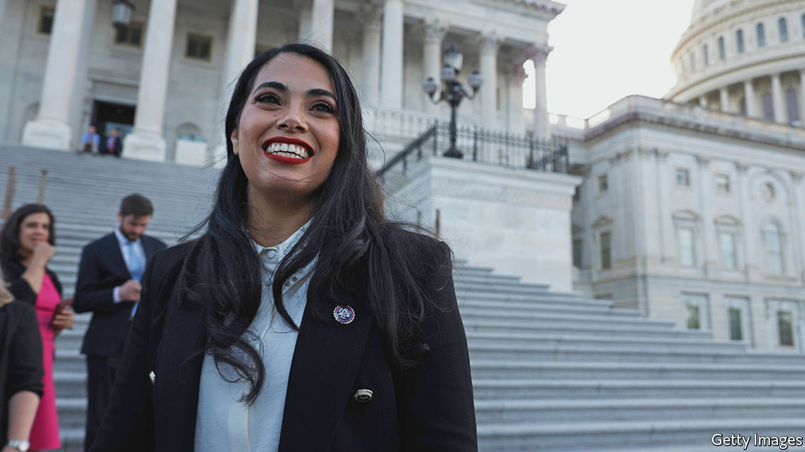

###### No, no se puede

# Democrats have a Hispanic problem 

##### Among Latino voters, the Trump years hurt Democrats more than they helped 

 

> Jul 7th 2022 

Southern texas, a heavily Hispanic region along the American border with Mexico, was once a Democratic stronghold as reliable as any urban core. But it now appears to be crumbling. Last month a special election was held to pick the next representative for the state’s 34th congressional district, which snakes 250 miles (400km) down from the San Antonio exurbs to the border city of Brownsville and the southernmost tip of the state. Some parts of the district have been represented continuously by Democrats since 1870. Barack Obama carried it by 23 percentage points in 2012. It is 85% Hispanic.

Yet it was a Republican, Mayra Flores (pictured), who triumphed. The first Mexican-born congresswoman in American history is hardly a moderate. She is a pro-life, anti-vaccine-mandate Republican who is searingly critical of illegal immigration (and married to a Border Patrol agent, to boot).

Democrats are starting to realise that they have a Hispanic problem. Party strategists who hoped that Donald Trump’s racially incendiary rhetoric, his campaign pledge of a big, beautiful border wall and the fiasco of his family-separation policy might have pushed more Hispanic voters into the Democratic camp found the opposite. Between 2016 and 2020, Mr Trump improved his share of the Hispanic vote, according to numbers crunched by Catalist, a Democratic-aligned political-data firm—from 29% to 37%. Among all major ethnic groups, that shift was the largest.

The Democratic erosion was worst along the Texas border and in Southern Florida—dimming Democrats’ hopes of winning Senate seats or governorships in those states. In the district flipped by Ms Flores, Hillary Clinton won 59% of the vote in 2016. President Joe Biden managed just 51.5% against 47.5% for Donald Trump. Republicans are now seriously contesting three congressional districts in Southern Texas. In Florida, analysis by Equis Research, which specialises in Hispanic public opinion, shows that in majority-Latino precincts of Miami-Dade County, Mr Trump improved his performance from 30% of the vote in 2016 to 50% in 2020.

In both Texas and Florida, local conditions may be magnifying the national trend. Open borders and police abolition are dirty words, not the stuff of liberating slogans, for Hispanics who live along the southern border. Antipathy for encroaching socialism is especially high among Hispanics in southern Florida, many of whom arrived as refugees from dictatorial communist or leftist regimes. Research by Equis shows that more Hispanic voters (and many more so in Florida) said they worried about Democrats embracing socialism and leftism than they did about Republicans embracing fascism and anti-democratic politics.

Southern Texas Democrats, who are overwhelmingly Hispanic, have “always been more conservative than Hispanics elsewhere”, says Mark Jones, a professor of Latin American studies at Rice University in Houston. Henry Cuellar, a Democratic congressman facing a close race to keep his district, on the border with Mexico, is the only Democrat in the House of Representatives who opposes abortion. Mr Jones notes that his polling of Hispanics in Texas shows that those who are male, evangelical or have two white grandparents are gravitating towards the Republican Party fastest. For conservative Hispanics, the Democrats’ national brand has become associated with gun control, trans rights, lax border policy and limited support for law enforcement, and is therefore less palatable. Although more Democrats running in border states have recently taken to criticising Mr Biden’s immigration policy, it may be too little, too late.

On both the economy and culture, Republicans claim to be the rightful party of the working class, whether white or Hispanic. “The number-one reason for success is how terrible the Democrats are. They’ve taken this far-left socialist turn, and it has turned a lot of Hispanic voters off,” says Tony Gonzales, a Republican congressman from Texas’s 23rd district, which stretches along the south-western border. Mr Gonzales notes that anti-police rhetoric does especially poorly in a district like his where many Hispanics have family who work in law enforcement. 

Mario Díaz-Balart, a Republican congressman from southern Florida, argues that the Democratic Party has simply become out of touch. “It’s become the party of the corporate elites, it’s become the party of the media elite…‘Latinx’ comes to mind. No Latino, no Hispanic calls themselves Latinx,” he says. Ruben Gallego, a Democratic representative from Arizona, has berated his party for ignoring that linguistic reality, and argues that the gender-neutral adjective is used only to “appease white rich progressives”. Only 2% of Hispanics say they use the term.

Messrs Gonzales and Díaz-Balart recently launched the Hispanic Leadership Trust, a political action committee to support the election of conservative Latino candidates. One of the new breed of Republicans it might help put in office is George Santos, a gay son of Brazilian immigrants, who is running for a toss-up congressional seat on Long Island in New York. He notes Latinos are conservative by nature. “South America is the largest Catholic, Christian continent in the world…I think that this excessive left-leaning social agenda that the Democrats are pushing is counterproductive. And the Republicans for the first time are hitting the messaging right.” ■


