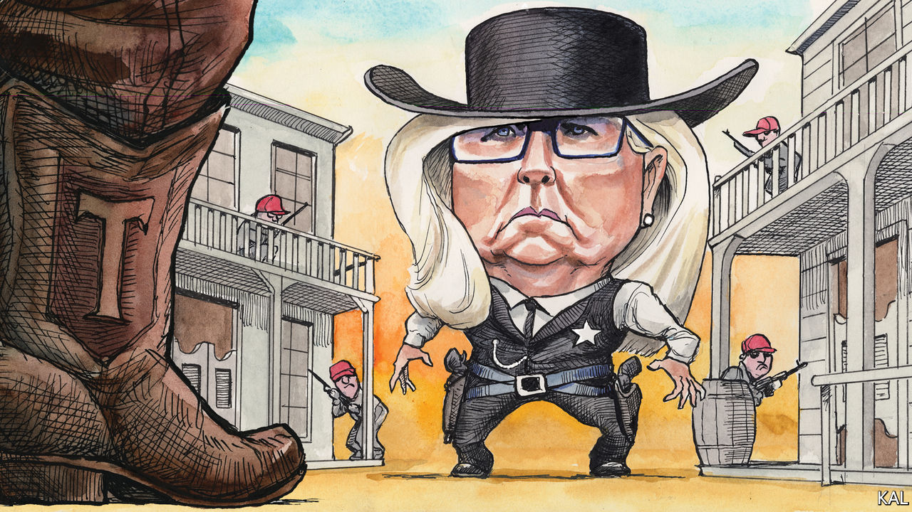

###### Lexington

# High noon for Liz Cheney 

##### Her example holds a lesson for the Republicans—and everyone else 

 

> Jul 6th 2022 

His fiancée, the pretty schoolmarm from Vermont, has tried to understand his peculiar code of honour. But as she begs the cowboy known simply as “the Virginian” not to go into Medicine Bow’s dusty streets to face the bad guy, she accuses him of serving only his pride. “I don’t know what you call it,” replies the cowboy, played by Gary Cooper in “The Virginian”, a film from 1929 based on a classic novel of that name. “But it’s somethin’ in the feelings of a man, down deep inside. Somethin’ a man can’t go back on.”

When Harriet Hageman, who is running in the Republican primary to be Wyoming’s sole member of Congress, mocks the incumbent, Liz Cheney, as “the Virginian”—Ms Cheney grew up there—it is doubtful she means to invoke this tale, which helped mint the heroic image of the cowboy. But, however unintentionally, she does point up how little value many Republicans place these days on rugged individualism, backbone, honour and so forth. In real life, they find these traits pretty annoying. They prefer the cattle to the cowboys.

Ms Cheney’s failing, Ms Hageman says, is that she has gone her own way rather than “ride for the brand”. You can guess what brand that really is. Back in 2016, Donald Trump barely registered in the Republican primary in Wyoming. Ted Cruz was favoured, including by Ms Hageman. She called Mr Trump “racist and xenophobic”. Now Mr Trump is so popular in Wyoming that even a Democrat seeking Ms Cheney’s seat supports him. 

Ms Hageman backs him with zeal and questions the legitimacy of his defeat in 2020. Mr Trump prizes no supporters more than those who once rejected him but then roped, broke and branded themselves. He has endorsed Ms Hageman and appeared last month at a rally in Casper with her. Ms Hageman, a lawyer, stoked the crowd by itemising things to revile, from illegal immigration to Anthony Fauci. But one bit of elaboration popped out when she said Mr Trump knew she would represent “your fallacies”, quickly amending that to “families”. 

Ms Cheney has travelled the other way. She endorsed Mr Trump in 2016, the year she first won her father Dick Cheney’s old seat, and voted with him more than 90% of the time, according to the politics website FiveThirtyEight. Her own rise was meteoric. After just a term her colleagues elected her conference chairwoman, the third-ranking Republican leader, and talked of her as an eventual speaker. They loved her slashing attacks on Democrats (“the party of anti-Semitism, the party of infanticide, the party of socialism”).

Then, on the night of January 6th last year, Ms Cheney found herself in the Capitol’s statuary hall. Exhausted law enforcement officers in black armour sat on the floor, resting against the marble figures. She looked up at the building’s oldest statue, of Clio, the muse of history. Though other Republicans’ resolve to punish Mr Trump would crumble, Ms Cheney voted to impeach him and kept hammering away even as her colleagues , and her state party voted not to recognise her as a Republican. When Nancy Pelosi asked her to serve on the , after Republican leaders forswore it, she accepted immediately. “I’m asking you to understand that I will never violate my oath of office, and if you’re looking for somebody who will then you need to vote for somebody else,” she said in a recent debate.

The primary is on August 16th, and Ms Cheney appears to be trailing. Alan Simpson, a former three-term senator, has known her since she was a girl. Asked if she could win, he says he doesn’t know. “That really isn’t the issue for her,” he adds. “That’s not the golden chalice for Liz.”

Senator Simpson, droll as ever at 90, was once booted from a leadership position himself, for insisting on being pro-choice in a pro-life party. He is delighted by Ms Cheney’s resistance to the herd: “She’s her own person.” He describes an environment of hate and nihilism around Mr Trump like nothing he has seen. “The guy is a wrecking ball of history,” he says. The chalice, for Ms Cheney, is to block Mr Trump’s path back to power, and the testimony elicited by her sombre, methodical questioning may just achieve that.

The Gary Cooper character she most resembles now is not the Virginian but Will Kane, the lawman of “High Noon”. When he learns on his wedding day that the murderer he sent away is returning with henchmen to get his revenge, Kane tries to enlist his fellow citizens in the town’s defence, only to be turned down time and again. Many are afraid; some consider Kane a tiresome prig; some admire the bad guy. For Kane, the corrupt character of his community comes into agonising focus.

In the end, Kane has an ally in his wife, played by Grace Kelly. Ms Cheney is stuck with the Democrats and their affiliated news organisations. They are treating her as a hero. That should prompt them to ask whether they had enough respect for her character before, when she took positions obnoxious to them. In this tribal, conformist era, they certainly respect Republican mavericks far more than they do their own—just ask Joe Manchin, the West Virginia senator who has been demonised for resisting the president.

Hero and the herd

“High Noon” came out more than 20 years after “The Virginian”, in 1952, the McCarthy era. As he was finishing the script, the writer, Carl Foreman, was subpoenaed by the House Un-American Activities Committee. He admitted he had been a member of the American Communist Party. But he refused to name others, an act of principled defiance that landed him on Hollywood’s blacklist.

“High Noon” is the film most requested in the White House by presidents, writes Glenn Frankel in his book about the film and its era. Bill Clinton screened it some 20 times. No doubt these presidents identify with Kane, as does anyone who watches the film. We are kidding ourselves; the film suspects us all. As Mr Frankel puts it, “‘High Noon’ says, ‘Let’s look at ourselves carefully.’” So does Ms Cheney. ■


