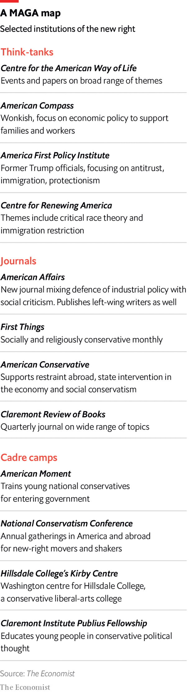

###### A Washington army in waiting

# In preparation for power, America’s new right builds new institutions 

##### The movement inspired by Donald Trump entrenches itself in Washington, DC 

 

> Jul 5th 2022 

A gilded conference room stocked with coffee and lanyard-wearing men in dark suits is a common enough sight in Washington. Only a sign at the door reading “The Lies of the Ruling Class”, hosted by the Claremont Institute’s year-old Centre for the American Way of Life, marks this event at the Mayflower Hotel as something more unusual. “America’s elites are not bright, not competent and not qualified,” says Michael Anton, a former national-security aide to Donald Trump, in the day’s first session. United in favour of economic nationalism, a restrained foreign policy and restricted immigration, many of the room’s self-described national conservatives see the “threat” to America from the left in existential terms. Yet they are brimming with confidence.

Come November, when Republicans expect to retake one if not both chambers of Congress, the national conservatives hope to translate their budding movement’s energy into a share of that power. Thrilled by Mr Trump’s election but disappointed by his inability to convert unorthodox instincts into action, they are intent on shaping a new conservative elite and agenda. Like-minded wonks and former Trump-administration officials are busy building think-tanks and advocacy organisations, to provide the policies and, crucially, the personnel for a new Republican right.

Conservatives have long relied on such places to “formulate concepts, strategies and policies that elected officials can implement when in positions of authority”, says Matthew Continetti, a scholar at the American Enterprise Institute (aei), a conservative think-tank, and author of a history of the American right. Years before Ronald Reagan became president, think-tanks including the Heritage Foundation and magazines such as  promoted a generation of Republicans that embraced free markets, social conservatism and an assertive foreign policy. They provided a career for young conservatives—and cadres for White House personnel directors and congressional chiefs of staff seeking to hire ideological allies.

 


But Mr Trump’s unexpected election was not preceded by institution-building to match his America First instincts. To staff the government, Mr Trump instead depended on outfits like the Heritage Foundation, stocked with many experts who had opposed him. The Republican majority in Congress busied itself with older priorities, such as tax cuts. It was the handful of dissident Republicans with experience and networks in Washington, like Robert Lighthizer, a lawyer appointed as us trade representative, who proved to be the most effective policymakers in the administration, reckons Mr Continetti.

Among the first to act was the Claremont Institute, based in southern California. It shot to prominence for its affiliates’ defence of Mr Trump. One of these was Mr Anton. Another, John Eastman, was the legal theorist behind Mr Trump’s bid to cling to power after the 2020 election. The institute has a highbrow journal, the , and a centre on Capitol Hill near other new-right institutions. A few blocks away is the Washington outpost of the conservative Hillsdale College, where Mr Anton is a lecturer. Nearby is the townhouse of a former Trump adviser, Steve Bannon, convener of new-right personalities and backer of national conservatives abroad like Italy’s Matteo Salvini.

A clutch of journals now promotes the new right’s ideas. First published in 2017, the quarterly  defends industrial policy and rejects the laissez-faire of conservatives past; it exemplifies the new right’s interest in using state power to reshape the economy and society. and the  are older but represent the salience of religious and nationalist thinking.  has published essays in favour of a pro-family welfare state to complement abortion bans. The  has argued for limits on American support for the war in Ukraine. Their tiny circulation belies their significance in stirring debate and giving new-right thinkers a chance to burnish their reputations.

Part wonkish, part anti-woke

To translate such ideas into policy, new think-tanks have sprung up. Among the more sophisticated is American Compass, founded in 2020. “There was this white space in the institutional landscape to put out new ideas in a rigorous way,” says Oren Cass, its founder. He has no love for Mr Trump, whose actions following the 2020 election he called “impeachable offences”. Mr Cass prefers to focus on wonkish proposals in support of the Republican Party’s turn towards statism, which have been influential among lawmakers. 

Last year Senator Mitt Romney proposed a universal child allowance to cut poverty and encourage family formation. It shared many characteristics with a scheme from American Compass, but Mr Cass and his colleagues criticised the absence of an incentive for work. A new version of the bill released on June 15th incorporated an earnings requirement. Another proposal from the think-tank to create firm-based workers’ councils, rather than labour unions, has been taken up by Senator Marco Rubio.

Former officials from the Trump administration have also created think-tanks, perhaps for combat in the culture wars as much as for policy work. The America First Policy Institute and the Centre for Renewing America (cra) churn out reports on right-wing bugbears: the latter, for example, has drafted tools for school boards to clamp down on the teaching of critical race theory. America First Legal, founded by Stephen Miller, a former Trump aide, is challenging the Biden administration in court, mostly over any loosening of immigration rules.

These outfits are perhaps the most loyal on the new right to Mr Trump personally. The cra employs Jeffrey Clark, whom the former president attempted to install as attorney-general to help him remain in office. After the fbi searched Mr Clark’s home on June 22nd in connection with the plot, Russ Vought, president of the cra and Mr Trump’s former budget director, decried the raid as “criminalising politics”.

Whether policies become reality depends on attracting and developing cadres, particularly young ones. The most prominent of these efforts is the National Conservatism Conference, begun during the Trump administration and held annually. It has drawn not only the new right’s leading thinkers, but also many ambitious politicians like Senators Josh Hawley and Ted Cruz. The opportunity to rub shoulders with new-right icons has made the conference hugely popular with young conservatives. That enthusiasm is evident in some older conservative institutions that cater to the young and to activists, including Turning Point usa and the Conservative Political Action Conference, which have embraced Mr Trump to retain their clout.

The Claremont Institute’s long-standing fellowship has alumni spread across the conservative movement. But American Moment, launched in February 2021, has made it its mission to identify and train young national conservatives for careers in Washington. “We’re looking for people who share our beliefs and motivations, to get them involved in the fight,” says Saurabh Sharma, the organisation’s president.

All of these initiatives require money. Some comes from donors that have long funded conservative causes, such as the Bradley, DeVos and Scaife foundations. Older institutions will compete for these funds: under a new president, the Heritage Foundation is shifting towards new-right positions and rhetoric, in part to retain access to donors; Trump-sceptical redoubts such as aei may fade into irrelevance in the party even as many remain formidable fundraisers.

But the new right has also proved adept at mobilising new funders. Peter Thiel, a venture capitalist and early backer of Mr Trump, has become a major benefactor to the National Conservatism Conference. Two Silicon Valley-based philanthropies, the Hewlett Foundation and the Omidyar Network, have earmarked millions of dollars for organisations to develop alternatives to market-friendly policies. , American Compass and American Moment have each managed to secure some of these grants.

The effectiveness of all this activity will become clearer after November’s mid-term elections. If Republicans retake both chambers, the party may need over 1,000 additional staff; the new right aims to contribute many of them. They will spread ideas and craft legislation. And they will eventually populate the executive branch under the next Republican president.

Where the new right may stumble is in its affiliation with Mr Trump. Many policy wonks are ambivalent about his continued involvement in Republican Party politics; they are more concerned about the long-term prospects of their own movement. Republican voters’ fealty to the erratic former president may thwart any hopes by new-right elites for a more disciplined successor, such as Florida’s governor, Ron DeSantis. But any future new-right president will have a Washington army in waiting. ■


