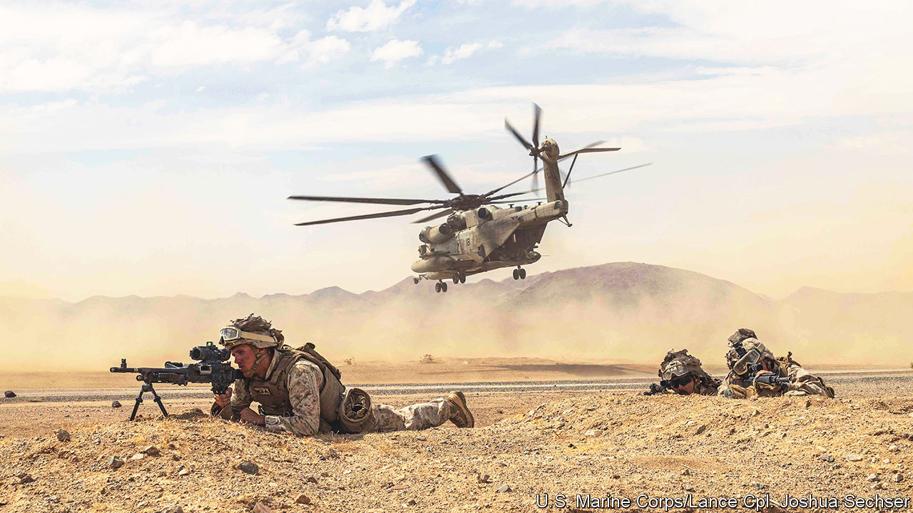

###### Command and control

# The Pentagon sharpens its cultural sword to win future wars 

##### More scattered forces will need to be more nimble and enterprising 

 

> Jul 7th 2022 

The war in Ukraine is hastening America’s own military rethink. The fighting holds lessons, from the vulnerability of tanks to the value of defensive weapons. Those pondering a future war between America and China draw a further conclusion: the advantage that “mission command” can give a military force, even one as outgunned as Ukraine’s.

A “decentralised, power-down, do-whatever-it-takes-to-win approach” to command and control is one reason the Ukrainians have pushed the Russians back from Kyiv, notes Doug Crissman, who was recently in charge of the Mission Command Centre of Excellence at Fort Leavenworth, Kansas, where much military doctrine is developed. In contrast, the Russian army’s rigid, top-down command system from the Soviet era has left it flat-footed, able to advance only through destructive artillery fire. Around a dozen Russian generals, taking charge of matters on the front line, have been killed there.

American planners are grappling with the new age of great-power contest, in which conflict with Russia or China is likely to mean American troops’ being outnumbered and fighting far from home. Rivals are already shrinking the technological gap that America has long enjoyed; in some areas, such as hypersonic missiles, Russia and China already outpace it.

So America is doubling down on its cherished concept of “mission command”. This involves the commander setting out objectives and then delegating much decision-making to lower-level officers. Western soldiers, many argue, are better able to take the initiative than troops trained under an authoritarian system. The idea, says Michèle Flournoy, a former under-secretary of defence for policy, is to harness this cultural strength of democracies more fully. As long as soldiers abide by the commander’s intent, they fight more effectively when given “licence and encouragement” to deviate from plans.

Generals like to say that no plan survives first contact with the enemy. Units able to improvise and devise alternatives should thus be able to seize opportunities. The notion was important in Iraq and Afghanistan, where small units were often dispersed. It could be even more important in the vast expanse of the Pacific. China’s arsenal of medium- and longer-range ballistic missiles makes large permanent bases more vulnerable. American forces are moving towards more flexible, dispersed forms of warfare. That will require the ability to detect enemy targets and strike them across long distances, and to push out supplies to far-flung units. It will also require those units to be more autonomous. 

America’s Marine Corps is keenest on the trend. Implementation, says Eric Flanagan, a spokesman for its commandant, David Berger, includes training recruits to “go out on a limb, think differently” and not fear failure. In November the marines announced a personnel revamp, Talent Management 2030. It tightens selection criteria to create a smaller, more independent force. The incentives to re-enlist have been expanded, with the aim of increasing its median age and therefore, it is hoped, military judgment. The plan also calls for recruiting mid-career professionals.

The navy, too, sees mission command as central to its “distributed lethality” reconfiguration: as anti-ship missiles proliferate, the navy will operate in more scattered fashion to avoid radio communications that can reveal its positions. The air force’s chief of staff told officers last year to “push decisions to the lowest competent, capable level”. Even the army is empowering “privates and sergeants at the tip of the spear” to take action “without calling back to the mother ship”, says Mr Crissman.

Control and command

The war in Ukraine is a natural experiment in the value of mission command. Ukrainian forces have used it well, partly thanks to three decades of democracy, however fledgling, and years of training provided by Western allies. Some experts thought Russia’s army would embrace mission command with its modernisation, begun after its poor performance in Georgia in 2008. 

But the concept has proved anathema to an increasingly authoritarian system, says Nora Bensahel of Johns Hopkins University. Nor does it help, she adds, that many Russian soldiers are conscripts disinclined to give their “creative all”. Russia’s big military exercises seem designed less for cultivating problem-solving than for political signalling and propaganda. Rampant corruption and restrictions on speech dampen, respectively, trust and critical thought—essential to mission command.

What about China? As part of his quest to turn it into a “world-class” military power by 2049, President Xi Jinping has pressed for the introduction of modern weapons and the recruitment of more talented soldiers. But he also wants to step up their political education. Military commanders must ”ensure rigid adherence to party guidelines”, explains Blake Herzinger, an American naval reserve officer who lives in Singapore.

Should America ever fight China, a more dynamic military culture should offer an important edge. But as the conflicts in Iraq and Afghanistan showed, there is more to winning wars than effective mission command. What is more, says Jason Brown, a former air-force colonel, defence planners would be wise not to assume that every non-democracy would perform as poorly as Russia’s army. China’s entrepreneurial spirit, he notes, runs deep. ■


