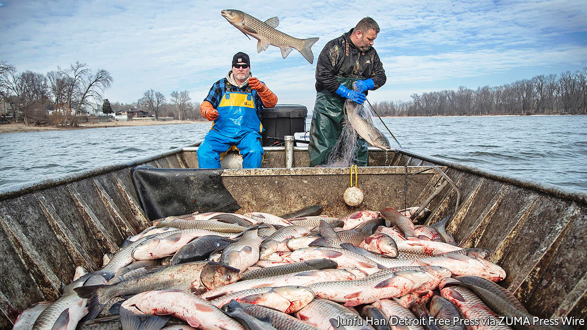

###### Ceci n’est pas une carpe

# To hook American diners, an invasive species of carp gets a new name 

##### It has worked before, for the Patagonian toothfish and the slimehead 

 

> Jul 7th 2022 

What’s not to like about Asian carp? Nutritious, mild and delicate in flavour, it can be filleted, deep-fried or minced into fish cakes—just mind the bones. But Americans do not care for it. For starters, they confuse the fish with the common (or European) carp that is a bottom feeder, a much-maligned group. Yet tempting people to eat more Asian carp could boost biodiversity in rivers across America’s South and Midwest. With a new campaign, officials in Illinois hope to lure diners.

The carp was brought from Asia in the 1970s to help clean aquafarms in Arkansas. (They clear the water of plankton and algae, earning them the name of “filter feeders”.) From there they escaped into the Mississippi and propagated northward, outcompeting native fish species for food. Now they are abundant in the Illinois River. Ecologists worry they will evade barriers in the waterways around Chicago and enter the Great Lakes, reducing the native fish diversity there.

In 2018 the Illinois Department of Natural Resources decided it would “recast” how Asian carp is perceived. Marketers were brought in. They cooked up a new name, which was released on June 22nd: copi (for copious). Nick Adam of Span, the agency behind the rebranding, says the goal was to shed the fish’s reputation as one only for adventurous eaters. Focus groups described copi as “cute” and “manageable”.

Asian carp is not the first to get a makeover. The Patagonian toothfish is marketed in America as Chilean sea bass (it is neither a bass nor native to Chile). The foul-sounding slimehead has been much better known as orange roughy since the late 1970s. And managing invasive species by harvesting them is not a novel idea either. The National Oceanic and Atmospheric Administration, a federal agency, exhorts people to eat lionfish, which threaten reefs along the Atlantic coast and in the Caribbean. Louisiana’s wildlife department offers recipes for nutria, a semi-aquatic rodent with an irrepressible breeding habit. , anyone?

Lionfish is quite well-liked, notwithstanding its 18 venomous fin spines; the toothfish’s new name was such a hit that it arguably contributed to its overfishing. But evidence is mixed about whether harvesting to control an invasive species is effective. With Asian carp, only larger fish are targeted for human consumption. A study by researchers at Michigan State University recommended that fishermen be given incentives to catch small ones too, for use in fertiliser and fish meal. 

But creating demand also risks impeding efforts to reduce numbers. Prairie Rivers Network, an environmental group, has opposed the copi rebranding because it seems to “incentivise a long-term sustainable carp fishery in Illinois waters”. Much will depend on whether America’s gourmands cop on to copi.


