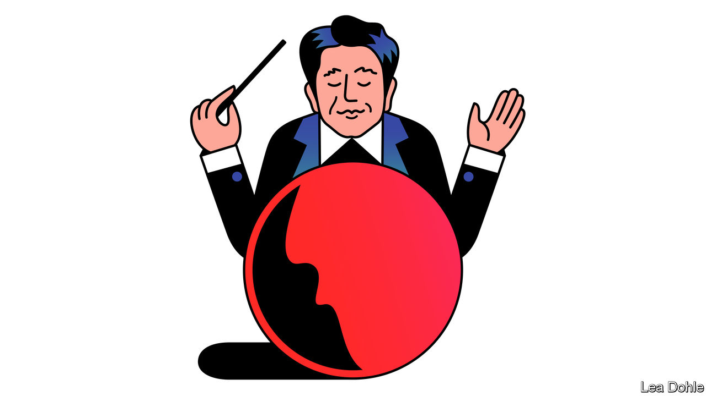

###### Banyan

# Abe Shinzo left his mark on Asia and the world, not just Japan 

##### The concept of the “free and open Indo-Pacific” is part of his enormous geopolitical legacy 

 

> Jul 14th 2022 

A procedural rule has long limited the trips a Japanese prime minister can ordinarily make overseas to the brief periods of the year when parliament is not in session. The rule appears tailor-made for the kind of inward-looking nonentity who has too often occupied the prime minister’s residence in Japan’s modern history. Abe Shinzo, who was , could not have been further from the stereotype. He squeezed 81 overseas visits to Asia, America and beyond into his second and longer stint in office, from 2012 to 2020.

Those trips helped transform Japan’s foreign-policy focus and standing in Asia—and confirmed Mr Abe as the  Japanese statesman since the second world war. Mr Abe once  to Banyan that China’s ascendance posed an existential challenge to Japan similar to that of Western imperial powers when they turned up in gunboats in Tokyo Bay in the mid-19th century. At home, his response was to bolster both the economy and security. Abroad, it meant putting a normally retiring Japan at the forefront of efforts to prevent Chinese assertiveness from wrecking an open, international order that for decades had by and large guaranteed East Asian peace and prosperity.

Japan, the ally that anchors the American military presence in the region, also needed to do more to keep a distracted America engaged, Mr Abe saw. That included seeding the idea of a “free and open Indo-Pacific” that is now at the conceptual heart of America’s grand strategy in Asia. During his brief term as prime minister in 2006-07, he first attempted to promote a “Quad” involving Australia, India, Japan and the United States—less an alliance than an alignment of states with concerns about the implications of China’s rise. 

The idea fizzled, but Mr Abe revived it in his second term. India, with a tradition of non-alignment and a reluctance to rile China, was hard to convince. Malcolm Turnbull, Australia’s prime minister at the time, says that it was Mr Abe who “put in the hard yards” with Narendra Modi, India’s prime minister, and thus brought the country around.

A warm style with foreign leaders—including man-hugs with Mr Modi—helped. Mr Abe was also the first Asian leader to realise that with the election of Donald Trump, America had changed. He hugged Mr Trump close, too, even as the new president disparaged America’s traditional alliances and pulled the country out of the Trans-Pacific Partnership (tpp), a prospective trade pact among 12 countries. Against the odds Mr Abe, working with Mr Turnbull, , forming the tpp’s successor, the Comprehensive and Progressive Agreement for Trans-Pacific Partnership. That, says Mr Turnbull, showed, “We don’t have to do everything with the Americans.” That the door is still open for the United States to return—the glaring absence in its grand Asian strategy is an economic dimension—is down to Mr Abe above all.

Across Asia, Mr Abe’s newly assertive diplomacy was much less controversial than it was at home. That might surprise some. After all, especially in South-East Asia, countries are reluctant to be openly dragged into the great geopolitical struggle between China and America for regional supremacy—and Japan is America’s indispensable Asian ally.

Yet Japan has plenty of appeal in the region. Commercial ties run deep. Japanese state-backed aid and loans provide a welcome alternative in South-East Asia to China’s Belt and Road Initiative of lending for infrastructure. Japan offers many of the goodies of investment and technology transfer without the political pressures to sign up to an official narrative that China brings to bear. The Japanese presence, says Kevin Rudd, another former Australian prime minister, “provides foreign-policy leverage in dealings with Beijing”. In March Cambodia’s long-standing dictator, Hun Sen, who has fallen under China’s sway, ostentatiously feted the current Japanese prime minister, Kishida Fumio. China’s shocked silence spoke volumes.

In part because Japan rarely lectures other countries, rulers with hang-ups about America often have no problems with Japan. Like his predecessor, Rodrigo Duterte, anti-American grievances run through the new president of the Philippines, Ferdinand “Bongbong” Marcos. But, like Mr Duterte, Mr Marcos evinces no qualms working with Japan, including on defence co-operation. And Japan is today a much more engaged partner. That is thanks to the transformations that Mr Abe wrought. 


 


