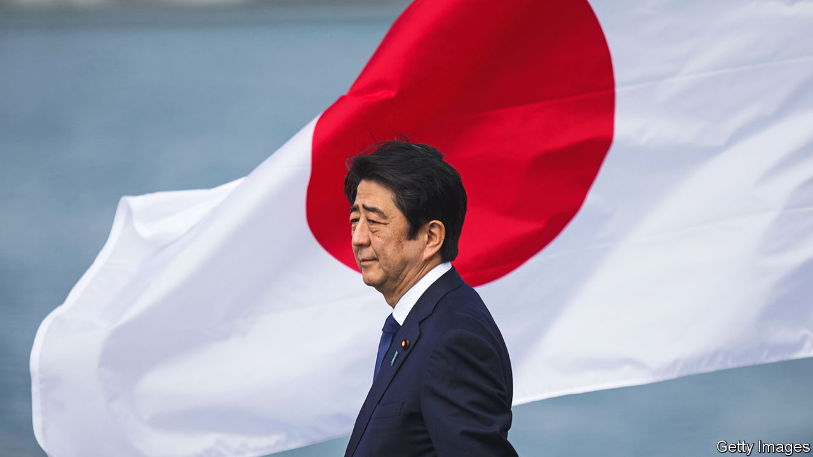

###### Staying the course

# Abe Shinzo’s policies will live on, but may be enacted more slowly 

##### He saw the challenges posed to Japan by a turbulent world, and acted accordingly 

 

> Jul 10th 2022 

Abe shinzo was . The former Japanese prime minister stood in the middle of an intersection just north of the train tracks in Nara, an ancient capital in the country’s west, where pedestrians and buses approach Yamato-Saidaiji station. He was partway through a stump speech for a candidate from the ruling Liberal Democratic Party (ldp), to which he belonged, early on July 8th when a man in a grey polo shirt approached from behind and fired a homemade gun. 

The killing shocked Japan. Gun violence is exceedingly rare: the country saw just one gun death in all of 2021. Political violence, too, has been virtually unheard of in recent years. Mr Abe had already earned the  of being Japan’s longest-serving premier, over two stints in office from 2006 to 2007 and from 2012 to 2020. The assassination made him the only Japanese head of government to be killed during the post-war era. Five days after his death, tearful mourners were still lined up at the site of the shooting to pay respects, leaving flowers and handwritten notes. “I couldn’t believe it,’” says Shida Michiko, who was among the well-wishers gathered there. “I couldn’t stop crying.” 

Mr Abe’s death leaves his country at a crossroads, too. In addition to being Japan’s longest-serving leader, he was its most consequential politician in decades. Even after stepping down, the course Mr Abe set remained Japan’s default—in domestic matters, but especially in , where he sought to counter China’s rise by strengthening Japan’s own defences, reinforcing its alliance with America and building ties with other regional powers. 

Out of office, as the head of the ldp’s largest faction in parliament Mr Abe exerted more than enough influence to push Kishida Fumio, the current prime minister, farther along that path. The question is whether his killing “will come to be seen as a turning point in Japanese political history” or whether it ends up “just having been an incident”, says Gerald Curtis of Columbia University.

Much will depend on how Mr Kishida responds. Voters gave the ldp a thumping victory in upper-house elections that went ahead as planned on July 10th. Along with its smaller partner, Komeito, the party secured 76 of the 125 seats up for grabs. Mr Abe’s death seems to have had little impact on the result: the ldp was already expected to ride to victory. Turnout was only a shade higher than in the previous such vote—hardly an outpouring of sympathy. Mr Kishida now has up to three years before he must face voters again.

Mr Kishida seems unlikely to reverse course entirely. But he may step back from some of Mr Abe’s most hawkish policies. He belongs to a moderate faction of the party. Without Mr Abe around, “his dovish policy dna” may come out, reckons Toshikawa Takao, the editor of , a political newsletter. 

Yet he could just as soon accelerate along the path Mr Abe laid. Conservatives are sure to use Mr Abe’s death to highlight the need for the kind of security policies he championed. Mr Kishida may countenance or even accede to such cries, accepting more spending on a beefier army and perhaps even a revision of Japan’s pacifist constitution, a charged issue and Mr Abe’s . “Kishida may not jump on that bandwagon, but he may not be powerful enough to slow it down,” says Mr Curtis. 

The likeliest scenario, however, is that Mr Kishida sticks to Mr Abe’s direction, but moves at a slower pace. When it comes to Japan’s strategic choices, “stay the course” is the “only option the Kishida administration can have, and they are well aware of this”, argues Funabashi Yoichi of the Asia-Pacific Initiative, a think-tank in Tokyo. In addition, the “centre of gravity of public opinion has shifted” towards support for a stronger, more muscular Japan, says Richard Samuels of mit. 

At the same time, Mr Abe’s death will upset the balance of power inside the ldp. His absence is likely to unleash factional infighting that will impede change. No one in the party, including Mr Kishida, can match Mr Abe’s network of relationships with world leaders. Although Mr Kishida supports revising the constitution, it is nowhere near the priority it was for Mr Abe; he is more likely to expend political capital on . Nor does he have much appetite for Mr Abe’s newer causes, such as asking for a say for Japan regarding the nuclear deterrent America wields on its behalf. 

The wider societal impact, too, may prove less than initially feared. Mr Abe’s killing revived unsettling memories of political violence in the run-up to the second world war and amid fierce debates about security policy in the 1960s. Lots of people had opposed Mr Abe’s efforts to beef up Japan’s armed forces, so it seemed plausible that his assassination might have been intended to change politics.

But as details about the killer emerged, Mr Abe’s death has come to look more like an isolated murder than the opening shot in a campaign of political violence. Yamagami Tetsuya, the shooter whom police arrested at the scene, reportedly told investigators that he was not motivated by politics, but by a grudge against the Unification Church. His mother is a member and apparently made large donations to the church. Many conservative politicians, including Mr Abe, have courted its support. Mr Yamagami seems to have worked alone. There is little resemblance to the political turbulence of the 1930s, says Fujiwara Kiichi of the University of Tokyo. 

Since the end of the second world war, Japanese have seen their country as safe. That confidence has been weakened in recent years—by China’s aggression, by the pandemic, by Russia’s war in Ukraine. Mr Abe himself was acutely aware of such insecurity: in an  with  in May, he urged Japan to discard its tendency to “speak about an ideal world”. In that context, his killing may fuel anxieties. If nothing else, Japan’s leaders are unlikely to be found meeting voters, exposed, in the middle of a road. ■

