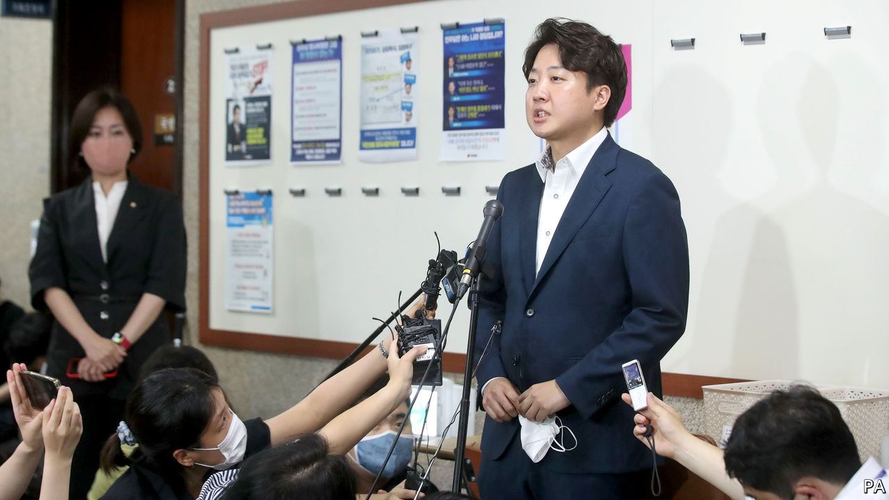

###### The way the wind blows

# Intra-party feuding distracts South Korea’s president 

##### The People Power Party is embroiled in scandal and recrimination 

 

> Jul 14th 2022 

As with many millennials, the soundtrack to Lee Jun-seok’s life features songs from 1990s Disney films. On July 8th the chairman of South Korea’s ruling People Power Party (ppp) posted a link to a song from “Pocahontas”, an animated film, on social media. With lyrics like “How high does the sycamore grow? If you cut it down then you’ll never know”, it is Mr Lee’s go-to tune when he is feeling the political heat. 

Never has it been hotter than on that day, when his membership of the party was suspended for six months after a ppp ethics committee ruled that Mr Lee had failed to uphold the “dignity of the party”. Kweon Seong-dong, the party’s leader in parliament, will act as chairman.

At the end of last year a right-wing YouTube channel known for spreading salacious rumours about celebrities and politicians alleged that a businessman had arranged sexual services for Mr Lee in 2013 (Mr Lee denies it). But it was not the accusation of impropriety that got him suspended. Rather it was the claim that Mr Lee asked Kim Cheol-geun, his political-affairs chief, to promise a 700m won ($537,000) investment to a witness to buy his silence (which they both deny). 

Mr Lee is a controversial figure, both within and outside the ppp. At only 37 he is the youngest-ever leader of a South Korean party. He has  among young men frustrated at their unsatisfactory careers and romantic prospects. Mr Lee has soothed their egos with his claims that feminism is “blowfish poison” and that men are victims of reverse discrimination. That in turn secured their support for the ppp, which was badly damaged after its previous president, Park Geun-hye, was impeached in 2017 for corruption. 

Mr Lee’s ability to woo that constituency is seen as crucial to the three electoral victories the party has won in the past three years, including for the presidency, which its candidate, Yoon Suk-yeol, secured by a  in March. Unsurprisingly, Mr Lee’s rhetoric sticks in the craw of young women, who earn less than their male counterparts, do far more housework and rarely get appointed to top jobs. South Korea sits at the bottom of  ’s glass-ceiling index, which measures the role and influence of women in the workforce in 29 countries. Young people were divided sharply by sex in the presidential election. Some 59% of men voted for Mr Yoon while a similar share of women voted for his main rival.

Mr Lee also has a record of annoying people in his own party. Almost as soon as Mr Yoon was named the party’s presidential candidate, the two clashed over policy and tactics, including how Mr Yoon’s campaign should be run. Their struggle over who controls the party has continued to simmer away in the background, and Mr Lee’s announcement last month that he intended to reform the way that the ppp selected candidates for elections further angered the party’s grandees. Some suggest that bigwigs in the party have deemed him —a hunting dog that is eaten after it has caught the rabbit. With no election on the horizon until 2024, there is a risk that Mr Lee is found to be surplus to requirements. 

Incensed, Mr Lee has taken to social media to encourage his fans to join the party, in the hope of convincing the acting leadership that he is indispensable. He has also said that he has “no intention” of stepping down. He has argued that the party’s bylaws mean that the ethics committee’s ruling should not come into force for ten days, and that its decision requires his sign-off as party chairman to be valid. 

For Mr Yoon, the fracas is a distraction and a headache. His approval rating has steadily dropped since his election. Twice as many South Koreans think he is doing a bad job as think he is doing a good one. Getting the political and public support necessary to achieve his ambitions—which include repairing the economy, improving relations with Japan and raising South Korea’s profile around the world—will be difficult enough without also having a civil war in his party.■

