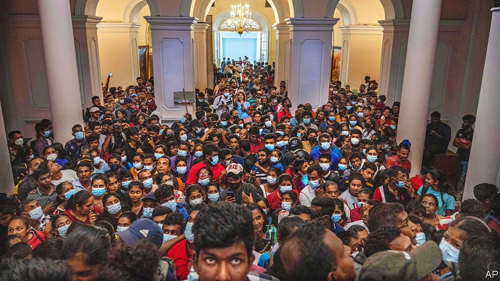

###### Midnight plane to Malé

# Sri Lanka’s president flees, leaving the country in chaos 

##### Gotabaya Rajapaksa takes a long time to resign 

 

> Jul 13th 2022 


In the end the mighty ex-military man cut a pathetic figure. First Gotabaya Rajapaksa  before it was taken over (pictured) by tens of thousands of  who had come to Colombo on July 9th to chase him from office. Then he spent days in hiding to avoid their wrath. Finally, in the early hours of July 13th, the disgraced president was spirited out of the country on a military jet. Gota, as he is known, flew to Malé, the capital of the Maldives, though there were rumours that he wanted to travel on to another country. As  went to press on July 14th, journalists in the Maldives were reporting that he was on his way to Singapore.

Gota’s departure marks the end of his family’s two-decade domination of politics on the island of 22m people. Most Sri Lankans considered it long past time. But it also leaves the country with a political vacuum. Ranil Wickremesinghe, the prime minister who has taken charge in the president’s absence, is deeply unpopular and tainted by his association with the Rajapaksa clan. Calm seems unlikely to be restored while he remains in post.

The situation is complicated by the president’s unwillingness to relinquish power even from without. Gota used his executive powers to commandeer the plane that took him to the Maldives, and did not resign, or make arrangements for his resignation, before fleeing, presumably to avoid losing his immunity from prosecution. (He has been accused of corruption in presiding over Sri Lanka’s economic collapse and of crimes committed during the country’s 26-year civil war, both of which he denies.) He has not spoken in public since leaving his residence. A promise that he would resign by July 13th was relayed through the speaker of Parliament, a political ally. Mr Wickremesinghe had also promised to resign as prime minister once an agreement to form an all-party interim government was in place.

By the morning of July 14th, no resignations had been forthcoming. The previous afternoon Mr Wickremesinghe, now acting as president, imposed a national curfew. The speaker issued a statement that the president had appointed Mr Wickremesinghe to act in his stead while he was overseas, suggesting that Gota was not in fact planning to step down. Even though the speaker later assured the public that he would, the dithering did not go down well with Sri Lankans. Reports that the prime minister had taken over sparked anger on social media and on the streets. Protesters stormed Mr Wickremesinghe’s office and attempted to take over Parliament. At least one person died and dozens were injured in clashes with security forces, who met the protesters with tear gas and batons.

Later in the day, Mr Wickremesinghe said he had asked the speaker to nominate a prime minister who would be “acceptable” to both government and opposition parties. The new prime minister would lead an all-party interim government to run the country until elections can be held. That government would also manage negotiations on a bail-out with the imf, a matter of utmost urgency if the economy is to get back on its feet. Sri Lanka  on its foreign debt in May. It has no foreign currency to pay for imports, resulting in an acute shortage of fuel, food and medicines. Fuel is being rationed to preserve essential services, and people are waiting days in queues at petrol pumps. There is still not enough to transport food to cities. 

Yet the political stability needed to make progress on a deal remains elusive. A meeting of party leaders on July 13th failed to yield an agreement on how to form the new government. Unless the president resigns, Parliament cannot elect a new one on July 20th, as had been announced earlier in the week. The old guard’s insistence on clinging to power is radicalising the protest movement, where leftist former militants are becoming worryingly dominant. The Bar Association of Sri Lanka, which supports the protesters, called on them to respect the rule of law and stop their attacks on government buildings, warning of “lawlessness and anarchy”. Unless the impasse is resolved soon, that is what Mr Wickremesinghe may find himself presiding over.■

