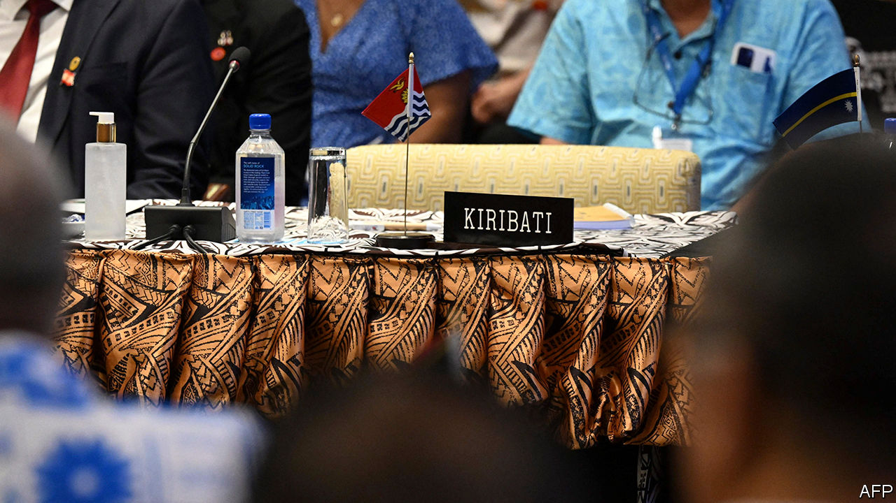
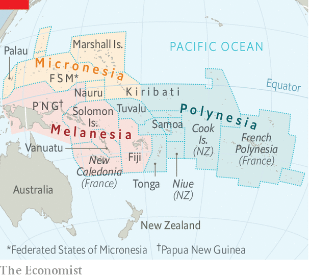

###### Politics takes atoll

# The Pacific Islands Forum is derailed by a high-profile withdrawal 

##### Kiribati says it has left the regional co-operation organisation 

 

> Jul 14th 2022 

With a swipe of a pen in 1832, Jules Dumont D’Urville, a French explorer, divided the islands of the Pacific into Micronesia, Polynesia and Melanesia. He named one group after the smallness of its various land masses, another after its multiplicity of islands and a third after its inhabitants’ higher levels of melanin (“mela” is Greek for “black”). 

Nearly two centuries later, these labels are still causing arguments among the countries those islands have become. At this year’s gathering of the Pacific Islands Forum (pif), a regional body, proceedings have been dominated by the question of whether Micronesian states—Kiribati, the Marshall Islands, the Federated States of Micronesia (fsm), Nauru and Palau—will leave the forum because of a sense that they are not being given their due.

 


Micronesian countries have long felt marginalised in pif. That is partly because of history and partly because of size. The body was established as the South Pacific Forum in 1971 to provide a political hub for newly independent Pacific states. It did not rename itself until 1999, well after the five Micronesian states, which are mostly north of the equator (see map), had joined. Their combined population of just 300,000 is equivalent to a mere 1% of that of Australia and New Zealand, the forum’s heavyweights. Papua New Guinea and Fiji are the other hefty members. 

On July 9th, two days before the summit kicked off in Suva, the capital of Fiji, David Kabua, the president of the Marshall Islands, dropped out because of legal complications that led to his country leaving the pif. The same day Taneti Maamau, Kiribati’s president, announced that his country had “taken the sovereign decision to withdraw from the Pacific Islands Forum with immediate effect”. 

The  in February 2021 when Henry Puna, a former prime minister of the Cook Islands, was selected as pif’s new secretary-general, edging out the Marshall Islands’ man by nine votes to eight. The five Micronesian members claimed that appointing a Cook Islander, from Polynesia, was in breach of a gentlemen’s agreement that the position would rotate among the three subregions. They gave notice of their intention to leave the forum in February this year. 

Ever since, other pif governments have been working behind the scenes to heal the rift. Earlier this year fsm claimed to have obtained an undertaking that Mr Puna would step down in June. In response, the Micronesian countries agreed to suspend plans to withdraw. 

Mr Puna did not step down. Instead, David Panuelo, fsm’s president, last month signed a compromise agreement with Frank Bainimarama, Fiji’s prime minister and this year’s pif chairman. The gentlemen’s agreement would be formalised, an additional deputy secretary-general position would ensure better representation of all three regions and the Office of the Pacific Ocean Commissioner would be moved from Suva to Micronesia.

Yet the deal failed to fulfil the Micronesians’ main demand: that Mr Puna step down this year. Instead, he will complete his term and then hand the reins to a Micronesian replacement in 2024. Kiribati’s president complained that all the Micronesian leaders should have been consulted about the deal. The Marshallese president, for his part, intended to withdraw his country’s notice of withdrawal, but domestic squabbles blocked him from so doing, leaving the Marshall Islands formally outside pif. The dispute is likely to drag on for another year. 

The drama comes at a time of heightened anxiety for pif. This is the first in-person meeting of leaders since 2019. A new, environment-friendly government in Australia offers a chance to establish a common front on climate change—a vital issue for the region, but one which was neglected by the previous prime minister in Canberra. And a controversial  between the Solomon Islands and China, signed in April, has Pacificisland countries worried about great-power games in their backyard. 

The Solomon Islands and Kiribati cut diplomatic ties with Taiwan in 2019 and initiated them with China instead. Anote Tong, a former president of Kiribati, thinks that his successor is cooking up a deal with China. The summit presented a chance to explore regional approaches to security concerns. But until pif can resolve its internal power struggles, dealing with external challenges will be a tall order. ■

